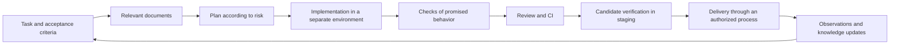

# Delivery Workflows with AI Agents

Providing a code-generation tool does not remove waiting for requirements, review or release. Standardize transitions: required inputs, resulting artifacts and responsibility for accepting each outcome.

## Change workflow

## Document roles

| Artifact | Question answered |
| --- | --- |
| Root instructions | Where should work start and what constraints apply? |
| Architecture and contracts | How does the system work and what does it promise? |
| Change plan | What changes and how is completion demonstrated? |
| ADR | Why was this alternative selected? |
| Reusable workflow skill | How is the procedure repeated? |
| Executable check | How is a violation detected automatically? |
| Runbook | How is operation diagnosed and restored? |

Keep shared knowledge separate from agent-specific adapters. Important documents need scope, owner, status and a review trigger. Avoid mechanically duplicating information already extractable from code.

## QA AI Lab example

Learning task: add a tool-purpose filter. Promise: the filter shows matching tools, language switching preserves the selection, and reset restores the full list.

| Stage | Proposed Lab artifact |
| --- | --- |
| Definition | Three observable expectations and a mixed-category definition |
| Context | Catalog files, filter logic and translation rules |
| Plan | Small diff, empty-result and reset states |
| Verification | One category, a mixed-purpose card and language switching |
| Review | Original expectations compared with diff and actual behavior |
| Delivery | Commit and authorized pipeline outcome |
| Feedback | Defects, time to acceptance and updated rule |

This is a proposed organization for a future task; the listed checks are not claimed to be implemented.

## Completion and efficiency

A result is ready for acceptance when a reviewable artifact, evidence for the original promise and remaining limitations are available. Review should use requirements and implementation rather than relying only on the implementer's persuasive report.

Pilot one repeatable task category. Measure active time and waiting separately, rework rate, verification cost and defects after acceptance. Compare similarly sized tasks; generation speed and PR count do not show how much useful output was accepted.

Choose a stronger or cheaper model from performance on concrete tasks and the cost of mistakes. A separate model reviewer can repeat the implementer's errors; testable expectations remain necessary. A reproducible environment may use containers or another suitable solution, but access boundaries must be explicit.

## Verify findings and the checks themselves

OstapAndreevich reports 111 findings: 86 accepted, 25 rejected, including four false findings. The false-rejection rate is unknown; this is not an audit-accuracy measurement.

| Check | Method |
| --- | --- |
| Agent conclusion | Open the source and reproduce the scenario |
| Protective rule | Inject a violation; verify failure and message; remove it |
| Confidentiality | Inspect contents, filenames and Git history |

Separate false findings from uneconomical fixes. Votes are not proof. The additional review system is proposed, not implemented.

## Related materials

- [Evidence-Engineered QA Agents](evidence-engineered-qa-agent.md)
- [Diagnosing AI Agent Failures](agent-failure-diagnosis.md)
- [Quality Controls for Production Coding Agents](production-coding-agent-controls.md)

## Sources

- [eaterman99: «Если ваши разработчики используют Claude Code, вы еще не автоматизировали разработку» (RU)](https://habr.com/ru/articles/1081076/) — opinion and practical recommendations, not a comparative productivity study.

- [OstapAndreevich: «Отдал сайт ИИ-агентам: из 111 находок аудита 25 пошли в мусор, 4 оказались выдумкой» (RU)](https://habr.com/ru/articles/1085422/) — personal case report; figures not independently verified.
