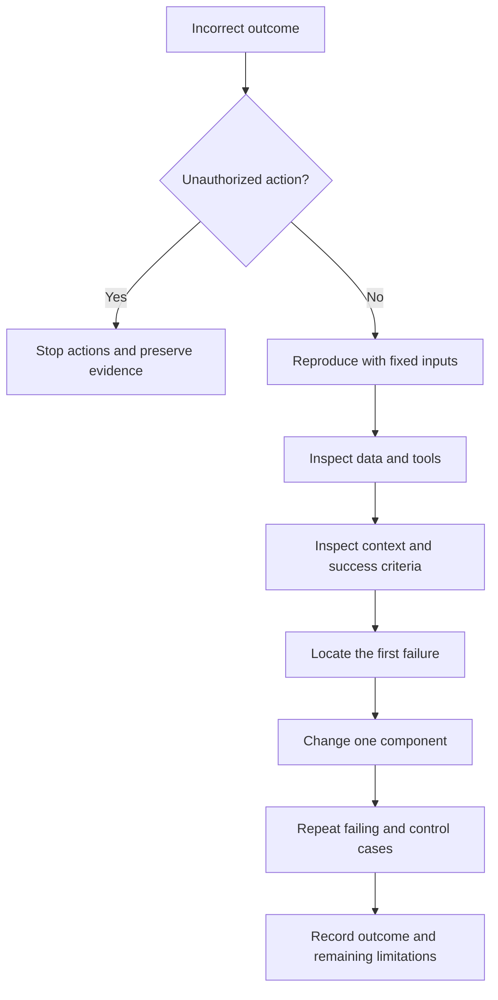

# Diagnosing AI Agent Failures

The same incorrect answer can originate in the model, harness, environment or evaluator. Locate the first unrecovered failure, then choose the repair separately: a model error can still require a software constraint.

## Diagnostic flow

## Working matrix for QA AI Lab

This is an authored verification template for our library, not the complete failure-mode catalog.

| Symptom | Evidence to inspect | Control experiment |
| --- | --- | --- |
| Article missing from search | Note ID in Markdown, catalog and index | Find one known note through each path |
| Router selects the wrong topic | Supplied excerpt and returned label | Repeat with the complete relevant excerpt |
| Translation loses an example | Headings and blocks in both versions | Remove an example in a copy and check detection |
| Tool claims success without output | Exit status and actual artifact | Inject a failure and inspect task status |
| Source does not support a claim | URL, version and relevant passage | Substitute an irrelevant source in a test copy |
| Broken page still passes | Assertion and observed behavior | Break the target feature and obtain a failing result |

## Verification traps

Checking that every document was processed differs from checking that at least one was processed. Keep omitted cases visible in the denominator. Compare identities and result membership, not just counts: equal counts can hide substitutions.

For a regression dataset, define expected IDs in advance. Compare returned and expected ID sets and check duplicates separately: a set hides repetitions. Reject an empty dataset explicitly, otherwise a universal condition can pass without any checks executing.

## Limits and incident record

The research taxonomy describes possible failures, not their frequencies. Agreement among AI judges does not guarantee correct attribution of a new case; insufficient evidence requires an unresolved status. The closed-project cases in the article are the author's self-report.

Lab record template: input version → expected outcome → actual outcome → first confirmed failure → experiment → change → repeated check. Also record owner, time and cost. The proposed checks here do not imply they have already been implemented.

## Related materials

- [Evidence-Engineered QA Agents](evidence-engineered-qa-agent.md)
- [Agent Evaluation from Build to Production](../llm-testing/agent-evaluation-lifecycle.md)

## Sources

- [Zakhar Kopanitsky: «Кто на самом деле сломал вашего ИИ-агента: модель или обвязка?» (RU)](https://habr.com/ru/articles/1079638/)
- [Harsh Raj et al.: Model or Harness? (EN)](https://arxiv.org/html/2607.28802v1) — taxonomy structure and limitations checked; no full research review performed.
