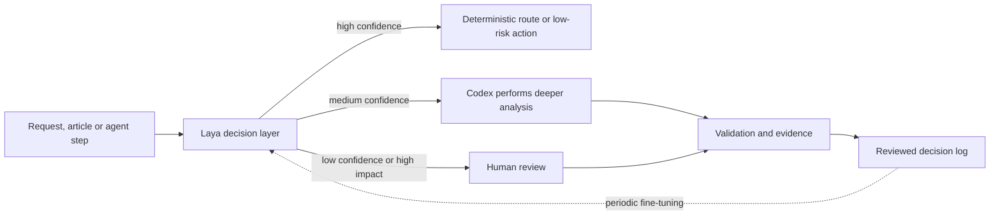

# Jev vs Laya: Fast Decision Models for AI Agents

Jev and Laya are decision models rather than chatbots. They receive text or structured state plus typed questions and return constrained values with probability distributions. Their three common primitives are **choice** for selecting a label, **score** for an ordered scale, and **noul** for a yes/no probability. They do not write explanations, code or final user-facing answers.

This makes them useful as a fast control layer around a slower AI agent: route a request, grade risk, filter retrieved passages, approve a low-risk branch or send an uncertain case to Codex or a person.

## The practical difference

| Dimension | Jev | Laya |
|---|---|---|
| Delivery | Managed TypeSafe AI API | Local Python, TypeScript or self-hosted service |
| Weights and license | Closed hosted model | Open weights and code under Apache 2.0 |
| Direct price | Metered input tokens | No per-call fee; hardware, electricity and operations still cost money |
| Setup | API key and network request | Python 3.10+, model download, memory and inference runtime |
| Data boundary | State is sent to a provider | Can operate locally or air-gapped after downloading weights |
| Context | Large hosted context | Smaller checkpoint-specific context; long multilingual mode needs validation |
| Adaptation | Shape behavior through state, criteria and application logic | Fine-tune and calibrate on labelled domain examples |
| Best current fit | Managed service, large option sets and minimal model operations | High-volume local routing, privacy-sensitive triage and custom domain decisions |

Jev was announced on 15 September 2026. The public Laya repository appeared on 18 September, three days later. Similar interfaces do not make Laya an on-premise release of Jev: it is an independent implementation with different checkpoints, training data, limits and operational responsibility.

## Strengths and limits

### Jev

**Strengths:** little infrastructure, long input capacity, mature hosted endpoint, typed responses, and stronger published performance when a choice contains many labels.

**Limits:** proprietary weights, network dependency, vendor data boundary, metered use and no customer-specific weight fine-tuning. English is its strongest documented language, so multilingual behavior still requires local evaluation.

### Laya

**Strengths:** local execution, Apache 2.0 licensing, no per-call fee, multilingual routing, batching, CPU/GPU options, MCP support and the ability to fine-tune checkpoints on project decisions.

**Limits:** first use downloads hundreds of megabytes per checkpoint; preloading several models needs substantially more memory. Base checkpoints are not automatically production classifiers. Accuracy can fall with more than roughly twenty choice labels, wording matters, arithmetic should remain in deterministic code, and long inputs require task-specific evaluation.

Laya is sometimes described as self-learning. More precisely, it is **self-hostable and trainable**. It does not safely learn from live traffic by itself. Improvement requires collecting reviewed examples, splitting train and evaluation data, fine-tuning, calibrating probabilities and deliberately deploying a new version. Feeding every agent decision back into training without review would reinforce its own errors.

Published Laya comparisons are useful hypotheses, not proof for QA AI Lab. Some headline results come from a checkpoint fine-tuned on the evaluated workflow, while base checkpoints can be much weaker. Jev figures and Laya figures have not always been measured with identical requests and infrastructure.

## Where a decision model belongs

The model should decide among predefined branches. Codex should still analyze sources, write articles, explain reasoning and handle novel cases. Deterministic code should still validate schemas, paths, permissions and numerical rules.

## Rational use with AI agents

1. Ask one atomic question at a time and compose several answers in code rather than asking for a broad verdict.
2. Keep choice sets small and hierarchical: first choose the domain, then a subcategory.
3. Define explicit confidence thresholds and an abstention path. A probability is a routing signal, not proof of correctness.
4. Calibrate thresholds on project data and evaluate by class, language and input length.
5. Log model version, input hash, question schema, answer, confidence, final reviewed outcome and latency.
6. Never let a decision model bypass existing permission checks or perform irreversible actions.
7. Use a cascade: cheap local decision first, Codex for difficult cases, human review for high-impact uncertainty.

## Laya pilot for QA AI Lab

### Stage 1 — one narrow shadow task

Start with **content routing only**. For every incoming description, Laya predicts one of three labels: `qa`, `ai`, or `tools`. It must not move files, publish content or change metadata. Compare its answer with the final reviewed location.

Create a versioned dataset from existing reviewed materials plus new inbox items. Keep training, calibration and final test sets separate. Do not claim learning progress from examples that were also used to tune the model.

### Stage 2 — measure before automation

Track macro-F1, per-class precision and recall, Brier score or calibration error, abstention coverage, latency, memory and cold-start time. Establish acceptance thresholds only after measuring the current rules and an LLM-routing baseline on the same hidden test set.

Inspect disagreements manually. Split broad labels or rewrite criteria when wording causes systematic errors; fine-tune only when prompt and schema corrections stop producing gains.

### Stage 3 — confidence-gated cascade

Allow a high-confidence Laya result to preselect a section in a draft. Send uncertain cases to Codex with the candidate labels and evidence, and keep the final content decision reviewable. Continue logging the reviewed outcome for later calibration.

### Stage 4 — expand carefully

After routing is stable, evaluate independent tasks one at a time:

- classify an incoming item as article, compact tool card or source bookmark;
- flag a prompt or proposed tool call for additional review;
- score article-processing priority using a fixed rubric;
- decide whether an agent step needs human review;
- filter clearly irrelevant retrieval candidates before deeper analysis.

Each task needs its own question schema, thresholds and evaluation set. Do not reuse one confidence threshold across unrelated decisions.

### Stage 5 — local integration

Run Laya in an isolated project environment and pin package and checkpoint revisions. Expose only typed prediction operations through a local service or a dedicated `layaLab` MCP server. Keep model caches and decision logs outside Git; commit schemas, evaluation fixtures, configuration and aggregate results. The integration remains optional until it beats the existing workflow on the project's own held-out data.

## Recommendation

Use Laya as the next **experimental workflow component**, not as a replacement for Obsidian, QMD or Codex. Obsidian holds knowledge, QMD retrieves it, Laya makes narrow repetitive routing decisions, and Codex performs the deeper work. Jev remains a useful managed benchmark, but Laya better matches the project's preference for local control and no per-call fee—provided that the team accepts model operations and validates every promoted task.
