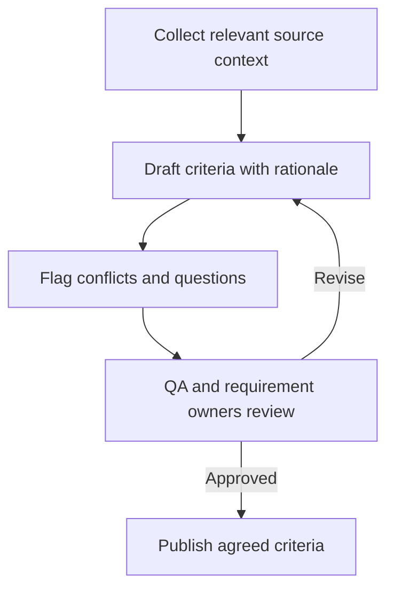

# AI-Assisted Acceptance Criteria

## TL;DR

AI can assemble a traceable draft from scattered requirements. People still decide whether its criteria are correct, complete and agreed.

## Source summary

Banki.ru describes moving QA earlier in delivery and using a skill to gather Jira, Confluence and Figma context. The workflow identifies stale information and open questions, drafts happy-path and edge-case criteria with rationale, asks QA to review, then publishes approved criteria through Jira's REST API.

The team reports shorter testing-queue waits and wider use of generated criteria after adopting the process. These results combine process changes and AI assistance; the article does not isolate AI's causal contribution. Generation is locally triggered, while platform automation is described as future work. [Original case study](https://habr.com/ru/companies/banki/articles/1056464/)

## How it works

## Practical QA use

Try this when a feature's intent is scattered across a ticket, design and discussion. Keep source references and unresolved decisions visible. The goal is reduced context-gathering effort with maintained requirement quality.

### Original example: reviewable output

| Field | Example |
| --- | --- |
| Scenario | Saved search returns no matching records |
| Expected behavior | Display the agreed empty state |
| Evidence | Requirement AC-04 and empty-state design |
| Open question | Should current filters remain after refresh? |
| Review owner | Product/analysis owner and QA |

An unanswered question must remain a question rather than becoming invented product behavior. Acceptance criteria state agreed outcomes; they are not a substitute for the full test strategy.

## Risks and limitations

Check omitted edge cases, conflicting versions, invented rules, access to source data, and publication permissions. Measure reviewer correction effort and missed requirements as well as time saved. The source's connector behavior, model cost and local labels are contextual observations, not current product guarantees. A label indicating no separate QA execution does not establish that a change is low risk.

The full article body was read. Embedded screenshots were not transcribed as a reusable implementation; the actual skill was not installed or tested.

## Related topics and sources

- [Test planning](../../qa/qa-process/test-planning.md)
- [Form testing](../../playbooks/checklists/form-testing.md)
- [OpenAI Academy learning resource](openai-academy-workplace-ai.md)
- Margarita Solobaeva, [Banki.ru AI-assisted acceptance criteria](https://habr.com/ru/companies/banki/articles/1056464/). Primary team experience, not an independent controlled evaluation.
