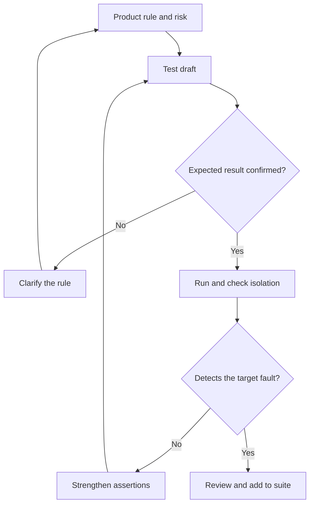

# AI-Generated Tests: Meaning and Reliability Checks

AI accelerates test drafting, but expected results must follow an agreed rule. Tests derived solely from implementation can preserve its defects. Case counts and passing runs alone do not establish the quality of assertions.

## Test acceptance loop

## Two independent stages

First verify the expected result’s origin and connection to risk. Then check compilation, repeatability, cleanup and dependencies. GitHub recommends running and extending generated tests; generation does not guarantee scenario completeness.

Mutation testing evaluates sensitivity to small code changes. Investigate surviving mutations: causes can include weak assertions, missing scenarios or equivalent changes. Mutation score does not replace requirements verification either.

## Project example

Original example: an agreed rule states that three incorrect code submissions block the fourth attempt. Tests should distinguish the second, third and fourth attempts, covering counter reset and user isolation. Changing the implementation threshold should make the boundary test detect the discrepancy. Record the rule owner and requirements link alongside the test.

Evaluate a pilot on one feature using total drafting, review and maintenance time. Track detected defects and instability separately so generation speed does not hide verification cost.

## Sources

- [Нетология / kirakirap — ИИ пишет тест-кейсы и автотесты за тебя: как их генерировать и не получить ложное покрытие (RU)](https://habr.com/ru/companies/netologyru/articles/1070438/)
- [GitHub Docs — Writing tests with GitHub Copilot (EN)](https://docs.github.com/en/copilot/tutorials/write-tests)
- [Stryker — What is mutation testing? (EN)](https://stryker-mutator.io/docs/)
