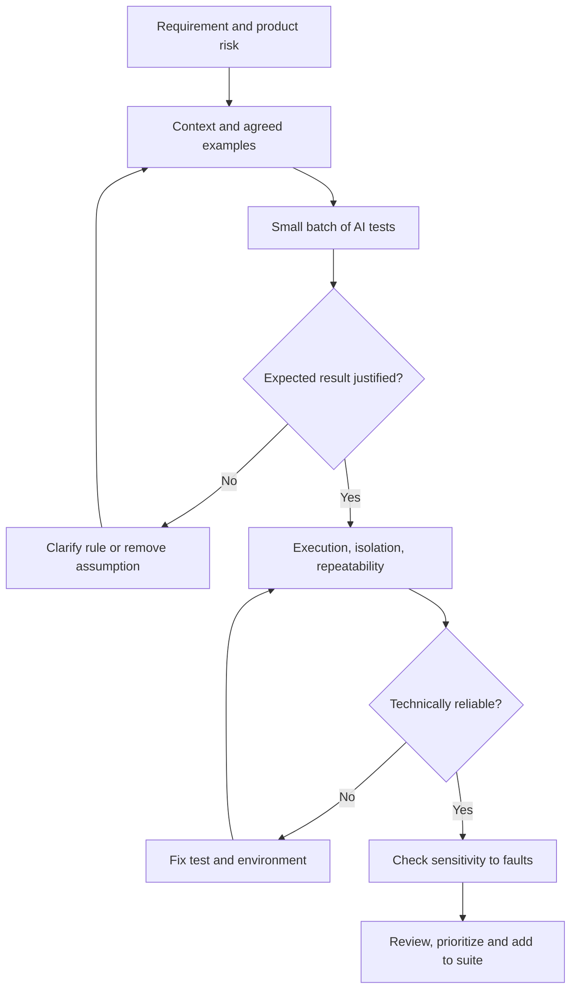

# AI-Generated Tests: Meaning and Reliability Checks

AI is useful for drafts, documentation formatting and test scaffolding. Accept its output after checking product rules, meaningful assertions and execution reliability. The team remains responsible for suite adequacy.

## From rule to accepted test



## Generation from requirements and from code

| Basis | What is checked | Main risk | Acceptance condition |
| --- | --- | --- | --- |
| Agreed requirement | Conformance to expected behavior | Gaps become invented rules | Every expectation traces to a requirement; unknowns become questions |
| Implementation | Observed behavior and regression changes | An implementation defect becomes the baseline | Expectations checked against independent rules |
| Code, requirements and existing tests | Suite expansion in the established style | Old defects and weak checks propagate | New scenarios add verifiable value |

A test oracle determines whether a result is correct. Research on oracle generation in Java projects highlights the risk of reproducing current behavior. Its results do not imply identical accuracy across all models and products.

## Where AI helps and who decides

The following is a proposed team responsibility model, not mandatory job boundaries.

| Work | Delegate to AI | Team confirms |
| --- | --- | --- |
| Positive scenarios | Draft from known rules | Main-flow completeness |
| Negative scenarios | Input-constraint violations | Product prohibitions and rejection consequences |
| Boundary values | Values around a specified threshold | Threshold, units and boundary inclusion |
| Test data | Synthetic datasets in the required format | Domain constraints and suitability |
| Documentation | Format selected checks | Meaning and currency |
| Automated tests | Code with fixtures and mocks | Assertions, real interfaces and isolation |
| Regression changes | Proposals for changed rules | Impact on adjacent features |
| Priorities | Sorting using a supplied risk model | Failure cost and release decision |
| Exploration | Hypotheses and suggestions | Response to emerging product behavior |

GitHub recommends providing existing tests and function context, splitting requests into small tasks, executing results and extending missing scenarios. Mocks help verify interactions; they do not prove compatibility with a real service.

## Why passing runs can be insufficient

| Signal | Establishes | Does not establish |
| --- | --- | --- |
| Test compiles | Acceptable syntax and dependencies | Correct business rule |
| Test passes | Assertions match this execution | Scenario completeness |
| Coverage increases | Additional code executed | Quality of expected results |
| Mutation detected | Suite noticed a particular change | Absence of other defects |
| Repeated runs stable | No instability observed under selected conditions | Stability in every environment |

Research on database tests identifies instability related to assumptions about result ordering. Do not compare a list as ordered when its contract allows any order. If ordering is a requirement, verify that ordering explicitly.

Mutation testing changes small implementation elements and reruns the suite. Investigate surviving mutations: possible causes include weak assertions, missing scenarios or equivalent changes. A known reproducible defect can also serve as a control case. The test should fail on the intended discrepancy rather than broken setup.

## Practical example: export limit

Original example. Rule EXP-01 allows editors to export at most 50 rows; readers cannot export data. Rejection must not create a file.

| Role | Rows | Expected result | Risk |
| --- | --- | --- | --- |
| Editor | 49 | File with 49 rows | Data loss |
| Editor | 50 | File with 50 rows | Inclusive-boundary defect |
| Editor | 51 | Rejection, no file | Limit bypass |
| Reader | 1 | Rejection, no file | Access violation |

An implementation using “less than 50” passes a test with only 49 rows while retaining the defect. A 50-row test detects it when its expectation comes from EXP-01. Checking “file is nonempty” is insufficient: verify row count and necessary values. Zero-row behavior is unspecified and must be clarified.

## Context for a small test batch

Provide the rule ID, available API contracts, an existing test example, environment constraints and related defects. Original task template:

```text
Prepare EXP-01 checks for reader/editor roles and the 50-row boundary.
For each specify: rule, risk, input, expected result,
side-effect assertions and automation level.
Do not define zero-row behavior: list it as a question.
Use only the supplied interfaces.
Show new scenarios and overlaps with existing tests separately.
```

Equivalence classes group inputs with identical behavior; boundary analysis checks where behavior changes. Use decision tables for interacting conditions and state transitions for lifecycles. Pairwise can reduce combinations but does not guarantee detection of faults involving three or more factors; case count depends on the parameter model.

## Acceptance checklist

- [ ] Expectations have independent justification, including an owner for ambiguous rules.
- [ ] Risk and observable outcome are specified.
- [ ] Allowed and forbidden actions are checked, including unwanted side effects.
- [ ] Input classes and behavior-change points are chosen deliberately.
- [ ] Roles, states, retries and concurrent operations are considered according to risk.
- [ ] Methods, fields and UI elements exist in the current version.
- [ ] Duplicates are assessed by the property checked; distinct fields are not merged without checking their logic.
- [ ] Assertions detect incorrect values rather than merely a response’s presence.
- [ ] Setup and cleanup are isolated; ordering, time and external dependencies are controlled.
- [ ] The target violation is detected reproducibly and failure causes are understandable.

## Pilot and benefit evaluation

Choose one feature and compare with the usual test-preparation process. Track total generation, review, correction and maintenance time; draft rejection reasons; detected defects; unstable runs. TestGen-LLM research illustrates filtering for compilation, stability and additional coverage before engineering review. This is a process example, not a promise of identical effectiveness elsewhere.

Related material: [AI-assisted acceptance criteria](ai-assisted-acceptance-criteria.md), [AI-assisted test documentation](ai-assisted-qa-documentation.md).

## Sources

- [Нетология / kirakirap — ИИ пишет тест-кейсы и автотесты за тебя: как их генерировать и не получить ложное покрытие (RU)](https://habr.com/ru/companies/netologyru/articles/1070438/)
- [GitHub Docs — Writing tests with GitHub Copilot (EN)](https://docs.github.com/en/copilot/tutorials/write-tests)
- [Stryker — What is mutation testing? (EN)](https://stryker-mutator.io/docs/)
- [ISTQB — Certified Tester Foundation Level v4.0 (EN)](https://istqb.org/certifications/certified-tester-foundation-level-ctfl-v4-0/)
- [Do LLMs generate test oracles that capture the actual or the expected program behaviour? (EN)](https://arxiv.org/html/2410.21136v1)
- [On the Flakiness of LLM-Generated Tests for Industrial and Open-Source Database Management Systems (EN)](https://arxiv.org/abs/2601.08998)
- [Automated Unit Test Improvement using Large Language Models at Meta (EN)](https://arxiv.org/abs/2402.09171)
