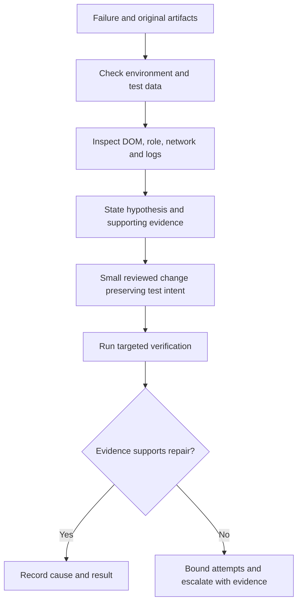

# Evidence-Led AI Test Triage

## Summary

A SENSE banking-project case study describes AI assistance for UI repairs, test drafting, Allure reruns, browser-grid diagnostics and Kafka checks. Project-specific instructions guide an orchestrator and workers. The author reports reduced investigation time but also invented selectors, repeated unsuccessful fixes and lost context. The useful pattern is gathering evidence before proposing a repair.

## Triage workflow

## Review checklist

- Preserve the failing assertion: replacing text correctness with visibility changes the test's meaning.
- Investigate intercepted clicks before using a JavaScript click that bypasses normal interaction.
- Verify selectors and existing steps against the actual application and repository.
- Correlate Kafka records with the current operation; a substring in an old message is weak evidence.
- Keep original failures and rerun outcomes visible; `ignoreFailures` needs a separate effective quality gate.
- Carry constraints and rejected hypotheses into delegated work.

## Limitations and corrections

Reported savings have no independently reproduced baseline. The illustrative token estimate combines input and output at one rate and omits substantial operating costs; it is not a pricing quote or a subscription-limit model. Cloud API use does not inherently require buying GPUs. Credentials, broad permissions and disabled certificate checks in snippets are not production defaults. Examples were read, not run; generated fixes still require review of product behavior.

## Related topics and source

- [Playwright review beyond lint](../../qa/automation/playwright-review-beyond-lint.md)
- [AI-assisted acceptance criteria](ai-assisted-acceptance-criteria.md)
- [AI failure-investigation case study](https://habr.com/ru/articles/1062316/). Complete cached body read.
