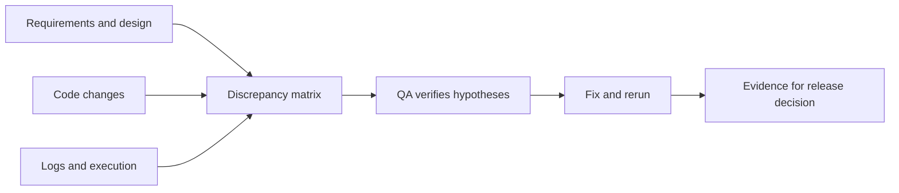

# AI Agents in Mobile QA: Evidence-Based Checks

Agents are useful when code, requirements and execution evidence need reconciliation. Their conclusions guide checks; quality decisions require observable outcomes.

## Practices to reuse

The article describes merge-base diff checklists triggered in CI, Jira/Figma reconciliation, iOS/Android comparisons, analytics checked against schema/code/logs, bug-report drafts, fix analysis and UI-test preparation. Internal skills are not a ready-made public package.

Useful automation rules: locate the screen route and existing components first; add only necessary Accessibility markup; reuse Page Objects and fixtures; isolate data; finish with a meaningful assertion. Simulators supplement real devices. Static fix analysis does not replace retesting.

## One-feature pilot — authored model

| Step | Input | Output and QA control |
| --- | --- | --- |
| Change map | Base commit, diff, full context of affected files | Risk list; check dependencies outside the diff |
| Contract | Acceptance criteria and specific design node | Agreed expectations; never resolve conflicts by guessing |
| Two platforms | Same feature and both implementation versions | Differences in logic, states, API, networking, cache, configuration, experiments, analytics, authorization, offline behavior, navigation, text, tests and edge cases; account for legitimate platform differences |
| Analytics | Event schema, sending code, scenario recording | Events and fields reconciled; absence from an incomplete log does not prove an event never happened |
| Defect | Steps, build, actual behavior, expected contract | Verifiable draft; publish through the team's accepted process |
| Fix | Bug, new diff, reproduction | Cause removed; original scenario and adjacent risk checked |
| Automated test | Approved scenario, existing infrastructure | Test compiles and runs; assertion checks an outcome rather than merely element presence |

### Analytics check example

For the fictional `filter_applied` event, define a contract: confirming the filter emits one event containing its identifier and no personal data. Execute the scenario, record time and session identity, then reconcile it with code. Repeat for cancellation and repeated clicks. Specify transport retry policy separately: another delivery attempt does not necessarily represent another user action.

### Measure savings

Start with read-only work: change mapping and analytics reconciliation. Across 3–5 comparable tasks, measure preparation, manual verification and agent-error correction time, request usage and useful findings. Compare against the ordinary process. Introduce ticket creation and test edits only after assessing outcomes and configuring access.

Acceptance includes real devices, networks, gestures and UX. Generated tests are unverified until executed; agent self-assessment does not replace review. Remove tokens and personal data before sharing logs.

## Related material

- [AI in everyday QA](everyday-ai-qa-workflows.md)
- [Delivery workflows with AI agents](../agents/agent-delivery-workflow.md)

## Source

- [Aleksandr Chernyshev / adcher: «Как ИИ-агент проходит весь цикл мобильного тестирования в hh.ru» (RU)](https://habr.com/ru/companies/hh/articles/1083878/). Accessible text reviewed; images, internal skills and linked talks were not studied separately. Mentioned model/product versions were not verified; the workflow above does not depend on them. No mobile-tool integration was implemented in Lab.
