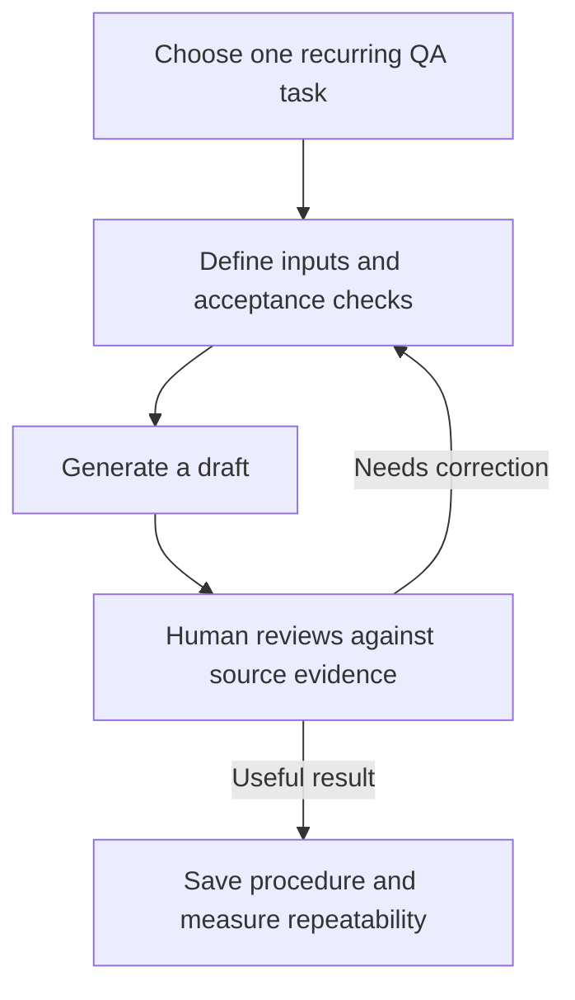

# OpenAI Academy - Workplace AI Learning for QA

## TL;DR

A learning resource to evaluate for practical AI adoption in a QA team. This is a course announcement, not a technical testing tutorial or evidence that the courses improve QA outcomes.

## What the source says

OpenAI announced three Academy courses on June 12, 2026:

| Course | Announced focus |
| --- | --- |
| AI Foundations | Prompting, context, output review and responsible use for everyday tasks |
| Applied AI Foundations | Repeatable workflow plans with inputs, models, tools, checkpoints and human review; quality, speed and cost tradeoffs |
| Agents and Workflows | Directing agent-assisted tasks with context, outputs, boundaries and review |

The announcement describes completion certificates and organizational learning uses. It does not establish course duration, pricing, prerequisites, language availability, or this user's enrollment eligibility. Those details remain unverified. No course was taken or independently evaluated for this note. [Original announcement](https://openai.com/index/academy-courses-applying-ai-at-work/)

## Why QA should care

**Our assessment:** medium-to-high relevance for AI-assisted QA and QA management; limited direct relevance to testing LLM systems. The practical opportunity is to turn an occasional useful AI interaction into a reviewable procedure.

## Practical use: proposed QA exercises

These are original adaptations, not confirmed course exercises.

| Practice | QA exercise | Evidence to review |
| --- | --- | --- |
| Clear context | Provide a fictional endpoint contract and ask for test ideas | Trace each idea to a requirement or explicit assumption |
| Repeatable workflow | Turn sanitized defect notes into a triage draft | Check missing facts, severity rationale and reproducibility |
| Bounded agent work | Ask an agent to draft a regression checklist from a supplied change description | Verify scope, unsupported claims and omitted risks |

## Example workflow

Start with one small task using synthetic or approved input. Compare the result with a human-produced baseline: useful coverage, factual errors, omissions, review effort and total time. Repeat on several examples before adopting it as a team practice.

## Common mistakes and limitations

- Treating a completion certificate as demonstrated QA competence.
- Counting draft-generation speed while ignoring review and correction time.
- Letting a reusable prompt replace explicit acceptance criteria.
- Treating a vendor announcement as independent evidence of effectiveness.
- Assuming these courses cover hallucination evaluation, prompt-injection testing, or an LLM test strategy; the announcement does not establish that coverage.

## Learning priority

SHOULD KNOW for a QA Manager exploring team AI adoption. Choose an exercise first, then evaluate whether the course supports it. A full course commitment is not yet recommended because syllabus depth and access conditions have not been verified.

## Related knowledge

- [API request review](../../playbooks/checklists/api-request-review.md)
- [Risk-based test planning](../../qa/qa-process/test-planning.md)
- [Exploratory heuristics](../../qa/manual-testing/exploratory-heuristics.md)

## Sources

- OpenAI, [New OpenAI Academy courses for the next era of work](https://openai.com/index/academy-courses-applying-ai-at-work/), June 12, 2026; reviewed September 5, 2026. Primary source for its own announcement; promotional claims are not independent validation.
- The announcement links to [OpenAI Academy](https://academy.openai.com/). Portal enrollment and course contents were not inspected.
