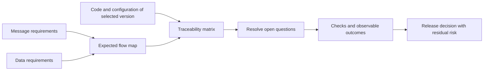

# Requirement Traceability for Risky Releases

For a risky change, reconstruct the chain from trigger through processing to observable outcome, and tie expectations to specific requirement and code versions.

## Search from outcome to cause

Sergei Terentev's case starts with requirements for a Kafka topic, a target SQL table and an implementation map. Triggering events are then recovered and expected flows compared with code. Findings preserve links and undergo review by specialists across teams. Reusable context distinguishes production behavior, branch behavior and documented expectations.

## Working model — authored adaptation

Requirement and implementation discovery can proceed independently; comparison needs their outputs. A missing discovered link does not prove that implementation or a requirement is absent.

| Comparison outcome | Next QA step — authored recommendation |
| --- | --- |
| Expectation and code agree | Execute the scenario; inspect data and messages |
| Behavior differs | Clarify the current contract; reproduce the difference |
| Implementation not found | Check repositories, configuration and dynamic links |
| Requirement not found | Identify the rule owner; check for outdated documentation |
| Sources conflict | Record the question and owner's decision; do not settle truth by agent voting |

## Record template for your project

This is a proposed Lab template, not the original article's format.

| Field | Record |
| --- | --- |
| Scope | Feature, services, included and excluded flows |
| Version | Commit, build, environment, requirement and configuration versions |
| Expectation | Trigger, preconditions, outcome, agreed contract link |
| Implementation | File/symbol and explanation of the discovered relationship |
| Check | Data, action, observation point, waiting window |
| Evidence | Log, operation identity, data query or message |
| Decision | Open question, owner, verification status and residual risk |

### Example without real data

For a fictional order cancellation, expect an `order_cancelled` event and an agreed status change. Correlate by operation identity rather than merely finding a similar message in the topic. Include repeated cancellation, delivery failure and a delayed consumer. Define the convergence window and detection of inconsistent states: immediate equality between a database and an event may contradict an asynchronous contract.

## Confidence boundaries

Review increases confidence but does not prove exhaustive coverage. Preserve search scope and unknown dependencies; verify execution separately. An index speeds retrieval, but conclusions need full current sources. Version or configuration changes require revisiting affected relationships.

Pilot one flow with read-only access. Measure search, finding verification and error correction time. Agent specialization alone does not guarantee savings: repeated reading, coordination and review also consume resources. This integration was not implemented in Lab.

## Related material

- [AI in everyday QA](everyday-ai-qa-workflows.md)
- [Evidence-based mobile QA checks](mobile-agent-evidence-workflow.md)

## Source

- [Sergei Terentev: «От тестирования релиза с высоким уровнем риска к новому ИИ-инструменту для QA» (RU)](https://habr.com/ru/articles/1086968/). Accessible text reviewed; the architecture image and LinkedIn original were not analyzed separately. Team results are author-reported and were not reproduced in Lab.
