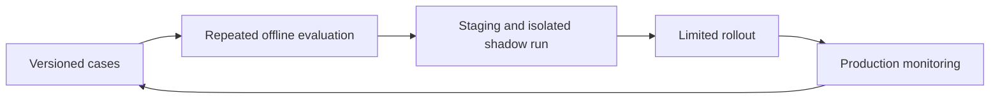

# Agent Evaluation from Build to Production

## Summary

AWS and Motorway describe evaluating a vehicle-search agent before release and on sampled production traffic. Their blueprint combines deterministic tool checks, model-based scoring and human calibration. Multi-turn cases and repeated trials expose failures that a fluent single answer can conceal. Reported improvements are case-study results, not independently reproduced benchmarks.

## Evaluation matrix

| Dimension | Original QA AI Lab example |
| --- | --- |
| Tool and parameters | Search API notes with the correct language filter |
| Outcome | Return relevant notes with working source references |
| Multi-turn context | Add a beginner filter without losing the API topic |
| Access and side effects | Never expose another user's private collection |
| Freshness | Exclude a deleted note from results |
| Efficiency | Measure latency, calls and cost per completed task |

## Reliability and limitations

`pass@k` concerns at least one success; `pass^k` concerns success across all trials. The shortcut probability `p^k` assumes independent trials with the same success probability. Report case-level results and uncertainty rather than treating a tiny sample as a guarantee.

Repeated trials do not remove judge bias. Calibrate judges against human labels and directly check measurable outcomes. Evaluate observable actions and explanations without assuming they reveal internal reasoning. Permit equivalent valid tool paths where ordering is not required.

The source's thresholds, sampling rates, runtime prerequisites and cost estimates are blueprint choices. Low sampling may miss rare severe failures. Offline evaluation does not enforce runtime authorization; shadow tools must prevent real writes. No AWS resources were deployed or companion code audited.

## Related topics and source

- [Evidence-led test triage](../ai-for-testing/evidence-led-test-triage.md)
- [Property-based testing](../../qa/automation/property-based-testing.md)
- [AWS and Motorway evaluation blueprint](https://aws.amazon.com/blogs/machine-learning/evaluating-ai-agents-a-production-blueprint-with-strands-and-agentcore/). Complete cached body read.
