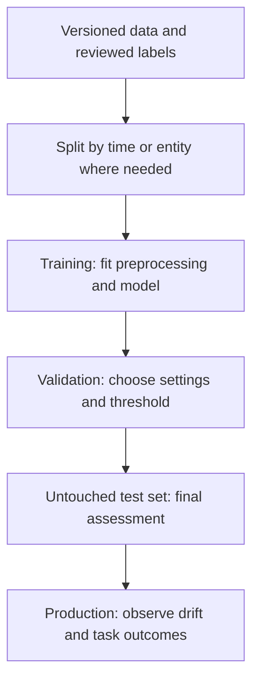

# Machine Learning Foundations for QA

## Summary

Use ML vocabulary to question evaluation results, not just to recognize algorithm names. A model can achieve high accuracy while missing the failures that matter. Evaluate the data split, decision threshold, error types and real task outcome together.

This is a QA-focused synthesis of four chapters of the [ML Glossary](https://ml-cheatsheet.readthedocs.io/en/latest/), not a review of its entire website. See the [review scope and corrections](../../docs/sources/ml-cheatsheet-review.md).

## Concepts to recognize

| Concept | Meaning | QA question |
| --- | --- | --- |
| Feature / label | Input measurement / expected target | Is the label reliable, and was the input available at prediction time? |
| Classification | Predict a category | Which class is positive, and which mistake matters most? |
| Regression | Predict a numeric quantity | What error is acceptable in the product's units? |
| Threshold | Convert a score into a decision | What happens below, at and above the cutoff? |
| Overfitting | Learn training-specific patterns that generalize poorly | How does performance change on independent data? |
| Loss | Objective measuring prediction error | Does optimizing it improve the product outcome? |

The [source glossary](https://ml-cheatsheet.readthedocs.io/en/latest/glossary.html) provides useful introductory terminology, but several definitions need correction: loss is not universally a signed residual, and input normalization is distinct from penalties on model weights.

## Worked example: defect triage

Original lab example: a classifier flags likely product bugs among 1,000 failed test runs. Human review identifies 100 real product bugs.

| Prediction | Actual product bug | Actual non-product failure |
| --- | --- | --- |
| Flagged as bug | 80 true positives | 40 false positives |
| Not flagged | 20 false negatives | 860 true negatives |

| Metric | Calculation | Interpretation |
| --- | --- | --- |
| Accuracy | (80 + 860) / 1,000 = 94% | Correct decisions overall |
| Precision | 80 / (80 + 40) = 66.7% | About two-thirds of flagged runs are real bugs |
| Recall | 80 / (80 + 20) = 80% | One-fifth of real bugs were missed |
| False-positive rate | 40 / (40 + 860) = 4.4% | Share of non-product failures incorrectly flagged |

Always predicting “not a product bug” would already yield 90% accuracy here. Compare against that baseline; do not stop at the 94% headline. Preserve counts, class balance and subgroup results with percentages. Zero denominators require an explicit reporting convention.

## Evaluate without leaking answers

Fit scalers and feature selectors on training data only, then apply the learned transformation to validation and test data. In cross-validation, keep learned preprocessing inside each training fold. This follows [scikit-learn's leakage guidance](https://scikit-learn.org/stable/common_pitfalls.html#data-leakage).

For our hypothetical triage tool, avoid placing near-duplicate failures from the same incident in both training and test sets. Test labels must not leak through later investigation fields. Keep a separate final test set when validation results guide model selection.

## Loss and regularization in practice

The [loss chapter](https://ml-cheatsheet.readthedocs.io/en/latest/loss_functions.html) introduces log loss for probabilistic classification and MAE, MSE and RMSE for numeric errors. Log loss penalizes confident incorrect predictions. MAE and RMSE retain target units; MSE uses squared units. The printed Huber formula has an error, so do not copy it into tests.

The [regularization chapter](https://ml-cheatsheet.readthedocs.io/en/latest/regularization.html) covers augmentation, dropout, early stopping, ensembles and weight penalties. QA should verify the deployed evaluation mode and that augmentation preserves the intended label. Deleting “not” from a sentence can reverse its meaning. Early stopping uses validation evidence; fewer training errors alone do not establish improvement.

## Logistic regression: checks before trusting a tutorial

The [logistic regression chapter](https://ml-cheatsheet.readthedocs.io/en/latest/logistic_regression.html) explains binary probability estimates, threshold decisions and training. A score between zero and one is not proof of calibration. Test exact boundary behavior and the complete preprocessing pipeline. Its example fits scaling before splitting data and contains broken or outdated Python; its two reported accuracy values are not a reliable implementation comparison.

## What to learn first

Prioritize confusion matrices, baselines, thresholds, independent evaluation data and leakage prevention. Optimizer derivations and neural-network architecture details can wait until a project requires them. For LLM agents, these foundations complement tests of tools, access, evidence and task completion; they do not replace them.

## Related knowledge

- [Agent evaluation lifecycle](agent-evaluation-lifecycle.md)
- [Evidence-led AI test triage](../ai-for-testing/evidence-led-test-triage.md)
- [Property-based testing](../../qa/automation/property-based-testing.md)
- [Source review and unread chapters](../../docs/sources/ml-cheatsheet-review.md)
