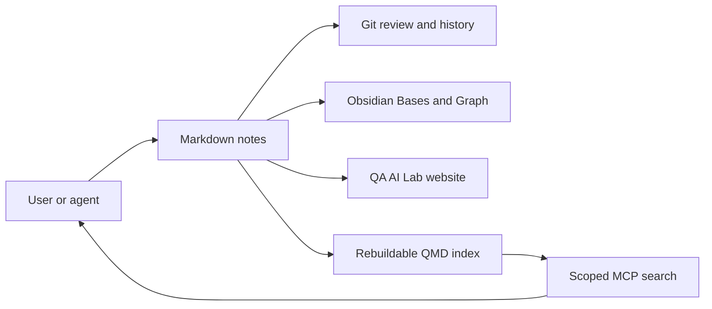

# Obsidian workflow for QA AI Lab

## Open the vault

1. Install Obsidian 1.12 or newer.
2. Choose **Open folder as vault**.
3. Select the repository root (`QA-AI-Lab`), not a new empty folder inside it.
4. Open [[Home]] and the embedded [[bases/Knowledge Library.base|Knowledge Library]] Base.

Every existing Markdown article is already part of the vault. The Base selects canonical notes by their current frontmatter and folders; no import or content duplication is required. Russian notes are available through [[bases/Russian Knowledge.base|Russian Knowledge]].

## Adopted from Obsidian Mind

| Pattern | Status | Reason |
|---|---|---|
| Repository as vault | Adopted | One source of truth for the site, Git and Obsidian |
| Obsidian Bases | Adopted | Dynamic views over existing frontmatter |
| Graph and explicit links | Adopted incrementally | Links must express real relationships |
| QMD semantic index | Adopted | Project-local index covers the bilingual library; its SQLite data is ignored and rebuildable |
| Read-first MCP access | Adopted | Codex exposes the project index as `qaAiLab`; tools search and read without editing notes |
| Upstream hooks | Selective review | Their schemas and folders do not match this repository unchanged |
| Full ShardMind overlay | Rejected | It is designed for a fresh vault and would conflict with local rules |

## Target agent flow



## QMD search and Codex MCP

The project pins its expected CLI behavior to QMD 2.8.3. Install `@tobilu/qmd@2.8.3` globally, or point `QA_AI_LAB_QMD_BIN` to a compatible `bin/qmd` launcher. Run all commands from any directory through the repository wrapper:

```powershell
node scripts/qmd.mjs update
node scripts/qmd.mjs embed
node scripts/qmd.mjs search "release readiness" -c qa-ai-lab
```

The committed `.qmd/index.yml` defines one project-local collection and scoped context. `.qmd/index.sqlite` is machine-local derived data and must not be committed. After changing notes, run `update`; run `embed` when semantic retrieval must include the changes.

Codex is registered with the following read-first server command:

```powershell
codex mcp add qaAiLab -- node "<repository>\scripts\qmd.mjs" mcp
```

Codex configuration is shared by its CLI and IDE integrations. An already running Codex session does not acquire newly registered MCP tools; start a new session after registration. Use QMD results only to locate notes, then read the Markdown before making decisions or edits.

On the current Windows host, `qmd doctor` validates all stored embedding samples, but a direct vector query can stall in both Vulkan and CPU modes. Use an explicit MCP `lex` search with `rerank: false` as the reliable default. Treat `vec` as experimental until it completes a fresh runtime smoke-test; do not download the optional generation and reranking models merely to make basic retrieval work.

## Write policy for agent changes

Begin with search and read operations. When writes are enabled, restrict them to `inbox/` and explicitly approved content folders. Each write must preserve canonical IDs, bilingual paths and source links, then pass `python scripts/check_translations.py` and the website build before commit. Do not expose `.git`, secrets, local Obsidian workspace state or unrelated files through MCP.

## Sources

- [Obsidian Mind](https://github.com/breferrari/obsidian-mind)
- [QMD](https://github.com/tobi/qmd)
- [OpenAI: connect Codex to MCP servers](https://developers.openai.com/learn/docs-mcp)
- [Obsidian Bases syntax](https://obsidian.md/help/bases/syntax)
- [Obsidian Graph view](https://obsidian.md/help/plugins/graph)
