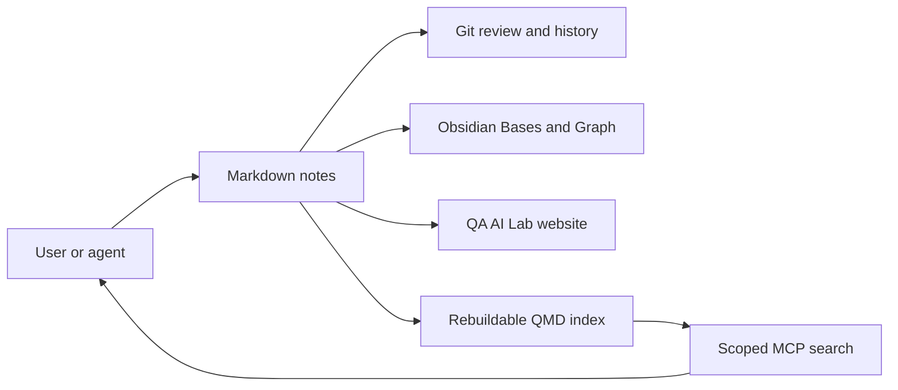

# Obsidian workflow for QA AI Lab

## Open the vault

1. Install Obsidian 1.12 or newer.
2. Choose **Open folder as vault**.
3. Select the repository root (`QA-AI-Lab`), not a new empty folder inside it.
4. Open [[Home]] and the embedded [[bases/Knowledge Library.base|Knowledge Library]] Base.

Every existing Markdown article is already part of the vault. The Base selects canonical notes by their current frontmatter and folders; no import or content duplication is required. Russian notes are available through [[bases/Russian Knowledge.base|Russian Knowledge]].

## Adopted from Obsidian Mind

| Pattern | Status | Reason |
|---|---|---|
| Repository as vault | Adopted | One source of truth for the site, Git and Obsidian |
| Obsidian Bases | Adopted | Dynamic views over existing frontmatter |
| Graph and explicit links | Adopted incrementally | Links must express real relationships |
| QMD semantic index | Next stage | Useful for retrieval, but requires a package and local model downloads |
| Read-first MCP access | Next stage | Needs a reviewed path and scope policy |
| Upstream hooks | Selective review | Their schemas and folders do not match this repository unchanged |
| Full ShardMind overlay | Rejected | It is designed for a fresh vault and would conflict with local rules |

## Target agent flow

## Write policy for future MCP integration

Begin with search and read operations. When writes are enabled, restrict them to `inbox/` and explicitly approved content folders. Each write must preserve canonical IDs, bilingual paths and source links, then pass `python scripts/check_translations.py` and the website build before commit. Do not expose `.git`, secrets, local Obsidian workspace state or unrelated files through MCP.

## Sources

- [Obsidian Mind](https://github.com/breferrari/obsidian-mind)
- [Obsidian Bases syntax](https://obsidian.md/help/bases/syntax)
- [Obsidian Graph view](https://obsidian.md/help/plugins/graph)
