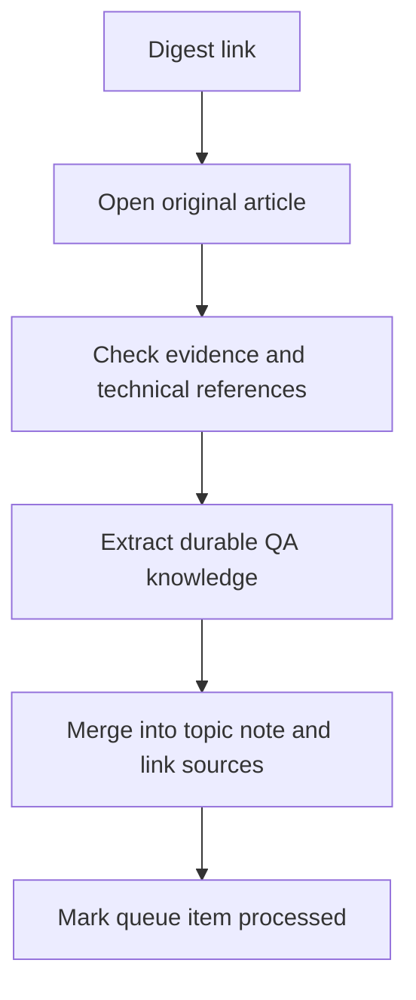

# QA and AI Digest - Reading Queue

## Summary

[QA4Life's Telegraph digest](https://telegra.ph/QA-dajdzhest-19-statej-o-testirovanii-i-AI-agentah-kotorye-stoit-prochitat-na-ehtoj-nedele-07-24-3) links to 19 numbered articles plus one bonus article: **20 unique reading targets**. This record preserves the links and our proposed routing. It is not a synthesis of all linked articles.

English labels below are short editorial topic labels, not verified translations of the destination titles. Priorities reflect this lab's QA, Playwright/TypeScript, and AI interests; they are not source-quality scores.

## Reading queue

First = highest relevance to current learning goals; Next = useful follow-up; Later = specialized or indirect relevance. Destination folders are planned homes for processed notes, not a claim those notes already exist.

| Source item | Reading target | Destination | Priority | Review question or rationale |
| --- | --- | --- | --- | --- |
| 1 | [Load-testing practice](https://habr.com/ru/articles/1061680/) | `qa/performance/` | Next | Workload design and meaningful metrics |
| 2 | [MCP integrations for QA](https://habr.com/ru/articles/1058170/) | `ai/agents/` | First | Evaluate practical integrations and permission boundaries |
| 3 | [QA hiring index, July 2026](https://habr.com/ru/articles/1061482/) | `qa/qa-process/` | Later | Time-sensitive career context; inspect sampling before generalizing |
| 4 | [AI-assisted acceptance criteria](https://habr.com/ru/articles/1056464/) | `ai/ai-for-testing/` | First | Requirements review and human checkpoints |
| 5 | [Usability research without user complaints](https://habr.com/ru/articles/1060872/) | `qa/web-testing/` | Next | Discover unreported user difficulties |
| 6 | [Atomic autotest design](https://habr.com/ru/articles/1060244/) | `qa/automation/` | Next | Compare abstraction benefits with maintenance cost |
| 7 | [Property-based testing with Hypothesis](https://habr.com/ru/articles/1058390/) | `qa/automation/` | First | Explore properties and generated counterexamples |
| 8 | [Origami Java test framework](https://habr.com/ru/articles/1061356/) | `qa/automation/` | Later | Specialized Java architecture; lower fit for current TypeScript focus |
| 9 | [Black-box bug bounty experience](https://habr.com/ru/articles/1058396/) | `qa/security/` | Next | Distinguish suspicious behavior from demonstrated impact |
| 10 | [Password-reset edge cases](https://habr.com/ru/articles/1058180/) | `qa/security/` | First | Extend practical account and session checks |
| 11 | [Playwright lint severity and test review](https://habr.com/ru/articles/1058692/) | `qa/automation/` | First | Relevant to Playwright, assertions and CI gates |
| 12 | [DSL for integration tests](https://habr.com/ru/articles/1059908/) | `qa/automation/` | Later | Assess readability against extra language maintenance |
| 13 | [Contract testing with Pact](https://habr.com/ru/articles/1058382/) | `qa/api-testing/` | First | Broaden API coverage to consumer/provider compatibility |
| 14 | [AI assistant for failed-test investigation](https://habr.com/ru/articles/1062316/) | `ai/ai-for-testing/` | First | Evaluate debugging assistance and verification effort |
| Bonus | [AI coding speed and production failures](https://habr.com/ru/articles/1058978/) | `qa/qa-process/` | Next | Trace translated claims to the original author and evidence |
| 15 | [Agent evaluation with Strands and AgentCore](https://aws.amazon.com/blogs/machine-learning/evaluating-ai-agents-a-production-blueprint-with-strands-and-agentcore/) | `ai/llm-testing/` | First | Direct fit for testing AI agents |
| 16 | [Tradeshift BI and agentic AI](https://aws.amazon.com/blogs/machine-learning/evolving-from-legacy-bi-to-agentic-ai-at-tradeshift-with-amazon-quick/) | `ai/tools/` | Later | Indirect QA relevance; vendor case study |
| 17 | [Jefferies trade-assistant observability](https://aws.amazon.com/blogs/machine-learning/building-trade-assistant-how-jefferies-optimized-front-office-trading-operations-with-ai/) | `tools/monitoring/` | Next | Inspect agent traces and diagnostic evidence |
| 18 | [Supply-chain agent workflows](https://aws.amazon.com/blogs/machine-learning/build-specialized-agent-workflows-for-your-business-with-amazon-quick-and-nvidia-nemo-agent-toolkit/) | `ai/agents/` | Later | Domain-specific workflow example |
| 19 | [monday.com production agents](https://aws.amazon.com/blogs/machine-learning/ai-teammates-how-monday-com-runs-production-ai-agents-on-amazon-bedrock/) | `ai/agents/` | Next | Explore production quality practices; avoid equating throughput with quality |

## Verification state

- The complete digest was retrieved and read, including its methodology and limitations.
- Targets #4, #11 and #15 were opened successfully for an initial check. #4 redirects to the Banki company article. Full technical synthesis and verification of their claims remain pending.
- The other 17 destinations have not been opened in this ingestion pass. Their descriptions and routing are based on the digest; availability and accuracy remain unverified.
- No linked tools or frameworks were installed, and no tests or course enrollments were performed.

## Source-quality notes

The digest is a secondary discovery source. Its methodology mentions a July 21-24 selection window and missing earlier feed data, so it should not be treated as a complete survey of three weeks. Its productivity, hiring, and error-rate figures require examination of the original methodology before reuse. The wording about Tradeshift response times is ambiguous about improvement versus increased latency; do not repeat the numeric claim without clarification.

For technical notes, check the article against relevant primary documentation and the stated version. Treat vendor case-study metrics as reported results with scope, not universal expectations. The phrase that AI has changed testing forever is editorial framing, not established evidence.

## Initial review question for #11

The Playwright article is directly relevant but contains broad advice that needs qualification: exact-value assertions can be correct for controlled test data, five passing repeats do not prove stability, and lint severity depends on configuration and version. These are review questions for the full note, not a blanket endorsement of its rules.

## Processing workflow

## Related knowledge

- [Existing API testing notes](../qa/api-testing/README.md)
- [AI for testing](../ai/ai-for-testing/README.md)
- [Web UI testing](../playbooks/checklists/web-ui-testing.md)
- [Risk-based test planning](../qa/qa-process/test-planning.md)

Keep this record in the inbox while article processing is pending. Replace status descriptions with links to completed notes as each source is processed; do not mark an article processed merely because its URL was saved.
