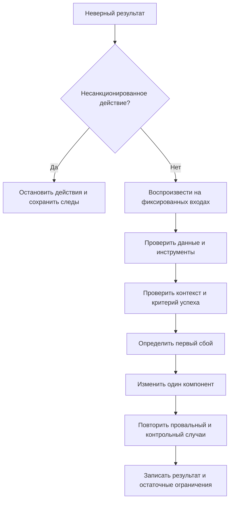

# Диагностика отказов AI-агентов

Одинаковый неверный ответ может возникнуть из-за модели, обвязки, окружения или оценщика. Локализуйте первый невосстановленный сбой и отдельно выбирайте способ ремонта: ошибка модели тоже может потребовать программного ограничения.

## Схема диагностики

## Рабочая матрица для QA AI Lab

Это авторский шаблон проверок для нашей библиотеки, а не полный каталог режимов отказа.

| Симптом | Проверяемое свидетельство | Контрольный эксперимент |
| --- | --- | --- |
| Статья исчезла из поиска | ID заметки в Markdown, каталоге и индексе | Найти одну известную заметку каждым способом |
| Router выбрал неверную тему | Переданный фрагмент и возвращённая метка | Повторить с полным релевантным фрагментом |
| Перевод потерял пример | Набор заголовков и блоков обеих версий | Удалить пример в копии и проверить обнаружение |
| Инструмент сообщил успех без результата | Код завершения и фактический артефакт | Подставить отказ и проверить статус задачи |
| Источник не подтверждает утверждение | URL, версия и нужный фрагмент | Подменить источник нерелевантным в тестовой копии |
| Всё зелёное при сломанной странице | Условие проверки и наблюдаемое поведение | Сломать целевую функцию и добиться красного результата |

## Ловушки проверки

Проверка «все документы обработаны» не равна «хотя бы один обработан». Пропущенные случаи должны оставаться видимыми в знаменателе. Сверяйте идентификаторы и состав результатов, а не только количество; одинаковое число записей может скрыть замену одной другой.

Для регрессионного набора заранее задайте ожидаемые ID. Сравнивайте множество полученных ID с ожидаемым и дополнительно проверяйте дубликаты: множество само скрывает повторения. Пустой набор отклоняйте отдельной проверкой, иначе универсальное условие может пройти без единой выполненной проверки.

## Ограничения и запись инцидента

Таксономия исследователей описывает возможные отказы, а не их частоты. Согласие AI-судей не гарантирует правильную атрибуцию нового случая; отсутствие данных требует статуса «причина не установлена». Кейсы закрытого проекта в статье — самоотчёт автора.

Шаблон записи для Lab: версия входа → ожидаемый результат → фактический результат → первый подтверждённый сбой → эксперимент → изменение → повторная проверка. Дополнительно фиксируйте владельца, время и стоимость. Предложенные проверки здесь не означают, что они уже внедрены.

## Связанные материалы

- [Инженерный контур QA-агента](evidence-engineered-qa-agent.md)
- [Оценка агента от разработки до эксплуатации](../llm-testing/agent-evaluation-lifecycle.md)

## Источники

- [Захар Копаницкий: «Кто на самом деле сломал вашего ИИ-агента: модель или обвязка?» (RU)](https://habr.com/ru/articles/1079638/)
- [Harsh Raj и соавторы: Model or Harness? (EN)](https://arxiv.org/html/2607.28802v1) — сверены структура таксономии и ограничения; полный обзор исследования не проводился.
