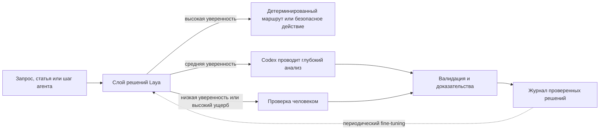

# Jev и Laya: быстрые decision models для AI-агентов

Jev и Laya — decision models, а не чат-боты. Они получают текст или структурированное состояние вместе с типизированными вопросами и возвращают ограниченные значения с распределениями вероятностей. Три общих примитива: **choice** для выбора метки, **score** для упорядоченной шкалы и **noul** для вероятности «да/нет». Они не пишут объяснения, код или итоговые ответы пользователю.

Поэтому их удобно применять как быстрый управляющий слой вокруг более медленного AI-агента: направить запрос, оценить риск, отфильтровать найденные фрагменты, разрешить безопасную ветвь или передать неопределённый случай Codex либо человеку.

## Практическая разница

| Параметр | Jev | Laya |
|---|---|---|
| Поставка | Управляемый API TypeSafe AI | Локальный Python, TypeScript или self-hosted сервис |
| Веса и лицензия | Закрытая облачная модель | Открытые веса и код под Apache 2.0 |
| Прямая цена | Оплата входных токенов | Нет платы за вызов; оборудование, электричество и эксплуатация всё равно стоят денег |
| Настройка | API-ключ и сетевой запрос | Python 3.10+, загрузка модели, память и inference runtime |
| Граница данных | Состояние отправляется провайдеру | После загрузки весов может работать локально или air-gapped |
| Контекст | Большой облачный контекст | Меньший контекст конкретного checkpoint; длинный multilingual-режим требует проверки |
| Адаптация | Поведение задаётся состоянием, критериями и логикой приложения | Fine-tuning и калибровка на размеченных примерах проекта |
| Лучшее текущее применение | Управляемый сервис, большие наборы вариантов и минимум model operations | Массовая локальная маршрутизация, приватный triage и доменные решения |

Jev был представлен 15 сентября 2026 года. Публичный репозиторий Laya появился 18 сентября, через три дня. Похожий интерфейс не делает Laya локальной версией Jev: это независимая реализация с другими checkpoints, данными обучения, ограничениями и ответственностью за эксплуатацию.

## Сильные стороны и ограничения

### Jev

**Сильные стороны:** мало инфраструктуры, большой объём входных данных, зрелый облачный endpoint, типизированные ответы и более сильные опубликованные результаты при выборе из большого числа меток.

**Ограничения:** закрытые веса, зависимость от сети, передача данных провайдеру, тарифицируемое использование и отсутствие fine-tuning весов под клиента. Основным документированным языком остаётся английский, поэтому multilingual-процессы требуют собственной проверки.

### Laya

**Сильные стороны:** локальный запуск, лицензия Apache 2.0, отсутствие платы за вызов, multilingual routing, batching, CPU/GPU-режимы, MCP и возможность дообучить checkpoints на решениях проекта.

**Ограничения:** первый запуск загружает сотни мегабайт на каждый checkpoint; предварительная загрузка нескольких моделей требует значительно больше памяти. Базовые checkpoints не становятся production-классификаторами автоматически. Точность может падать при выборе примерно из более чем двадцати меток, формулировки сильно влияют на ответ, арифметику следует оставлять детерминированному коду, а длинные входы требуют отдельной оценки.

Laya иногда называют самообучающейся. Точнее говорить, что она **локально разворачивается и допускает обучение**. Она не обучается безопасно на рабочем трафике сама по себе. Для улучшения нужно собрать проверенные примеры, разделить train и evaluation data, выполнить fine-tuning, откалибровать вероятности и осознанно развернуть новую версию. Автоматическое возвращение каждого решения агента в обучение закрепляло бы собственные ошибки модели.

Опубликованные сравнения Laya полезны как гипотезы, но не доказывают качество для QA AI Lab. Некоторые высокие результаты принадлежат checkpoint, дообученному на оцениваемом процессе, тогда как базовые checkpoints могут быть значительно слабее. Показатели Jev и Laya не всегда измерялись на полностью одинаковых запросах и инфраструктуре.

## Место decision model в системе

Модель должна выбирать среди заранее заданных ветвей. Codex по-прежнему анализирует источники, пишет статьи, объясняет выводы и разбирает новые случаи. Детерминированный код продолжает проверять схемы, пути, разрешения и числовые правила.

## Рациональное применение с AI-агентами

1. Задавать один атомарный вопрос за раз и объединять ответы в коде вместо запроса общего вердикта.
2. Делать наборы вариантов небольшими и иерархическими: сначала выбирать домен, затем подкатегорию.
3. Определить явные пороги уверенности и ветвь отказа. Вероятность — сигнал маршрутизации, а не доказательство правильности.
4. Калибровать пороги на данных проекта и оценивать результаты по классу, языку и длине входа.
5. Записывать версию модели, hash входа, схему вопроса, ответ, уверенность, итог проверки и задержку.
6. Не позволять decision model обходить проверки разрешений или выполнять необратимые действия.
7. Использовать каскад: дешёвое локальное решение сначала, Codex для сложных случаев, человек при неопределённости с высоким ущербом.

## Пилот Laya для QA AI Lab

### Этап 1 — одна узкая задача в shadow mode

Начать только с **маршрутизации контента**. Для каждого входящего описания Laya предсказывает одну из трёх меток: `qa`, `ai` или `tools`. Она не перемещает файлы, не публикует контент и не меняет metadata. Ответ сравнивается с окончательным проверенным расположением.

Сформировать версионируемый датасет из существующих проверенных материалов и новых элементов inbox. Разделить training, calibration и финальный test sets. Нельзя считать улучшением результат на примерах, которые уже использовались для настройки модели.

### Этап 2 — измерение до автоматизации

Измерять macro-F1, precision и recall каждого класса, Brier score или calibration error, покрытие с отказом, задержку, память и cold start. Устанавливать критерии приёмки только после измерения текущих правил и LLM-routing baseline на одном скрытом тестовом наборе.

Разбирать расхождения вручную. Разделять слишком широкие метки или исправлять критерии, если системные ошибки вызывает формулировка; переходить к fine-tuning только после исчерпания улучшений схемы и вопросов.

### Этап 3 — каскад с порогом уверенности

Разрешить результату Laya с высокой уверенностью только предварительно выбирать раздел в черновике. Неопределённые случаи передавать Codex вместе с вариантами и доказательствами, сохраняя финальное решение проверяемым. Продолжать записывать проверенные исходы для будущей калибровки.

### Этап 4 — осторожное расширение

После стабилизации маршрутизации отдельно оценивать по одной задаче:

- определять входящий материал как статью, компактную карточку инструмента или bookmark источника;
- помечать prompt или предполагаемый tool call для дополнительной проверки;
- оценивать приоритет обработки статьи по фиксированной шкале;
- определять необходимость проверки шага агента человеком;
- отсеивать явно нерелевантные результаты retrieval до глубокого анализа.

Каждой задаче нужны собственные схема вопросов, пороги и evaluation set. Нельзя применять один порог уверенности ко всем решениям.

### Этап 5 — локальная интеграция

Запустить Laya в изолированном окружении проекта и закрепить версии пакета и checkpoints. Открыть только типизированные операции прогнозирования через локальный сервис или отдельный MCP-сервер `layaLab`. Кэш моделей и журналы решений хранить вне Git; в репозиторий добавлять схемы, evaluation fixtures, конфигурацию и агрегированные результаты. Интеграция остаётся опциональной, пока не превзойдёт существующий процесс на собственных закрытых тестовых данных проекта.

## Рекомендация

Использовать Laya как следующий **экспериментальный компонент workflow**, а не как замену Obsidian, QMD или Codex. Obsidian хранит знания, QMD находит их, Laya принимает узкие повторяющиеся решения, а Codex выполняет глубокую работу. Jev остаётся полезным управляемым ориентиром, но Laya лучше соответствует стремлению проекта к локальному контролю и отсутствию платы за вызов — если команда готова заниматься model operations и проверять каждую автоматизируемую задачу.
