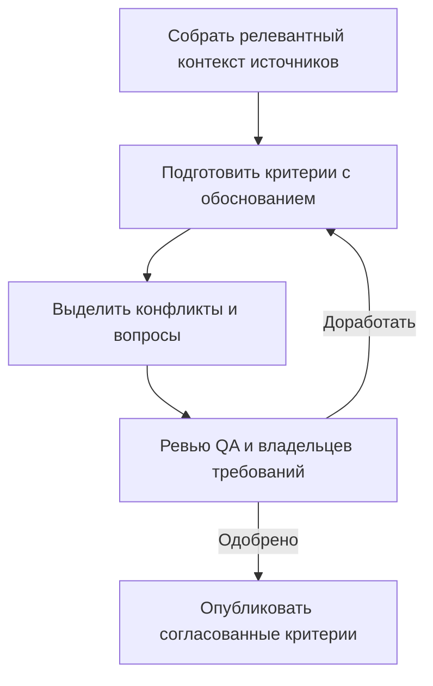

# Критерии приёмки с помощью AI

## Кратко

AI может собрать прослеживаемый черновик из разрозненных требований. Люди по-прежнему решают, корректны, полны и согласованы ли критерии.

## Содержание источника

Banki.ru описывает более раннее включение QA в поставку и skill для сбора контекста Jira, Confluence и Figma. Процесс выявляет устаревшую информацию и открытые вопросы, готовит основные и граничные критерии с обоснованием, запрашивает QA-ревью, затем публикует одобренные критерии через REST API Jira.

Команда сообщает о сокращении очереди тестирования и расширении использования сгенерированных критериев после внедрения процесса. Результат сочетает изменения процесса и AI; статья не изолирует причинный вклад AI. Генерация запускается локально, платформенная автоматизация описана как будущее. [Исходный кейс](https://habr.com/ru/companies/banki/articles/1056464/)

## Как это работает

## Практика QA

Попробуйте, когда смысл функции разбросан по задаче, дизайну и обсуждению. Сохраняйте ссылки и нерешённые вопросы видимыми. Цель — меньше труда по сбору контекста при сохранении качества требований.

### Авторский пример проверяемого результата

| Поле | Пример |
| --- | --- |
| Сценарий | Сохранённый поиск не находит записей |
| Ожидаемое поведение | Показать согласованное пустое состояние |
| Свидетельства | Требование AC-04 и дизайн пустого состояния |
| Открытый вопрос | Сохранять ли фильтры после обновления? |
| Владелец ревью | Ответственный за продукт/анализ и QA |

Вопрос без ответа должен оставаться вопросом, а не выдуманным поведением продукта. Критерии приёмки задают согласованные результаты и не заменяют полную стратегию тестирования.

## Риски и ограничения

Проверяйте пропущенные границы, конфликты версий, выдуманные правила, доступ к исходным данным и права публикации. Измеряйте исправления ревьюера и пропуски требований вместе с экономией времени. Поведение коннекторов, стоимость модели и локальные метки в источнике — контекстные наблюдения, а не текущие гарантии продукта. Метка отсутствия отдельного QA-выполнения не устанавливает низкий риск изменения.

Полный текст прочитан. Скриншоты не переписывались в переиспользуемую реализацию; сам skill не устанавливался и не проверялся.

## Связанные темы и источники

- [Планирование тестирования](../../qa/qa-process/test-planning.md)
- [Тестирование форм](../../playbooks/checklists/form-testing.md)
- [Учебный ресурс OpenAI Academy](openai-academy-workplace-ai.md)
- Маргарита Солобаева, [критерии приёмки с AI в Banki.ru](https://habr.com/ru/companies/banki/articles/1056464/). Первичный опыт команды, а не независимая контролируемая оценка.
