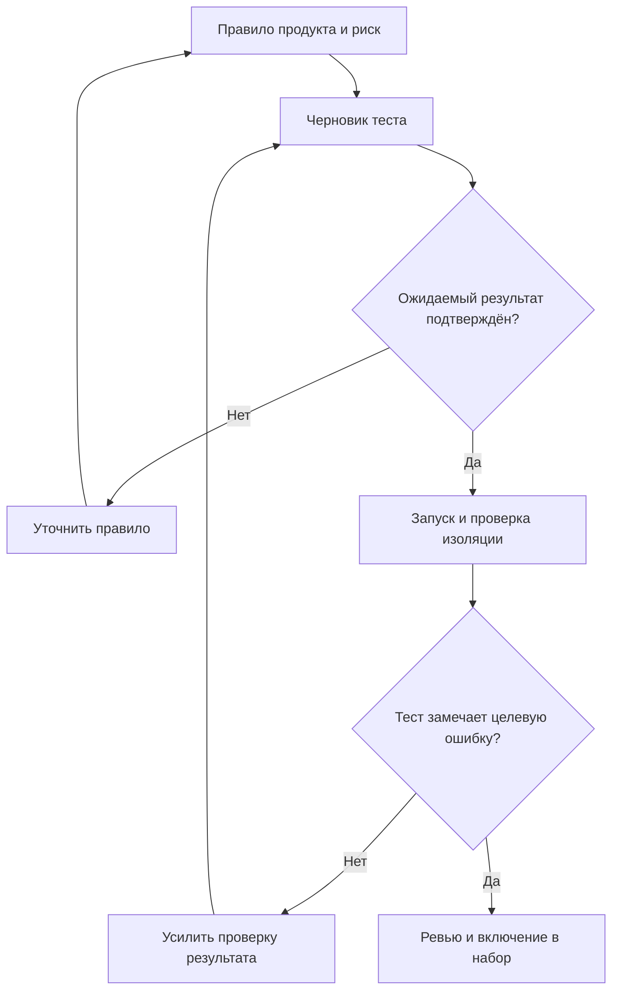

# AI-тесты: проверка смысла и надёжности

ИИ ускоряет подготовку тестов, но ожидаемый результат должен опираться на согласованное правило. Тест, написанный только по реализации, способен закрепить её ошибку. Количество кейсов и зелёный прогон сами по себе не доказывают качество проверок.

## Контур приёмки теста

## Два независимых этапа

Сначала проверьте происхождение ожидаемого результата и связь с риском. Затем проверьте сборку, повторяемость, очистку данных и зависимости. GitHub рекомендует запускать и дополнять сгенерированные тесты; генерация не гарантирует полноту сценариев.

Мутационное тестирование оценивает чувствительность набора к небольшим изменениям кода. Выжившая мутация требует разбора: возможны недостаточные assertions, отсутствие подходящего сценария или эквивалентное изменение. Mutation score также не заменяет проверку требований.

## Пример для проекта

Авторский пример: по согласованному правилу три неудачных ввода кода блокируют четвёртую попытку. Проверки должны различать вторую, третью и четвёртую попытки, учитывать сброс счётчика и изоляцию пользователей. Если изменить порог в реализации, тест на границе должен обнаружить расхождение. Запишите владельца правила и ссылку на требование рядом с тестом.

Оцените пилот на одной функции по общему времени подготовки, ревью и поддержки. Отдельно учитывайте найденные дефекты и нестабильность, чтобы скорость генерации не скрывала стоимость проверки.

## Источники

- [Нетология / kirakirap — ИИ пишет тест-кейсы и автотесты за тебя: как их генерировать и не получить ложное покрытие (RU)](https://habr.com/ru/companies/netologyru/articles/1070438/)
- [GitHub Docs — Writing tests with GitHub Copilot (EN)](https://docs.github.com/en/copilot/tutorials/write-tests)
- [Stryker — What is mutation testing? (EN)](https://stryker-mutator.io/docs/)
