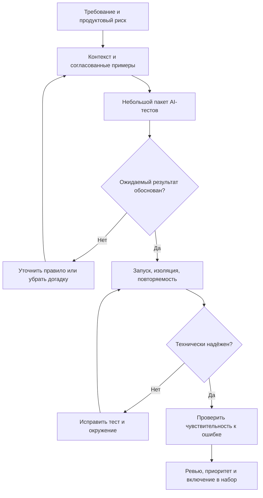

# AI-тесты: проверка смысла и надёжности

ИИ полезен для подготовки черновиков, оформления документации и заготовок автотестов. Принимать результат стоит после проверки продуктового правила, существенных assertions и надёжности исполнения. Ответственность за достаточность набора остаётся у команды.

## От правила до принятого теста



## Генерация из требований и из кода

| Основа | Что проверяем | Главный риск | Условие приёмки |
| --- | --- | --- | --- |
| Согласованное требование | Соответствие ожидаемому поведению | Пробелы превращаются в придуманные правила | Каждое ожидание связано с требованием; неизвестное вынесено в вопросы |
| Реализация | Наблюдаемое поведение и регрессионные изменения | Ошибка реализации закрепляется как норма | Ожидания сверены с независимыми правилами |
| Код, требования и существующие тесты | Дополнение набора в принятом стиле | Старые ошибки и слабые проверки наследуются | Новые сценарии дают проверяемую ценность |

Тестовый оракул — способ определить правильность результата. Исследование о генерации оракулов на Java-проектах показывает риск воспроизведения текущего поведения. Его результаты не означают одинаковую точность для всех моделей и продуктов.

## Где использовать AI и кто принимает решения

Ниже — рабочее распределение ответственности для команды, а не обязательные должностные границы.

| Работа | Что поручить AI | Что подтверждает команда |
| --- | --- | --- |
| Позитивные сценарии | Черновик по известным правилам | Полноту основного потока |
| Негативные сценарии | Варианты нарушений входных ограничений | Продуктовые запреты и последствия отказа |
| Граничные значения | Значения вокруг заданного порога | Сам порог, единицы и включённость границы |
| Тестовые данные | Синтетические наборы нужного формата | Ограничения домена и пригодность данных |
| Документация | Оформление выбранных проверок | Смысл и актуальность |
| Автотесты | Код с fixtures и mocks | Assertions, реальные интерфейсы и изоляцию |
| Изменение регресса | Предложения по изменённым правилам | Влияние на соседние функции |
| Приоритеты | Сортировку по заданной модели риска | Стоимость ошибки и решение о выпуске |
| Исследование | Гипотезы и подсказки | Реакцию на новое поведение продукта |

GitHub рекомендует передавать существующие тесты и контекст функции, делить запросы на небольшие задачи, запускать результат и дополнять пропущенные сценарии. Mock полезен для контроля взаимодействия; он не доказывает совместимость с реальным сервисом.

## Почему зелёный прогон бывает недостаточным

| Сигнал | Что он устанавливает | Чего не устанавливает |
| --- | --- | --- |
| Тест собрался | Синтаксис и зависимости приемлемы | Верность бизнес-правила |
| Тест прошёл | Проверки согласуются с этим запуском | Полноту сценариев |
| Покрытие выросло | Исполнены новые участки кода | Качество ожидаемых результатов |
| Мутация обнаружена | Набор заметил конкретное изменение | Отсутствие других дефектов |
| Повторные прогоны стабильны | В выбранных условиях не проявилась нестабильность | Стабильность во всех окружениях |

Исследование тестов для СУБД обнаруживает нестабильность, связанную в том числе с предположениями о порядке результатов. Не сравнивайте список как упорядоченный, если контракт допускает любой порядок. Если порядок является требованием, проверяйте именно его.

Мутационное тестирование меняет небольшие элементы реализации и запускает набор заново. Выжившую мутацию нужно разобрать: возможны слабая проверка, пропущенный сценарий или эквивалентное изменение. Известную воспроизводимую ошибку также можно использовать как контрольный пример. Проверка должна падать из-за нужного расхождения, а не сбоя подготовки.

## Практический пример: лимит экспорта

Авторский пример. Правило EXP-01 разрешает редактору экспортировать не более 50 строк; читатель не может экспортировать данные. При отказе файл не создаётся.

| Роль | Строк | Ожидание | Риск |
| --- | --- | --- | --- |
| Редактор | 49 | Файл с 49 строками | Потеря данных |
| Редактор | 50 | Файл с 50 строками | Ошибка на включённой границе |
| Редактор | 51 | Отказ, файл не создан | Обход лимита |
| Читатель | 1 | Отказ, файл не создан | Нарушение доступа |

Если реализация использует условие «меньше 50», тест только на 49 строк пройдёт, но дефект останется. Тест на 50 строк выявит его при ожидании, взятом из EXP-01. Проверка «файл не пустой» недостаточна: сверяйте число строк и необходимые значения. Поведение при нуле строк пока не задано — его нужно уточнить.

## Контекст для небольшого пакета проверок

Передайте агенту правило с ID, доступные API-контракты, пример существующего теста, ограничения окружения и связанные дефекты. Авторский шаблон задания:

```text
Подготовь проверки EXP-01 для ролей reader/editor и границы 50 строк.
Для каждой укажи: правило, риск, вход, ожидаемый результат,
проверку побочных эффектов и уровень автоматизации.
Не определяй поведение для нуля строк: вынеси его в вопросы.
Используй только предоставленные интерфейсы.
Отдельно покажи новые сценарии и пересечения с существующими тестами.
```

Классы эквивалентности помогают группировать одинаковое поведение; границы проверяют точки его изменения. Для нескольких условий используйте таблицу решений, для жизненного цикла — переходы состояний. Pairwise может уменьшить набор комбинаций, но не гарантирует обнаружение ошибок, зависящих от трёх и более факторов; число кейсов определяется конкретной моделью параметров.

## Чек-лист приёмки

- [ ] Ожидание имеет независимое основание, включая владельца неоднозначного правила.
- [ ] Указаны риск и наблюдаемый результат проверки.
- [ ] Проверены допустимые и запрещённые действия, включая отсутствие нежелательных побочных эффектов.
- [ ] Классы входов и точки смены поведения выбраны осознанно.
- [ ] Роли, состояния, повторы и конкурирующие операции рассмотрены по риску.
- [ ] Методы, поля и элементы UI существуют в текущей версии.
- [ ] Дубли оценены по проверяемому свойству; разные поля не объединены без проверки их логики.
- [ ] Assertions обнаруживают ошибочное значение, а не только наличие ответа.
- [ ] Подготовка и очистка изолированы; порядок, время и внешние зависимости контролируются.
- [ ] Целевое нарушение обнаруживается воспроизводимо, а причины падения понятны.

## Пилот и оценка пользы

Возьмите одну функцию и сравните процесс с привычной подготовкой тестов. Учитывайте суммарное время генерации, ревью, исправления и поддержки; причины отклонения черновиков; найденные дефекты; нестабильные прогоны. Исследование TestGen-LLM показывает подход с фильтрацией по сборке, стабильности и дополнительному покрытию перед инженерным ревью. Это пример процесса, а не обещание такой же эффективности в другом проекте.

Связанные материалы: [AI и критерии приёмки](ai-assisted-acceptance-criteria.md), [AI и тестовая документация](ai-assisted-qa-documentation.md).

## Источники

- [Нетология / kirakirap — ИИ пишет тест-кейсы и автотесты за тебя: как их генерировать и не получить ложное покрытие (RU)](https://habr.com/ru/companies/netologyru/articles/1070438/)
- [GitHub Docs — Writing tests with GitHub Copilot (EN)](https://docs.github.com/en/copilot/tutorials/write-tests)
- [Stryker — What is mutation testing? (EN)](https://stryker-mutator.io/docs/)
- [ISTQB — Certified Tester Foundation Level v4.0 (EN)](https://istqb.org/certifications/certified-tester-foundation-level-ctfl-v4-0/)
- [Do LLMs generate test oracles that capture the actual or the expected program behaviour? (EN)](https://arxiv.org/html/2410.21136v1)
- [On the Flakiness of LLM-Generated Tests for Industrial and Open-Source Database Management Systems (EN)](https://arxiv.org/abs/2601.08998)
- [Automated Unit Test Improvement using Large Language Models at Meta (EN)](https://arxiv.org/abs/2402.09171)
