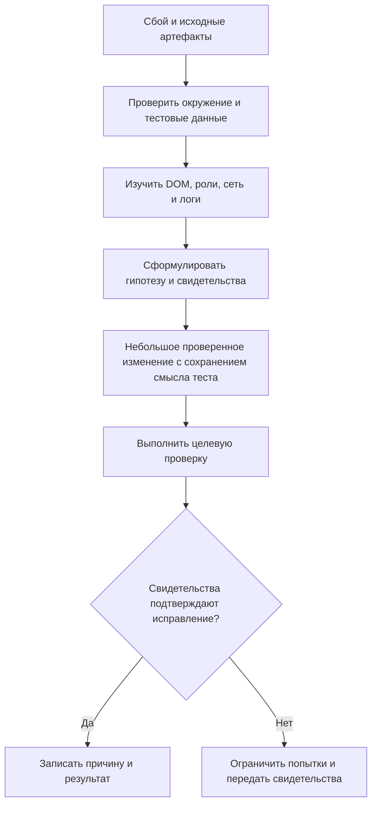

# AI-триаж тестов по свидетельствам

## Кратко

Кейс банковского проекта SENSE описывает AI-помощь в исправлении UI, подготовке тестов, перезапусках Allure, диагностике браузерного грида и проверках Kafka. Проектные инструкции направляют оркестратор и workers. Автор сообщает о сокращении времени расследований, но также о выдуманных селекторах, повторных неудачных исправлениях и потере контекста. Полезный подход — собирать свидетельства до предложения исправления.

## Процесс триажа

## Чек-лист ревью

- Сохранить упавший assertion: замена корректности текста видимостью меняет смысл теста.
- Исследовать перехваченные клики до JavaScript-клика, обходящего обычное взаимодействие.
- Сверить селекторы и существующие шаги с реальным приложением и репозиторием.
- Связать записи Kafka с текущей операцией; подстрока в старом сообщении — слабое свидетельство.
- Сохранить видимость первичных сбоев и повторов; `ignoreFailures` требует отдельного действенного гейта качества.
- Передавать ограничения и отвергнутые гипотезы при делегировании.

## Ограничения и уточнения

Для заявленной экономии нет независимо воспроизведённого базового уровня. Примерная оценка токенов объединяет вход и выход по одному тарифу и пропускает существенные эксплуатационные расходы; это не ценовое предложение и не модель лимита подписки. Облачный API сам по себе не требует покупки GPU. Учётные данные, широкие права и отключение проверки сертификатов в примерах не являются production-настройками по умолчанию. Примеры прочитаны, но не запущены; сгенерированные исправления требуют проверки поведения продукта.

## Связанные темы и источник

- [Ревью Playwright за пределами линтинга](../../qa/automation/playwright-review-beyond-lint.md)
- [Критерии приёмки с AI](ai-assisted-acceptance-criteria.md)
- [Кейс AI-расследования сбоев](https://habr.com/ru/articles/1062316/). Прочитан полный кешированный текст.
