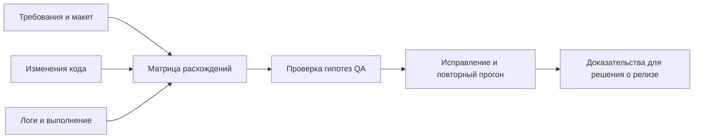

# AI-агент в мобильном QA: проверки по свидетельствам

Агент полезен там, где нужно сопоставлять код, требования и результаты выполнения. Его вывод становится основанием для проверки, а решение о качестве требует наблюдаемого результата.

## Что переносить из практики

В статье описаны чек-лист по diff с merge-base и запуском в CI, сверка Jira/Figma, сравнение iOS/Android, аналитика по схеме, коду и логам, черновик баг-репорта, анализ исправления и подготовка UI-тестов. Внутренние скиллы не являются готовым публичным комплектом.

Полезные правила автоматизации: сначала найти маршрут к экрану и существующие компоненты; добавить только нужную Accessibility-разметку; переиспользовать Page Object и фикстуры; изолировать данные; завершить тест содержательной проверкой. Симулятор дополняет реальные устройства. Статический разбор исправления не заменяет ретест.

## Пилот на одной фиче — авторская схема

| Шаг | Вход | Результат и контроль QA |
| --- | --- | --- |
| Карта изменения | Базовый коммит, diff, полный контекст затронутых файлов | Перечень рисков; проверить зависимости вне diff |
| Контракт | Критерии приёмки и конкретный узел макета | Согласованные ожидания; конфликт не разрешать догадкой |
| Две платформы | Одна фича и версии обеих реализаций | Различия логики, состояний, API, сети, кэша, конфигурации, экспериментов, аналитики, авторизации, оффлайна, навигации, текстов, тестов и крайних случаев; учитывать допустимые платформенные различия |
| Аналитика | Схема события, код отправки, запись сценария | События и поля сопоставлены; отсутствие в неполном логе не доказательство отсутствия события |
| Дефект | Шаги, сборка, фактическое поведение, ожидаемый контракт | Проверяемый черновик; публикация по принятому в команде процессу |
| Исправление | Баг, новый diff, воспроизведение | Причина устранена; исходный сценарий и соседний риск проверены |
| Автотест | Утверждённый сценарий, существующая инфраструктура | Тест компилируется и выполняется; assertion проверяет результат, а не только наличие элемента |

### Пример проверки аналитики

Для вымышленного события `filter_applied` задайте контракт: после подтверждения фильтра событие возникает один раз, содержит идентификатор фильтра и не содержит персональных данных. Пройдите сценарий, сохраните запись с временем и идентификатором сессии, сопоставьте её с кодом. Повторите при отмене и повторном нажатии. Политика повторной доставки должна быть задана отдельно: повтор транспортной попытки не обязательно означает повтор пользовательского действия.

### Измеряем экономию

Начните с чтения без внешних записей: карта изменений и сверка аналитики. На 3–5 сходных задачах измерьте время подготовки, ручной проверки и исправления ошибок агента, расход запросов и число полезных замечаний. Сравните с обычным процессом. Подключайте создание тикетов и изменение тестов только после оценки результата и настройки доступа.

Приёмка включает реальное устройство, сеть, жесты и UX. Не считайте сгенерированный тест проверенным до запуска; самооценка агента тоже не заменяет ревью. Перед передачей логов удаляйте токены и личные данные.

## Связанные материалы

- [AI в ежедневной работе QA](everyday-ai-qa-workflows.md)
- [Процессы поставки с AI-агентами](../agents/agent-delivery-workflow.md)

## Источник

- [Александр Чернышев / adcher: «Как ИИ-агент проходит весь цикл мобильного тестирования в hh.ru» (RU)](https://habr.com/ru/companies/hh/articles/1083878/). Прочитан доступный текст; изображения, внутренние скиллы и связанные доклады отдельно не изучались. Упомянутые в статье версии моделей и продуктов не проверялись; процесс выше не зависит от них. Интеграция мобильных инструментов в Lab не выполнялась.
