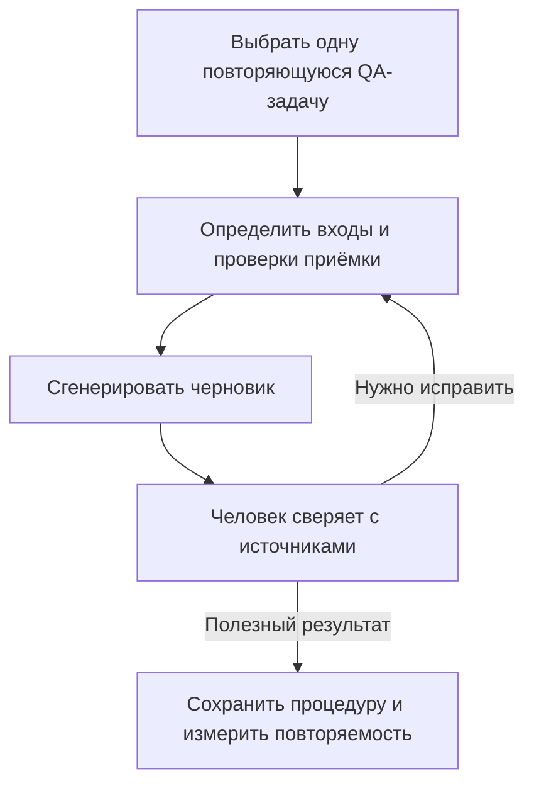

# OpenAI Academy — обучение рабочему применению AI для QA

## Зачем это QA

**Наша оценка:** средняя или высокая релевантность для QA с AI и управления QA; ограниченная прямая релевантность тестированию LLM-систем. Практическая возможность — превратить случайное полезное взаимодействие с AI в проверяемую процедуру.

## Практика: предлагаемые QA-упражнения

Это авторские адаптации, а не подтверждённые упражнения курсов.

| Практика | Упражнение QA | Что проверить |
| --- | --- | --- |
| Ясный контекст | Дать вымышленный контракт endpoint и запросить идеи тестов | Проследить каждую идею до требования или явного допущения |
| Повторяемый процесс | Превратить очищенные заметки дефектов в черновик триажа | Пропущенные факты, обоснование серьёзности и воспроизводимость |
| Ограниченная работа агента | Попросить регрессионный чек-лист по описанию изменения | Объём, неподтверждённые утверждения и пропущенные риски |

## Пример процесса

Начните с маленькой задачи на синтетических или разрешённых данных. Сравните с человеческим базовым результатом: полезное покрытие, фактические ошибки, пропуски, усилия ревью и общее время. Повторите на нескольких примерах перед внедрением в команду.

## Частые ошибки и ограничения

- Считать сертификат доказанной компетентностью QA.
- Считать скорость генерации без времени ревью и исправлений.
- Подменять явные критерии приёмки переиспользуемым промптом.
- Считать анонс поставщика независимым доказательством эффективности.
- Предполагать охват оценки галлюцинаций, prompt injection или стратегии LLM-тестирования: анонс не подтверждает этого.

## Приоритет изучения

SHOULD KNOW для QA Manager, изучающего внедрение AI в команду. Сначала выберите упражнение, затем оцените поддержку курсом. Полное прохождение пока не рекомендуется: глубина программы и условия доступа не проверены.

## Практические принципы

- [Проверка API-запроса](../../playbooks/checklists/api-request-review.md)
- [Планирование по рискам](../../qa/qa-process/test-planning.md)
- [Исследовательские эвристики](../../qa/manual-testing/exploratory-heuristics.md)

## Источники

- OpenAI, [New OpenAI Academy courses for the next era of work](https://openai.com/index/academy-courses-applying-ai-at-work/), 12 июня 2026; проверено 5 сентября 2026. Первичный источник собственного анонса; рекламные утверждения не являются независимой валидацией.
- Анонс ссылается на [OpenAI Academy](https://academy.openai.com/). Запись и содержание курсов не изучались.
