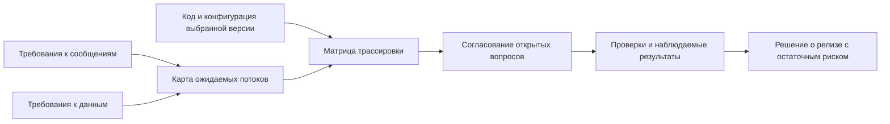

# Трассировка требований для рискованного релиза

Для рискованного изменения важно восстановить цепочку «триггер → обработка → наблюдаемый результат» и привязать ожидания к конкретным версиям требований и кода.

## Поиск от результата к причине

В кейсе Сергея Терентьева анализ начинается с требований к Kafka-топику, целевой SQL-таблице и карты реализации. Затем восстанавливаются запускающие события и сравниваются ожидаемые потоки с кодом. Выводы сохраняют ссылки и проходят проверку специалистов нескольких команд. Полученный контекст переиспользуется с разделением production, ветки и документированных ожиданий.

## Рабочая модель — авторская адаптация

Поиск требований и реализаций может выполняться независимо; сравнение требует их результатов. Отсутствие найденной связи не доказывает отсутствие реализации или требования.

| Результат сравнения | Следующий шаг QA — авторская рекомендация |
| --- | --- |
| Ожидание и код согласуются | Запустить сценарий; проверить данные и сообщения |
| Поведение различается | Уточнить актуальный контракт; воспроизвести различие |
| Реализация не найдена | Проверить репозитории, конфигурацию и динамические связи |
| Требование не найдено | Установить владельца правила; проверить, не устарела ли документация |
| Источники конфликтуют | Записать вопрос и решение владельца; не выбирать правду голосованием агентов |

## Шаблон записи для своего проекта

Это предложенный шаблон Lab, а не формат из исходной статьи.

| Поле | Что фиксировать |
| --- | --- |
| Область | Фича, сервисы, включённые и исключённые потоки |
| Версия | Коммит, сборка, среда, версия требования и конфигурации |
| Ожидание | Триггер, предусловия, результат, ссылка на согласованный контракт |
| Реализация | Файл/символ и объяснение найденной связи |
| Проверка | Данные, действие, точка наблюдения, время ожидания |
| Свидетельство | Лог, идентификатор операции, запрос к данным или сообщение |
| Решение | Открытый вопрос, владелец, статус проверки и остаточный риск |

### Пример без реальных данных

Для вымышленной отмены заказа ожидаются событие `order_cancelled` и согласованное изменение статуса. Проверяйте связь по идентификатору операции, а не наличие похожего сообщения в топике. Добавьте повторную отмену, сбой доставки и задержку обработчика. Установите допустимое время сходимости и способ обнаружить несогласованные состояния: мгновенное равенство БД и события может не соответствовать асинхронному контракту.

## Границы уверенности

Согласование отчёта повышает доверие, но не доказывает исчерпывающее покрытие. Сохраняйте область поиска и неизвестные зависимости; отдельно проверяйте выполнение. Индекс ускоряет поиск, но итоговые выводы сверяют с полными актуальными источниками. Изменение версии или конфигурации требует пересмотра соответствующих связей.

Для пилота выберите один поток и доступ только на чтение. Измеряйте время поиска, проверки выводов и исправления ошибок. Специализация агентов сама по себе не гарантирует экономию: повторное чтение, координация и ревью тоже расходуют ресурсы. В Lab эта интеграция не внедрялась.

## Связанные материалы

- [AI в ежедневной работе QA](everyday-ai-qa-workflows.md)
- [Проверки мобильного QA по свидетельствам](mobile-agent-evidence-workflow.md)

## Источник

- [Сергей Терентьев: «От тестирования релиза с высоким уровнем риска к новому ИИ-инструменту для QA» (RU)](https://habr.com/ru/articles/1086968/). Прочитан доступный текст; архитектурное изображение и оригинал LinkedIn отдельно не анализировались. Результаты команды описаны автором и в Lab не воспроизводились.
