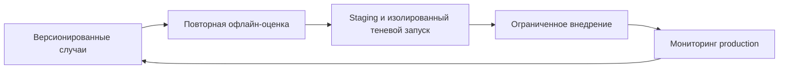

# Оценка агентов от разработки до production

## Кратко

AWS и Motorway описывают оценку агента поиска автомобилей до релиза и на выборке production-трафика. Подход сочетает детерминированные проверки инструментов, модельные оценки и калибровку человеком. Многошаговые диалоги и повторы выявляют сбои, скрытые за беглым одиночным ответом. Сообщаемые улучшения — результаты кейса, а не независимо воспроизведённые измерения.

## Матрица оценки

| Измерение | Авторский пример QA AI Lab |
| --- | --- |
| Инструмент и параметры | Искать заметки API с правильным языковым фильтром |
| Результат | Возвращать релевантные заметки с работающими ссылками источников |
| Контекст диалога | Добавить фильтр начинающего, не потеряв тему API |
| Доступ и побочные эффекты | Не раскрывать чужую приватную коллекцию |
| Актуальность | Исключить удалённую заметку из результатов |
| Эффективность | Измерять задержку, вызовы и стоимость завершённой задачи |

## Надёжность и ограничения

`pass@k` означает хотя бы один успех; `pass^k` — успех во всех попытках. Упрощение вероятности `p^k` предполагает независимые попытки с одинаковой вероятностью успеха. Сообщайте результаты по случаям и неопределённость, не превращая маленькую выборку в гарантию.

Повторы не устраняют смещение судьи. Калибруйте судей по человеческой разметке и напрямую проверяйте измеримые результаты. Оценивайте наблюдаемые действия и объяснения, не считая их раскрытием внутреннего рассуждения. Допускайте эквивалентные корректные пути инструментов, где порядок не обязателен.

Пороги, доли выборки, требования среды и оценки стоимости — решения конкретного подхода. Малая выборка может пропустить редкие тяжёлые сбои. Офлайн-оценка не обеспечивает авторизацию при выполнении; теневые инструменты должны предотвращать реальные записи. Ресурсы AWS не развёртывались, сопутствующий код не проверялся.

## Связанные темы и источник

- [Триаж по свидетельствам](../ai-for-testing/evidence-led-test-triage.md)
- [Тестирование на основе свойств](../../qa/automation/property-based-testing.md)
- [Подход AWS и Motorway к оценке](https://aws.amazon.com/blogs/machine-learning/evaluating-ai-agents-a-production-blueprint-with-strands-and-agentcore/). Прочитан полный кешированный текст.
