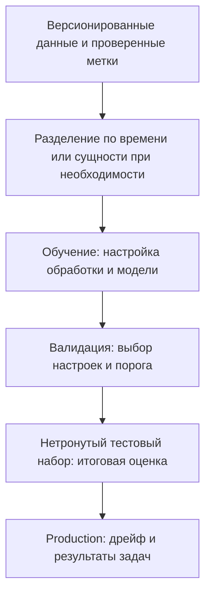

# Основы машинного обучения для QA

## Понятия

| Понятие | Значение | Вопрос QA |
| --- | --- | --- |
| Признак / метка | Входное измерение / ожидаемая цель | Надёжна ли метка и был ли вход доступен в момент предсказания? |
| Классификация | Предсказать категорию | Какой класс положительный и какая ошибка важнее? |
| Регрессия | Предсказать численную величину | Какая ошибка допустима в единицах продукта? |
| Порог | Превратить оценку в решение | Что происходит ниже, на границе и выше? |
| Переобучение | Усвоить особенности обучения, плохо обобщаемые на новые данные | Как меняется результат на независимых данных? |
| Функция потерь | Цель, измеряющая ошибку предсказания | Улучшает ли её оптимизация результат продукта? |

[Глоссарий источника](https://ml-cheatsheet.readthedocs.io/en/latest/glossary.html) полезен для знакомства, но требует исправлений: loss не всегда является знаковой невязкой, а нормализация входов отличается от штрафов на веса модели.

## Разобранный пример: триаж дефектов

Авторский пример: классификатор отмечает вероятные продуктовые ошибки среди 1,000 упавших тестовых запусков. Человек выявляет 100 настоящих продуктовых дефектов.

| Предсказание | Реальный дефект продукта | Реальный непродуктовый сбой |
| --- | --- | --- |
| Отмечен дефект | 80 истинноположительных | 40 ложноположительных |
| Не отмечен | 20 ложноотрицательных | 860 истинноотрицательных |

| Метрика | Расчёт | Интерпретация |
| --- | --- | --- |
| Accuracy | (80 + 860) / 1,000 = 94% | Верные решения в целом |
| Precision | 80 / (80 + 40) = 66.7% | Около двух третей отмеченных запусков — реальные дефекты |
| Recall | 80 / (80 + 20) = 80% | Пятая часть реальных дефектов пропущена |
| Доля ложноположительных | 40 / (40 + 860) = 4.4% | Доля непродуктовых сбоев, ошибочно отмеченных |

Постоянный ответ «не дефект продукта» уже дал бы 90% accuracy. Сравнивайте с этой базой, не останавливаясь на 94%. Сохраняйте количества, баланс классов и результаты подгрупп вместе с процентами. Для нулевых знаменателей нужно явное соглашение отчётности.

## Оценка без утечки ответов

Обучайте scalers и выбор признаков только на обучающих данных, затем применяйте преобразование к валидационным и тестовым. При кросс-валидации обучаемая обработка должна оставаться внутри каждого обучающего fold. Это соответствует [рекомендациям scikit-learn по утечкам](https://scikit-learn.org/stable/common_pitfalls.html#data-leakage).

В условном инструменте триажа не помещайте почти одинаковые сбои одного инцидента одновременно в обучение и тест. Тестовые метки не должны утекать через поля позднейшего расследования. Сохраняйте отдельный итоговый тестовый набор, когда валидация направляет выбор модели.

## Потери и регуляризация на практике

[Глава о потерях](https://ml-cheatsheet.readthedocs.io/en/latest/loss_functions.html) вводит log loss для вероятностной классификации и MAE, MSE, RMSE для численных ошибок. Log loss штрафует уверенные неверные предсказания. MAE и RMSE сохраняют единицы цели; MSE использует квадрат единиц. Напечатанная формула Huber ошибочна — не копируйте её в тесты.

[Глава о регуляризации](https://ml-cheatsheet.readthedocs.io/en/latest/regularization.html) рассматривает аугментацию, dropout, раннюю остановку, ансамбли и штрафы весов. QA следует проверять режим оценки развёрнутой модели и сохранение смысла метки при аугментации. Удаление «не» может перевернуть смысл предложения. Ранняя остановка использует валидационные свидетельства; меньше ошибок обучения не доказывает улучшение.

## Логистическая регрессия: проверки перед доверием руководству

[Глава логистической регрессии](https://ml-cheatsheet.readthedocs.io/en/latest/logistic_regression.html) объясняет бинарные вероятностные оценки, пороги и обучение. Число от нуля до единицы не доказывает калибровку. Проверяйте точные границы и полный конвейер обработки. В примере scaling обучается до разбиения; Python сломан или устарел; два значения accuracy не являются надёжным сравнением реализаций.

## Что изучать сначала

Приоритетны матрицы ошибок, базовые ориентиры, пороги, независимые данные оценки и предотвращение утечек. Выводы оптимизаторов и архитектуры нейросетей могут подождать потребности проекта. Для LLM-агентов основы дополняют проверки инструментов, доступа, свидетельств и завершения задачи, но не заменяют их.

## Источники

- [Жизненный цикл оценки агентов](agent-evaluation-lifecycle.md)
- [AI-триаж по свидетельствам](../ai-for-testing/evidence-led-test-triage.md)
- [Тестирование на основе свойств](../../qa/automation/property-based-testing.md)
- [Разбор источника и непрочитанные главы](../../docs/sources/ml-cheatsheet-review.md)
