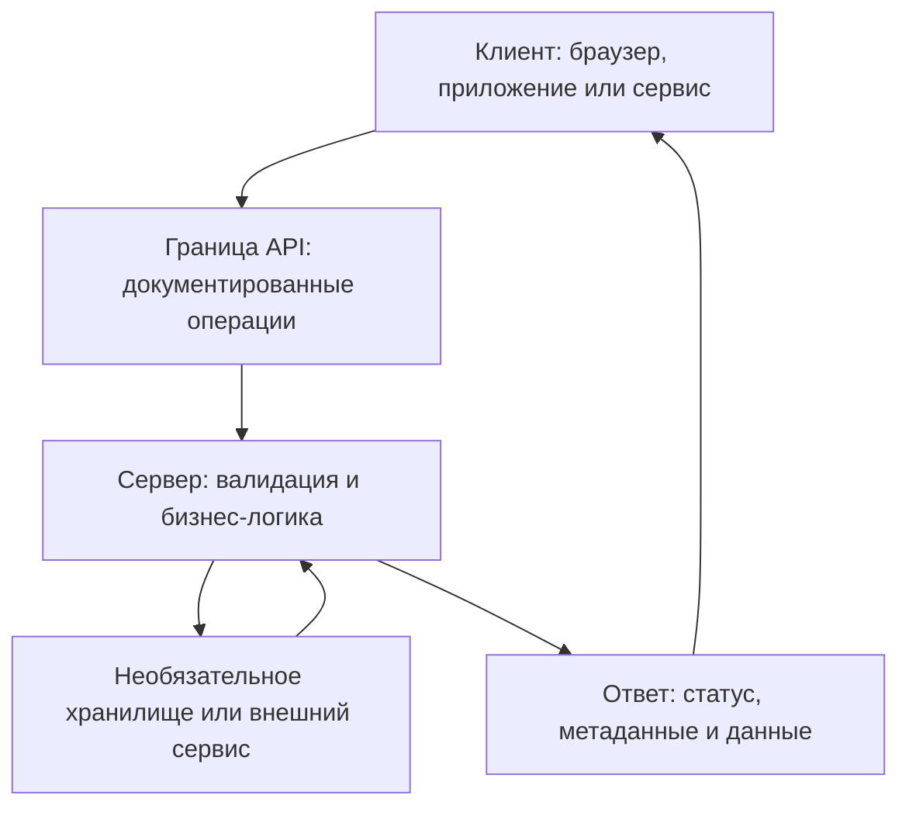

# Основы API и подводные камни HTTP

## Архитектура на одной схеме

| Понятие | Практическая трактовка |
| --- | --- |
| Клиент / сервер | Роли взаимодействия; клиенту необязателен UI |
| API | Контракт интерфейса; не все API удалённые или основаны на HTTP |
| База данных | Необязательная зависимость, а не условие существования сервера |
| RAM / постоянное хранилище | Данные могут находиться в любом из них; проверяйте требования сохранности |
| DNS | Разрешает имена; один домен не обязательно соответствует одному серверу или IP |
| HTTPS | Защищает соединение TLS; не доказывает корректность приложения |

## Уточнения HTTP, которые стоит запомнить

- Ответ POST может кешироваться при определённых условиях; проверяйте реальную политику
- Серверы, шлюзы и приложения могут ограничивать размер тела
- Семантика замены не задаёт именно такой результат для поля; нужен контракт
- Это отказ; аутентификация не является универсальным предварительным условием
- Это непредвиденный сбой сервера, а не подтверждение валидности входа
- Так устроен HTTP/1.x; HTTP/2 использует фреймы и псевдозаголовки

Уточнения основаны на [семантике HTTP](https://www.rfc-editor.org/rfc/rfc9110.html#section-9) и [HTTP/2](https://www.rfc-editor.org/rfc/rfc9113.html#section-8.3). Методы HTTP не являются прямыми командами БД. POST тоже может содержать query-параметры.

## Безопасность и данные

Для современного HTTPS используйте термин TLS. Сертификат помогает аутентифицировать endpoint, но не подтверждает честность сайта. Шифрование не скрывает все метаданные соединения и не мешает конечным сторонам записывать содержимое в логи. См. [TLS 1.3](https://www.rfc-editor.org/rfc/rfc8446.html#section-1).

JSON и XML — форматы представления, а не конкурирующие транспортные протоколы. REST не требует JSON. Пустой элемент XML не эквивалентен JSON null автоматически: соответствие зависит от схемы. Различайте отсутствующее поле, null, пустую строку и пустую коллекцию.

## Практика: авторское упражнение с контрактом

Для вымышленного API контактов сначала задайте медиатипы, обязательность полей, семантику обновлений и правила доступа. Затем соберите небольшой набор свидетельств:

| Сценарий | Что проверить |
| --- | --- |
| Создать контакт | Документированный успешный статус и возвращённый идентификатор |
| Прочитать его обратно | Сохранённые значения соответствуют намерению при создании |
| Пропустить email при замене | Предусмотренные контрактом отказ, значение по умолчанию или удаление |
| Передать неподдерживаемый медиатип | Документированный ответ без нежелательного изменения данных |
| Повторить операцию после тайм-аута | Дублирующие эффекты и политика повторов |
| Вызвать серверный сбой | Запрос, correlation ID и доступные сведения с сервера |

Не определяйте виновный компонент только по статусу. Зафиксируйте сбой и выясните, возник ли он в приложении, шлюзе или другой зависимости.

## Источники

- [Продолжение, части 3–5: инструменты, безопасность и автоматизация](../../tools/developer-tools/api-testing-toolkit.md)
- [QA4Life / Евгений Гусинец — Часть 1: Основы](https://telegra.ph/SHpargalka-po-API-dlya-QA-CHast-1-Osnovy-07-07)
- [QA4Life / Евгений Гусинец — Часть 2: HTTP и данные](https://telegra.ph/SHpargalka-po-API-dlya-QA-CHast-2-HTTP-i-dannye-07-07)
- [Основы запросов REST API](rest-api-request-basics.md)
- [Чек-лист API-запроса](../../playbooks/checklists/api-request-review.md)
