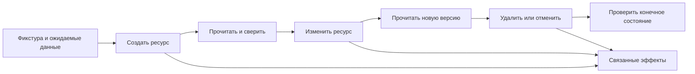

# Тестирование API: ответ, доступ и состояние

Проверка API связывает контракт, правила продукта и фактическое состояние после операции. Успешный HTTP-статус подтверждает только часть результата. Перед тестом зафиксируйте исходные данные, ожидаемый ответ и допустимые изменения связанных ресурсов.

## Жизненный цикл ресурса



## 20 проверок по пяти группам

Матрица — рабочая адаптация для проектирования тестов; конкретные поля, коды и правила задаются контрактом вашего API.

| Группа | № | Проверка | Проверяемое свидетельство |
| --- | --- | --- | --- |
| Успех | 1 | Статус | Операция действительно достигла заявленного результата |
| Успех | 2 | Структура | Обязательные и вложенные свойства соответствуют схеме |
| Успех | 3 | Типы и форматы | Числа, даты и идентификаторы имеют заданное представление |
| Успех | 4 | Значения | Ответ относится к текущему запросу и пользователю |
| Успех | 5 | Правила продукта | Расчёт подтверждён независимой фикстурой |
| Вход | 6 | Обязательность | Удаление обязательного свойства отклонено |
| Вход | 7 | Пустота и null | Отсутствие, null и пустая строка различаются по правилам |
| Вход | 8 | Неверный тип | Преобразование или отказ соответствуют контракту |
| Вход | 9 | Границы | Проверены пределы и соседние недопустимые значения |
| Вход | 10 | Дополнительные поля | Неизвестные свойства обработаны; защищённые не изменены |
| Ошибка | 11 | Статус отказа | Причина отказа правильно выражена протоколом |
| Ошибка | 12 | Тело | Структурированное сообщение соответствует ошибке |
| Ошибка | 13 | Раскрытие данных | Нет секретов и деталей реализации в публичном ответе |
| Доступ | 14 | Аутентификация | Отсутствующие и недействительные credentials отклонены |
| Доступ | 15 | Объект | Второй пользователь не читает и не меняет чужой ресурс |
| Доступ | 16 | Функция | Роль ограничена для каждого метода и операции |
| Состояние | 17 | Сохранение | Повторное чтение подтверждает результат изменения |
| Состояние | 18 | Связанные эффекты | Проверены резерв, событие или другие заданные последствия |
| Состояние | 19 | Повтор | Эффект соответствует обещанной идемпотентности |
| Состояние | 20 | Согласованность | Связанные операции показывают допустимую версию ресурса |

## Учебный пример Postman

Для вымышленного API библиотечных закладок контракт обещает `201` и объект с `id`, `title` и `owner_id`. Тестовая фикстура заранее задаёт ожидаемый заголовок и владельца. Скрипт добавляется в Post-response запроса создания:

```javascript
pm.test("Bookmark creation matches the fixture", () => {
  pm.response.to.have.status(201);
  const bookmark = pm.response.json();
  pm.expect(bookmark.id).to.be.a("string").and.not.empty;
  pm.expect(bookmark.title).to.eql(pm.collectionVariables.get("expected_title"));
  pm.expect(String(bookmark.owner_id)).to.eql(pm.collectionVariables.get("expected_owner_id"));
  pm.collectionVariables.set("bookmark_id", bookmark.id);
});
```

Следующий запрос `GET /bookmarks/{{bookmark_id}}` должен независимо проверить сохранённые значения. Для запрещённого изменения используйте пользователя B, затем прочитайте объект владельцем A: отказ в ответе ещё не доказывает отсутствие записи. Пример не запускался против реального сервиса.

## Как сделать assertions полезными

- Не вычисляйте ожидаемую цену только из цены в ответе: согласованные неверные значения пройдут такой тест. Используйте отдельную фикстуру и продуктовую формулу.
- Проверяйте ошибку по структурированному коду и полю, а не только поиском слова в JSON. Подстрока может встретиться в нерелевантном месте.
- Запрет дополнительных свойств включайте только если контракт закрытый; схема с `properties` сама не делает поля обязательными.
- Идемпотентность относится к эффекту: повторный DELETE может вернуть другой код. Для POST защита от повторов требует отдельного соглашения.
- При асинхронной операции задайте предельное время и допустимые состояния; polling должен завершаться с диагностикой, а не бесконечно скрывать отказ.

## Расширение набора и автоматизация

Добавляйте по рискам: пагинацию и стабильность порядка, лимиты и восстановление квоты, старые клиенты, конфликт конкурентных изменений, отказ зависимости, состояния feature flags, асинхронное завершение, подписи и дубли событий, кеш и изоляцию пользователей.

Коллекция должна иметь собственные данные, уникальные имена запросов, переменные окружения и очистку после сбоя. Сохраняйте ID после подтверждённого создания и не используйте старый ID при неудаче. Сначала установите ожидаемое поведение, затем автоматизируйте его. Базовые 20 проверок не заменяют нагрузочные, интеграционные и специализированные security-тесты.

## Связанные материалы

- [Основы API и ловушки HTTP](api-foundations-and-http-pitfalls.md)
- [HTTP-статусы](http-status-codes.md)
- [Инструменты и стратегия API-тестирования](../../tools/developer-tools/api-testing-toolkit.md)

## Источники

- [Нетология: «Как тестировать API: 20 проверок, которые должен уметь делать QA» (RU)](https://habr.com/ru/companies/netologyru/articles/1075684/)
- [RFC 9110: HTTP Semantics (EN)](https://www.rfc-editor.org/rfc/rfc9110.html)
- [JSON Schema: object (EN)](https://json-schema.org/understanding-json-schema/reference/object)
- [OWASP: Broken Object Level Authorization (EN)](https://api-security.owasp.org/editions/2023/en/0xa1-broken-object-level-authorization/)
