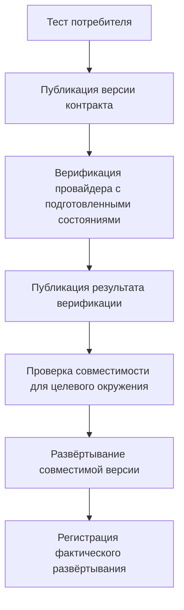

# Контракты от потребителя с Pact

## Кратко

Pact проверяет, удовлетворяет ли провайдер взаимодействиям, от которых зависят его потребители. Потребительские тесты выполняют клиентский код против mock; верификация провайдера проверяет эти взаимодействия на провайдере. Это уменьшает незамеченное расхождение mocks и сервисов, но не устанавливает полную бизнес-корректность.

## Процесс релиза

Официальная документация Pact объясняет: матрице совместимости нужны версии приложений, результаты верификации и точные записи развёртываний. Отсутствие верификации — неопределённость, а не успех. Pending-контракты позволяют разрабатывать без немедленного падения сборки провайдера; совместимость перед развёртыванием всё равно нужно проверять.

## Практическое QA-ревью

| Проверка | Пример |
| --- | --- |
| Реальное поведение потребителя | Выполнять production API-клиент, а не его тестовый дубликат |
| Содержательные matchers | Проверка типа string сама по себе не ограничивает допустимый enum статуса |
| Воспроизводимое состояние провайдера | Подготовить и очистить изолированный заказ для каждого взаимодействия |
| Покрытие ошибок | Включить реально используемые ответы отсутствующего ресурса и валидации |
| Оставшийся риск интеграции | Сохранить проверки аутентификации, транспорта и сквозного поведения |

## Ограничения и уточнения

Имя состояния потребителя в статье отличается от последующего обработчика провайдера, если не применить промежуточную параметризованную замену. Примеры — учебные фрагменты, а не проверенный запускаемый проект. Сгенерированный OpenAPI тоже может расходиться с поведением при выполнении; генерация не является доказательством. Контракты полезны известным клиентам публичного API, но не покрывают неизвестных потребителей. Цены, ребрендинг и скорость миграции независимо не проверялись.

## Связанные темы и источники

- [Основы API-запросов](rest-api-request-basics.md)
- [DSL тестовых данных](../automation/domain-test-data-dsl.md)
- [Статья о Pact](https://habr.com/ru/articles/1058382/). Прочитан полный кешированный текст; примеры не запускались.
- [Официальная документация совместимости развёртываний Pact](https://docs.pact.io/pact_broker/can_i_deploy), проверена 6 сентября 2026 года.
