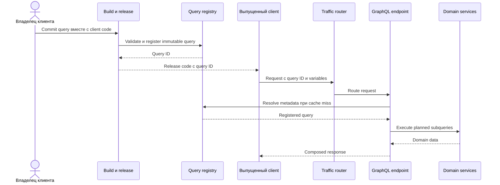

# Архитектура зарегистрированных GraphQL-запросов

Присланная схема ByteByteGo перерисовывает архитектуру LinkedIn: клиентские запросы тестируются и регистрируются при поставке, после чего production clients отправляют неизменяемые query IDs. Execution endpoint разрешает ID, кэширует metadata и распределяет subqueries по domain services. Это способ контроля production, а не обязательное свойство GraphQL.

## Build-time control plane

Владельцы клиента хранят queries рядом с client code. CI проверяет их по schema, назначает или получает стабильный identifier и публикует query в central registry до выпуска клиента. Регистрация создаёт allowlist известных operations и делает видимыми ownership, compatibility и usage.

Порядок release важен: client нельзя выпускать раньше доступности query, а удаление регистрации должно учитывать старые версии клиентов. Проверьте pipeline при schema incompatibility, duplicate registration, partial publication, rollback и одновременной работе нескольких client versions.

## Runtime data plane

Выпущенный client отправляет query ID и variables вместо произвольного query text. Traffic-routing layer направляет запрос в нужный frontend API server. GraphQL endpoint получает query из cache или registry, выполняет подготовленный plan через domain services и собирает response.

Pre-registration сокращает parsing и planning, поддерживает caching и ограничивает production operation set. При этом остаются дорогие разрешённые запросы, field authorization, N+1 access, downstream fan-out, stale cache и риск раскрытия чувствительных данных.

## Стратегия QA

Проверяйте вместе три контракта:

1. **Schema contract:** fields, nullability, types, deprecation и authorization совместимы с поддерживаемыми clients.
2. **Registry contract:** ID соответствует нужному immutable document, публикация предшествует client release, cache invalidation предсказуема.
3. **Execution contract:** variables, partial errors, timeouts, fan-out, batching, tracing и сборка response сохраняют поведение продукта.

Негативные случаи: неизвестный или удалённый ID, валидный ID с неверными variables, client для более новой schema, недоступные fields, outage registry при warm и cold cache, падение одного domain service и query дороже установленной policy. Наблюдайте query ID, client version, latency resolver, downstream calls и error classification без записи secrets.

## Границы паттерна

Обычный GraphQL часто принимает query documents во время выполнения, а механизмы persisted queries различаются. Central registry добавляет deployment coupling и операционную инфраструктуру. Это оправдано для контролируемого client fleet, большого объёма запросов, query governance или предсказуемого исполнения. Публичному исследовательскому API может требоваться другой баланс.

Схема упрощает federation и execution. Опубликованная архитектура LinkedIn описывает распределённые GraphQL endpoints во frontend microservices и schemas, генерируемые из существующих entity systems; не следует считать, что каждый запрос проходит через один универсальный GraphQL server.

## Источники

- Присланная пользователем схема ByteByteGo по GraphQL flow LinkedIn, проверено 2026-09-26.
- [LinkedIn Engineering: внедрение GraphQL architecture](https://www.linkedin.com/blog/engineering/architecture/how-linkedin-adopted-a-graphql-architecture-for-product-developm)
- [Спецификация GraphQL](https://spec.graphql.org/)

