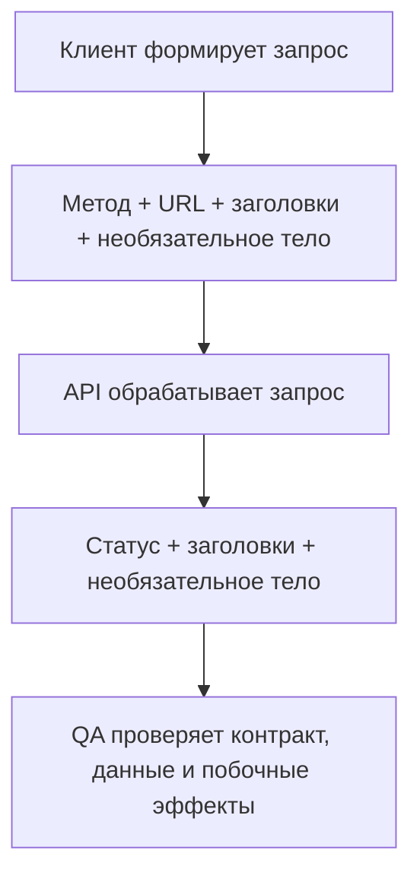

# Основы запросов REST API

## Что это

Вводный справочник HTTP для QA, подготовленный по трём русскоязычным изображениям от пользователя. Понятия применимы к HTTP API в целом; само использование HTTP и JSON не означает соблюдения архитектурных ограничений REST.

## Зачем это QA

Эта терминология нужна для расследования сбоев в API-клиенте, сетевой панели браузера или отчёте автоматизированных тестов.

## Как это работает



### Устройство URL

Пример контракта, а не действующий endpoint:

```text
https://api.example.com/contacts/2?fields=phone,email
│       │               │        │
Схема   Хост            Путь     Строка запроса
```

Полный путь — `/contacts/2`; `2` является значением параметра, если API определяет маршрут вроде `/contacts/{id}`. Соглашения наподобие `fields=phone,email` зависят от API. Ни `?phone`, ни `?phone&email` не выбирают поля ответа универсальным образом: сверяйтесь с контрактом.

### Методы HTTP

| Метод | Назначение |
| --- | --- |
| GET | Получить представление |
| POST | Обработать переданное содержимое; часто создаёт ресурс |
| PUT | Создать или заменить целевое состояние |
| PATCH | Применить частичные изменения |
| DELETE | Удалить связь с целевым ресурсом; физическое стирание данных не гарантируется |

GET безопасен; GET, PUT и DELETE идемпотентны по определённой семантике. Идемпотентность касается ожидаемого эффекта, а не одинаковых ответов. POST и PATCH не являются идемпотентными по умолчанию. Поведение PATCH зависит от формата документа изменений. [Методы HTTP](https://www.rfc-editor.org/rfc/rfc9110.html#section-9), [PATCH](https://www.rfc-editor.org/rfc/rfc5789.html)

### Заголовки

| Заголовок | Значение |
| --- | --- |
| Accept | Предпочтительные медиатипы ответа |
| Content-Type | Медиатип содержимого |
| Accept-Encoding / Content-Encoding | Допустимые / применённые кодирования содержимого, например gzip |
| Authorization | Учётные данные аутентификации |
| Content-Length | Длина в байтах, а не символах |
| Location | Ссылка на ресурс, смысл которой зависит от статуса |

`Accept-Charset` устарел. [Семантика HTTP](https://www.rfc-editor.org/rfc/rfc9110.html)

### Краткий справочник статусов ответа

| Код | Значение |
| --- | --- |
| 200 / 201 | Успех / создано |
| 202 | Принято; завершение не гарантируется |
| 204 | Успех без содержимого |
| 301 | Постоянное перенаправление |
| 401 | Отсутствуют действительные данные аутентификации |
| 403 | В запросе отказано |
| 404 | Не найдено или существование не раскрывается |
| 405 | Метод не поддерживается для этого ресурса |
| 409 | Конфликт с текущим состоянием ресурса |
| 500 | Непредвиденная ситуация на сервере |
| 502 / 504 | Шлюз получил некорректный ответ вышестоящего сервера / не дождался ответа |
| 503 | Временно недоступно |

[Определения статусов](https://www.rfc-editor.org/rfc/rfc9110.html#section-15)

### Основы JSON

JSON поддерживает объекты, массивы, строки, числа, логические значения и null. Массивы могут содержать любые значения JSON, а не только объекты. Используйте прямые двойные кавычки; комментарии и завершающие запятые недопустимы. Фрагмент свойства нужно заключить в фигурные скобки, чтобы получить объект. `5` и `"5"` имеют разные типы. [Спецификация JSON](https://www.rfc-editor.org/rfc/rfc8259.html)

```json
{
  "pets": [
    { "name": "Spot", "type": "dog", "age": 5 },
    { "name": "Fluffy", "type": "cat", "age": 3 }
  ]
}
```

## Когда применять

При чтении незнакомого контракта endpoint, создании первого API-теста или объяснении неудачного запроса коллеге.

## Пример

Для условного контракта `GET /contacts/{id}?fields=phone,email`:

1. Запросите контакт тестового пользователя.
2. Проверьте документированный статус, схему ответа и ожидаемые значения контакта.
3. Убедитесь, что выбор полей соответствует документации.
4. Повторите запрос с ID контакта другого пользователя и проверьте правило доступа.
5. Попробуйте отсутствующий, некорректный и неизвестный ID; сопоставьте каждый результат с контрактом.

Это предлагаемые QA-проверки, а не утверждения о реальном сервисе. См. [сопутствующий чек-лист](../../playbooks/checklists/api-request-review.md).

## Частые ошибки

- Воспринимать HTTP-методы как прямые команды базы данных.
- Приписывать параметру запроса смысл без проверки контракта API.
- Считать тест успешным только из-за статуса 200.
- Считать числовую строку числом JSON.
- Повторять изменяющий состояние запрос без понимания дублирующих эффектов.

## Ограничения

Это вводный справочник, а не полное руководство HTTP или REST. Аутентификация, кеширование, cookies, пагинация и конкурентный доступ заслуживают отдельных заметок. Ни один пример запроса не отправлялся в действующий API.

## Практические принципы

- [Основы API и подводные камни HTTP](api-foundations-and-http-pitfalls.md) — архитектура и уточнения к двум статьям QA4Life.
- [Чек-лист проверки API-запроса](../../playbooks/checklists/api-request-review.md)
- [Раздел тестирования API](README.md)

## Источники

- Трёхстраничная шпаргалка REST API от пользователя, получена 2026-09-05; атрибуция изображений описана выше.
- [RFC 9110 — Семантика HTTP](https://www.rfc-editor.org/rfc/rfc9110.html)
- [RFC 5789 — Метод PATCH](https://www.rfc-editor.org/rfc/rfc5789.html)
- [RFC 8259 — JSON](https://www.rfc-editor.org/rfc/rfc8259.html)
