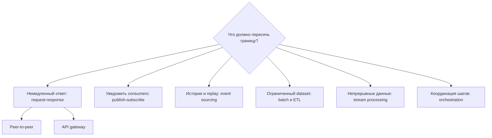

# Девять паттернов интеграции систем и границы их тестирования

Девять паттернов на присланной схеме ByteByteGo дают полезные точки зрения, но это не девять взаимозаменяемых решений одного архитектурного уровня. Одни описывают связь сервисов, другие — обработку данных, один — хранение состояния, ещё один — управление workflow. Реальная система часто сочетает несколько паттернов.

## Синхронное взаимодействие сервисов

**Peer-to-peer** — прямые вызовы, простые при малом масштабе. Плотный call graph повышает связанность, риск каскадных сбоев и неопределённость ownership. Проверяйте contracts, timeouts, retries, idempotency и частичный отказ, а не только успешный ответ.

**Request-response** описывает форму взаимодействия: вызывающая сторона ждёт связанный ответ. HTTP распространён, но необязателен. Вместе со status и schema проверяйте latency, cancellation, повтор запроса, downstream timeout и безопасность retry.

**API gateway** создаёт единую контролируемую точку для routing, authentication, rate limits, protocol adaptation или aggregation. Он не устраняет сбои downstream services. Отдельно тестируйте gateway policy: identity propagation, routing, transformations, limits, caching, observability и деградацию зависимостей.

## Messaging и долговечная история событий

**Publish-subscribe** разделяет publishers и subscribers через topic или broker. Каждый subscriber обычно независимо получает подходящие сообщения. Проверяйте delivery semantics, обработку дубликатов, область порядка, poison-message policy, эволюцию schema, backpressure и eventual consistency.

**Event sourcing** хранит изменения состояния как append-only историю и получает текущее состояние через replay или projections. Это больше, чем публикация событий. Проверяйте invariants при принятии command, совместимость версий событий, детерминированный replay, rebuild projections, snapshots и исправление ошибочной истории.

## Перемещение и обработка данных

**ETL** извлекает данные, преобразует и загружает в назначение. Он может быть batch или streaming. Проверяйте source-to-target reconciliation, mapping полей, null, rejected records, late data, restartability, lineage и отсутствие дубликатов при rerun.

**Batch processing** обрабатывает ограниченный набор по расписанию или порогу объёма. Приоритет — throughput и повторяемость, а не мгновенный результат. Проверяйте cutoff boundaries, partitioning, checkpoints, reruns, частичное завершение и итоговую reconciliation.

**Stream processing** непрерывно обрабатывает неограниченный поток. Проверяйте event time и processing time, windows, watermarks, late и out-of-order events, backpressure, partition rebalancing, восстановление state и exactly-once на уровне бизнес-результата, а не только broker.

## Координация workflow

**Orchestration** передаёт coordinator ответственность за многошаговый workflow. Последовательность и статус становятся наблюдаемыми, но управление концентрируется. Проверяйте transitions, retries, timeouts, compensation, manual intervention, idempotent activities и восстановление после restart orchestrator. Choreography через события подходит, когда участники способны реагировать независимо; она меняет центральный контроль на более сложное глобальное наблюдение.

## Матрица выбора и тестирования

| Потребность | Вероятный стартовый паттерн | Доказательства для QA |
|---|---|---|
| Простой немедленный запрос | Request-response / direct API | Contract, latency, timeout и error mapping |
| Единая публичная поверхность | API gateway | Policy, routing, auth propagation и деградация downstream |
| Рассылка нескольким consumers | Publish-subscribe | Delivery, дубликаты, ordering и consumer lag |
| Восстановление состояния по истории | Event sourcing | Invariants, replay, schema evolution и rebuild projection |
| Периодическая обработка большого объёма | Batch ETL | Reconciliation, безопасный rerun и checkpoints |
| Непрерывные вычисления почти real time | Stream processing | Windows, late data, backpressure и recovery |
| Долгая бизнес-транзакция | Orchestration | State transitions, compensation и operator recovery |

Выбирайте по требуемым latency, coupling, replay, volume, consistency, владельцу отказа и операционным навыкам. Комбинации нормальны: API gateway может запускать orchestrated workflow, который публикует события и обновляет streaming projection.

## Источники

- Присланная пользователем инфографика ByteByteGo «Top 9 System Integrations», проверено 2026-09-26.
- [Microsoft: проектирование integration architecture](https://learn.microsoft.com/en-us/azure/architecture/integration/integration-start-here)
- [Microsoft: event-driven architecture](https://learn.microsoft.com/en-us/azure/architecture/guide/architecture-styles/event-driven)
- [Microsoft: API gateways в microservices](https://learn.microsoft.com/en-us/azure/architecture/microservices/design/gateway)
