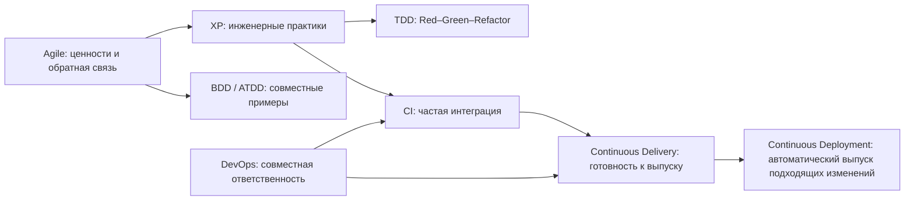

# Agile, DevOps и TDD: проверенная стратегия качества

## TL;DR

Обе версии прочитаны полностью: по 15 страниц. Ver2 — более поздняя и существенно переработанная редакция того же материала; её следует считать основной, а Ver1 — исторической версией. Темы идут от XP и DevOps через CI/CD к TDD, BDD, ATDD, квадрантам тестирования, выбору процесса и роли QA.

Главная идея полезна: качество создаёт вся команда, а QA ускоряет обратную связь и помогает принимать решения по риску. Числа `60/30/10`, `80% автоматизации`, `>90% покрытия`, `5–10 интеграций в день`, `95% успешных сборок` и проценты переработки не являются универсальными нормами.

## Карта всех страниц Ver2

| Страницы | Тема | Практический вывод |
| --- | --- | --- |
| 1 | Экосистема Agile, XP, DevOps, TDD, BDD, ATDD | Это связанные идеи разных уровней, а не линейная шкала сложности |
| 2–3 | Ценности, практики и петли XP | Выбирать практики по проблеме команды, а не по отрасли |
| 4–6 | DevOps, CI, Continuous Delivery и Deployment | Строить короткий проверяемый путь изменения до production |
| 7 | TDD | Red–Green–Refactor проектирует поведение малыми шагами; процент покрытия не гарантирован |
| 8 | BDD и пирамида тестов | BDD — совместное исследование поведения, а не уровень тестов |
| 9 | ATDD | Согласовывать примеры до реализации; эффект измерять, а не обещать нулевую переработку |
| 10 | Agile Testing Quadrants | Карта целей тестирования, без жёсткого деления manual/automation |
| 11–12 | Scrumban, Water-Scrum-Fall, выбор процесса | Учитывать ограничения и обратную связь, а не только сроки и стабильность требований |
| 13–14 | Роль QA и советы | QA — партнёр по качеству; доля автоматизации зависит от риска |
| 15 | Карьера и обучение | Полезная карта тем, но сроки роста индивидуальны |

## Как связаны практики

Scrum — лёгкий фреймворк для сложной работы и намеренно не задаёт инженерные техники. Поэтому XP, TDD, BDD и CI/CD могут дополнять Scrum. QA участвует как член кросс-функциональной команды, а не как изолированный финальный шлюз.

## Исправления важных утверждений

| В материале | Корректная трактовка |
| --- | --- |
| CI = 5–10 интеграций или 10+ сборок в день | CI означает частое объединение изменений с быстрой автоматической обратной связью; частоту выбирает команда |
| Успешность сборок 95%+, исправление до 30 минут | Возможные внутренние SLO. Нужны baseline, причины отказов, время восстановления и flaky rate |
| Delivery — ручной выпуск, Deployment — «робот решил» | Delivery означает готовность выпустить по запросу; Deployment автоматически выпускает подходящее изменение. Политики и approvals могут оставаться в конвейере |
| TDD даёт >90% покрытия и меньше дефектов | TDD задаёт цикл разработки. Покрытие и дефекты — отдельные результаты |
| Пирамида = 60% unit, 30% BDD, 10% E2E | Пирамида — эвристика: больше быстрых узких проверок и меньше широких дорогих. BDD не является уровнем тестирования |
| ATDD снижает переработку до 0–5% | ATDD помогает раньше увидеть расхождения, но эффект зависит от участия и примеров |
| Q1, Q2, Q4 автоматизированы, Q3 ручной | Квадранты обсуждают цель проверки; в каждом возможны ручные и автоматизированные активности |
| Норма — 80% автоматизации и zero defects | Цели выводят из риска и стоимости обратной связи. «Нет известных критических дефектов» может быть критерием выпуска, но не доказательством отсутствия дефектов |

## Рабочая стратегия QA

1. На refinement сформулируйте риски и примеры поведения. Используйте Given/When/Then, когда формат проясняет правило.
2. Поддержите быстрые unit/component-проверки рядом с кодом, integration/contract — на границах, E2E — для критических пользовательских потоков.
3. В CI запускайте быстрые детерминированные проверки на каждое изменение. Долгие наборы размещайте позже, сохраняя понятный сигнал отказа.
4. Останавливайте продвижение по согласованным критериям: критический дефект, нарушение контракта или безопасности, неприемлемая нестабильность. QA предоставляет доказательства; решение о риске имеет владельца.
5. Измеряйте lead time, причины отказов, время восстановления, escaped defects и flaky rate. Coverage используйте для поиска непротестированного кода, а не как оценку качества.
6. Пересматривайте проверки по данным production, изменениям архитектуры и стоимости поддержки.

## Граница предоставленного описания

В сопроводительном тексте заявлены сравнение Selenium, Playwright и Cypress с тезисом «Playwright на 30–40% быстрее», отдельные разделы QA Metrics и Test Data Management/GDPR. В обеих 15-страничных PDF этих разделов нет. Они не приписаны источнику, а benchmark нельзя принять без воспроизводимого сценария, версий, окружения и результатов.

## Проверенные ориентиры

- [Agile Manifesto и принципы](https://agilemanifesto.org/principles)
- [Официальный Scrum Guide 2020](https://scrumguides.org/scrum-guide.html)
- [Martin Fowler: Continuous Integration](https://martinfowler.com/articles/continuousIntegration.html)
- [The Practical Test Pyramid](https://martinfowler.com/articles/practical-test-pyramid.html)
- [Cucumber: BDD discovery workshop](https://cucumber.io/docs/bdd/discovery-workshop/)

## Контроль усвоения

- Объясните разницу CI, Continuous Delivery и Continuous Deployment без названия инструмента.
- Выберите уровни проверок по скорости, локализации дефекта и риску без фиксированной пропорции.
- Покажите, какую неопределённость снимают TDD, BDD и ATDD и кто участвует в обратной связи.
- Для каждой числовой цели задайте владельца, период, baseline и действие при отклонении.

