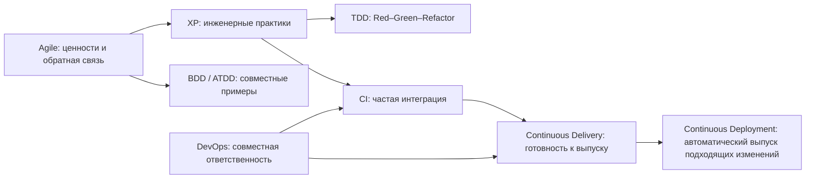

# Agile, DevOps и TDD: проверенная стратегия качества

## Как связаны практики

Scrum — лёгкий фреймворк для сложной работы и намеренно не задаёт инженерные техники. Поэтому XP, TDD, BDD и CI/CD могут дополнять Scrum. QA участвует как член кросс-функциональной команды, а не как изолированный финальный шлюз.

## Исправления важных утверждений

| В материале | Корректная трактовка |
| --- | --- |
| CI = 5–10 интеграций или 10+ сборок в день | CI означает частое объединение изменений с быстрой автоматической обратной связью; частоту выбирает команда |
| Успешность сборок 95%+, исправление до 30 минут | Возможные внутренние SLO. Нужны baseline, причины отказов, время восстановления и flaky rate |
| Delivery — ручной выпуск, Deployment — «робот решил» | Delivery означает готовность выпустить по запросу; Deployment автоматически выпускает подходящее изменение. Политики и approvals могут оставаться в конвейере |
| TDD даёт >90% покрытия и меньше дефектов | TDD задаёт цикл разработки. Покрытие и дефекты — отдельные результаты |
| Пирамида = 60% unit, 30% BDD, 10% E2E | Пирамида — эвристика: больше быстрых узких проверок и меньше широких дорогих. BDD не является уровнем тестирования |
| ATDD снижает переработку до 0–5% | ATDD помогает раньше увидеть расхождения, но эффект зависит от участия и примеров |
| Q1, Q2, Q4 автоматизированы, Q3 ручной | Квадранты обсуждают цель проверки; в каждом возможны ручные и автоматизированные активности |
| Норма — 80% автоматизации и zero defects | Цели выводят из риска и стоимости обратной связи. «Нет известных критических дефектов» может быть критерием выпуска, но не доказательством отсутствия дефектов |

## Рабочая стратегия QA

1. На refinement сформулируйте риски и примеры поведения. Используйте Given/When/Then, когда формат проясняет правило.
2. Поддержите быстрые unit/component-проверки рядом с кодом, integration/contract — на границах, E2E — для критических пользовательских потоков.
3. В CI запускайте быстрые детерминированные проверки на каждое изменение. Долгие наборы размещайте позже, сохраняя понятный сигнал отказа.
4. Останавливайте продвижение по согласованным критериям: критический дефект, нарушение контракта или безопасности, неприемлемая нестабильность. QA предоставляет доказательства; решение о риске имеет владельца.
5. Измеряйте lead time, причины отказов, время восстановления, escaped defects и flaky rate. Coverage используйте для поиска непротестированного кода, а не как оценку качества.
6. Пересматривайте проверки по данным production, изменениям архитектуры и стоимости поддержки.

## Контроль усвоения

- Объясните разницу CI, Continuous Delivery и Continuous Deployment без названия инструмента.
- Выберите уровни проверок по скорости, локализации дефекта и риску без фиксированной пропорции.
- Покажите, какую неопределённость снимают TDD, BDD и ATDD и кто участвует в обратной связи.
- Для каждой числовой цели задайте владельца, период, baseline и действие при отклонении.
