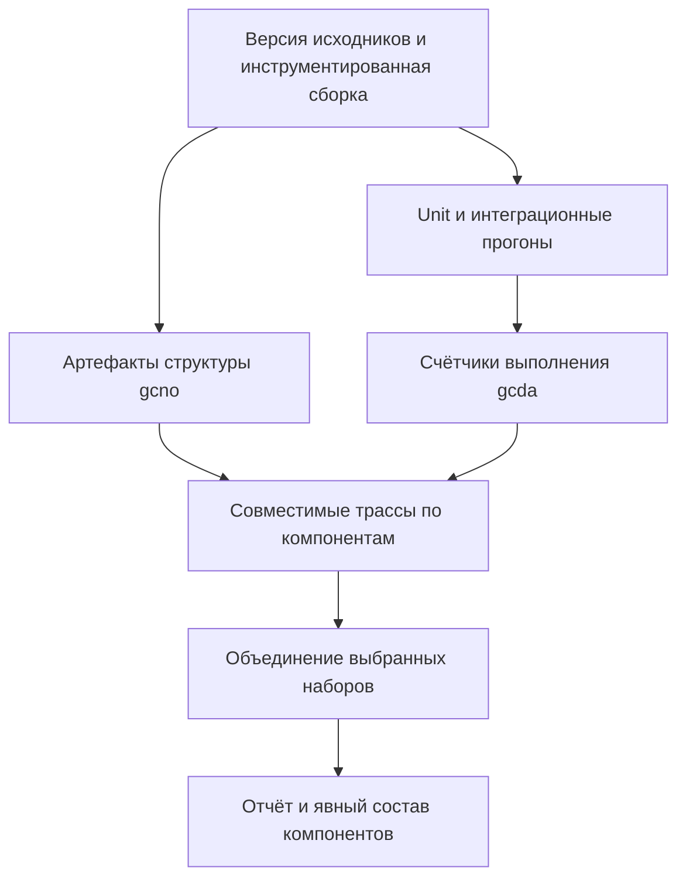

# Сбор и объединение кодового покрытия

В описанном кейсе отдельная инструментированная сборка создаёт `.gcno`, а тестовые устройства возвращают `.gcda`. Независимые тестовые конвейеры формируют трассы по пакетам; отдельный конвейер объединяет их и строит отчёты для выбранного состава компонентов.

## Поток артефактов

## Проверки конвейера: шаблон Lab

| Проверка | Условие принятия |
| --- | --- |
| Совместимость | Исходники, сборка, архитектура и инструмент соответствуют друг другу |
| Происхождение | Каждый артефакт связан с конкретным прогоном |
| Полнота | Известен ожидаемый набор компонентов, а не только обнаруженные файлы |
| Отсутствующие данные | Различаются отсутствие теста, сбой сбора и нулевое выполнение |
| Объединение | Складываются совместимые данные, а не средние проценты |
| Изоляция | Старые счётчики не попадают в новый прогон |
| Сравнение | Динамика объяснима при изменении состава кода |

## Выбор отчётов и ограничения

Разделяйте обзор критических компонентов, базового набора и полного продукта; у каждого фиксируйте знаменатель. Высокий процент маленького выбранного набора нельзя выдавать за покрытие всей системы.

Инструментация меняет условия исполнения: производительность релизной сборки измеряйте отдельно. Покрытие показывает выполнение кода, но не качество assertions. Нужны также проверки поведения и чувствительности тестов к дефектам.

Для Lab этот материал — архитектурный ориентир, не внедрённый C/C++ coverage-процесс. Команды из кейса не запускались. Предложенный авторами переход на gcovr описан как план, а не завершённый результат.

## Источники

- [Иван Растегаев: «Особенности сбора кодового покрытия в ОС „Нейтрино“» (RU)](https://habr.com/ru/companies/swd_es/articles/1080274/)
