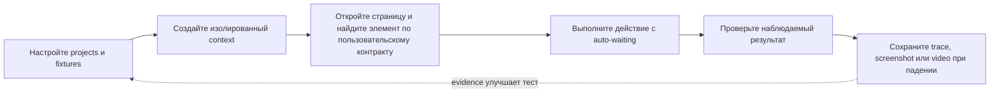

# Практическая шпаргалка Playwright TypeScript

Playwright Test объединяет test runner, изолированные browser contexts, устойчивые locators, assertions с автоожиданием, управление сетью и артефакты падений. Справочник сохраняет полезный охват присланной шпаргалки и исправляет паттерны, которые часто создают race conditions и flaky tests.



## Установка, запуск и отладка

```bash
npm init playwright@latest
npx playwright test
npx playwright test tests/checkout.spec.ts
npx playwright test --grep @smoke
npx playwright test --project=chromium
npx playwright test --ui
npx playwright test tests/checkout.spec.ts:18 --debug
npx playwright show-report
```

`npm init playwright@latest` создаёт основу проекта Playwright Test. После установки dependencies установите browser binaries; в Linux CI может понадобиться `npx playwright install --with-deps`. Фиксируйте версии lockfile: команды с инфографики не являются вечным контрактом.

## Структура теста и конфигурация

```ts
import { test, expect } from '@playwright/test';

test('customer can add a product', { tag: '@smoke' }, async ({ page }) => {
  await page.goto('/products');
  await page.getByRole('button', { name: 'Add to cart' }).click();
  await expect(page.getByRole('status')).toHaveText('Added to cart');
});
```

Параметры runner `testDir`, `retries`, `workers`, `projects` и `reporter` находятся на верхнем уровне `playwright.config.ts`. Опции browser context `baseURL`, `viewport`, `locale`, `storageState`, `trace`, `screenshot` и `video` задаются в `use`. В CI включите `forbidOnly`, чтобы случайный `test.only` не уменьшил покрытие незаметно.

## Locators, действия и assertions

Предпочитайте locators пользовательского контракта: `getByRole`, `getByLabel`, `getByText`, `getByPlaceholder`, `getByAltText`, `getByTitle`, затем осознанный `getByTestId`. Уточняйте выбор через `filter`, `and`, `or`, `first`, `last` или `nth`, сохраняя однозначность. Длинные CSS и XPath цепочки связывают тест с реализацией.

Действия `click`, `fill`, `check`, `selectOption`, `press`, `hover` и `dragTo` проверяют actionability. Web-first assertions повторно находят элемент до успеха или timeout:

```ts
const save = page.getByRole('button', { name: 'Save' });
await expect(save).toBeEnabled();
await save.click();
await expect(page.getByRole('status')).toContainText('Saved');
await expect(page).toHaveURL(/\/profile$/);
```

Не синхронизируйте тест через `waitForTimeout`. Ждите наблюдаемый результат, auto-retrying assertion, `waitForResponse`, `waitForURL`, действительно значимый `waitForLoadState` или используйте `expect.poll` для eventual consistency. `locator.all()` не ждёт окончания загрузки динамического списка.

## Изоляция, аутентификация и несколько пользователей

Built-in fixtures дают каждому тесту отдельный `BrowserContext`. Повторно используйте авторизованный `storageState`, только если аккаунты и серверные данные безопасны для параллельного запуска. Для второго пользователя создайте второй context:

```ts
const adminContext = await browser.newContext({ storageState: 'playwright/.auth/admin.json' });
const customerContext = await browser.newContext({ storageState: 'playwright/.auth/customer.json' });
const adminPage = await adminContext.newPage();
const customerPage = await customerContext.newPage();
// ... interaction between two roles ...
await Promise.all([adminContext.close(), customerContext.close()]);
```

Не коммитьте действующие credentials или production session state. API setup ускоряет UI-тесты, однако критическое поведение аутентификации требует отдельных end-to-end проверок.

## Events, файлы, dialogs и frames

Подпишитесь на событие до действия, которое его вызывает:

```ts
const downloadPromise = page.waitForEvent('download');
await page.getByRole('button', { name: 'Export' }).click();
const download = await downloadPromise;
await download.saveAs(`test-results/${download.suggestedFilename()}`);

page.once('dialog', dialog => dialog.accept());
await page.getByRole('button', { name: 'Delete' }).click();

await page.getByLabel('Upload file').setInputFiles('fixtures/report.csv');
await page.frameLocator('#payment-frame').getByLabel('Card number').fill('4242424242424242');
```

Для popup применяйте тот же порядок через `page.waitForEvent('popup')`. Временные загрузки удаляются при закрытии context, если файл явно не сохранён.

## API, сеть и состояние браузера

Built-in fixture `request` подходит для preconditions и API assertions. `page.request` и `context.request` используют cookie storage browser context; отдельный `apiRequest.newContext()` не разделяет его без настройки. `page.route` и `browserContext.route` позволяют наблюдать, подменять, изменять или отклонять запросы, но часть тестов должна работать с реальными интеграциями.

Cookies, local storage и session storage — разные механизмы. `storageState` охватывает cookies и local storage; session storage нужно переносить отдельно. Событие `requestfailed` означает сетевой сбой, а не HTTP-ответ 404 или 500.

## Диагностика, projects и annotations

Используйте projects для браузеров, устройств и вариантов окружения. Сохраняйте trace на первом retry или при падении, балансируя доказательства и объём хранения. Tracing Playwright Test включает сведения об assertions, которых нет в низкоуровневом `context.tracing`.

`test.skip` обозначает неприменимый сценарий, `test.fixme` — известную проблему теста или продукта, мешающую запуску, `test.fail` — ожидаемое падение, которое всё ещё полезно выполнить, `test.slow` — намеренно увеличенный timeout. Tags выбирают наборы, annotations сохраняют контекст в отчёте. Retries показывают нестабильность, но не исправляют flaky test.

## Источники

- Присланное пользователем изображение Playwright cheat sheet, проверено 2026-09-26.
- [Локаторы Playwright](https://playwright.dev/docs/locators)
- [Assertions Playwright](https://playwright.dev/docs/test-assertions)
- [Конфигурация Playwright](https://playwright.dev/docs/test-configuration)
- [API testing в Playwright](https://playwright.dev/docs/api-testing)
- [Trace viewer Playwright](https://playwright.dev/docs/trace-viewer)

