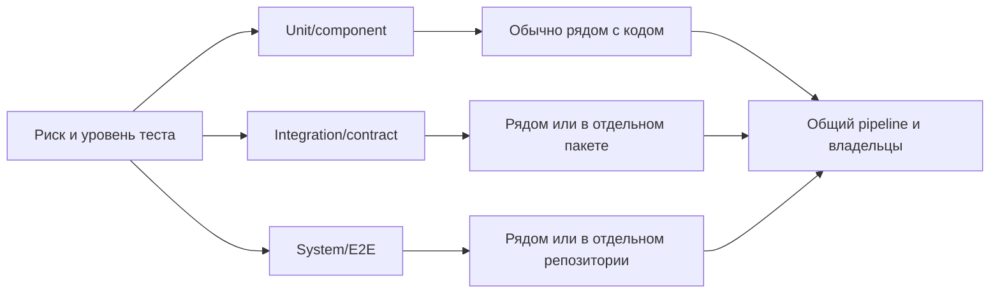

# Python для QA: основы, уроки 1–2

## Организация автоматизации



Выбирайте структуру по владельцам, частоте изменений, границам доступа, переиспользованию, времени pipeline и способу доставки. Один репозиторий не гарантирует участия разработчиков, а отдельный не означает слабую связь с бизнесом. Общие библиотеки ускоряют работу, но чрезмерное переиспользование производственной логики может повторить ту же ошибку в тесте и приложении.

## Надёжный старт проекта

```bash
python -m venv .venv
# Windows PowerShell
.venv\Scripts\Activate.ps1
python -m pip install --upgrade pip
python -m pip install pytest requests
python -m pytest
```

Не коммитьте `.venv`. Храните прямые зависимости и их ограничения в `pyproject.toml` либо другом выбранном формате, а воспроизводимость обеспечивайте lock-файлом или контролируемой процедурой сборки. `pip freeze` полезен для снимка среды, но без разбора фиксирует также транзитивные и платформенные пакеты.

## Главные поправки

- CPython обычно компилирует модуль в байткод, который выполняет виртуальная машина; граница «компилируемый/интерпретируемый» размыта
- Скорость зависит от реализации, JIT/AOT, нагрузки, библиотек и измерения; такая таблица не подходит для технического выбора
- Статическая/динамическая типизация и неформальная шкала strong/weak — разные оси; касты и доступ к памяти не образуют строгую классификацию
- Аннотации и статические анализаторы находят многие несоответствия до запуска, хотя рантайм по умолчанию их не запрещает
- Порядок вставки гарантирован спецификацией Python начиная с 3.7
- В Python значения являются объектами; `str` — неизменяемый последовательностный тип
- Среда содержит свой интерпретатор/ссылку и `site-packages`, но может использовать базовую установку и стандартную библиотеку
- Создание экземпляра выполняет `__new__`; `__init__` инициализирует созданный объект
- Один `_` — соглашение о внутреннем API; `__name` включает name mangling для предотвращения случайных конфликтов, но не делает данные недоступными
- Notebook полезен для исследования и диагностики; воспроизводимые тесты лучше хранить как обычные модули и запускать в CI
- Это наблюдения автора без измеряемой выборки, а не универсальные метрики

## Исправленная учебная модель

В исходнике `Tester.write_bug_report(self, scenario, failed_step)` создаёт `Bug` без обязательного `actual_result`, но пример вызывает метод ещё и с `actual_result` и `severity`. Такой код завершится `TypeError`. Согласованная минимальная версия:

```python
from dataclasses import dataclass, field

@dataclass
class Step:
    number: int
    description: str
    expected_result: str

@dataclass
class TestCase:
    name: str
    steps: list[Step] = field(default_factory=list)
    status: str = "not_run"

@dataclass
class Bug:
    scenario: TestCase
    failed_step: Step
    actual_result: str
    severity: str = "major"

    def __post_init__(self):
        index = self.scenario.steps.index(self.failed_step)
        self.steps_to_reproduce = self.scenario.steps[: index + 1]

class Tester:
    def __init__(self, name: str, level: str):
        self.name = name
        self.level = level
        self.test_cases: list[TestCase] = []

    def create_test_case(self, name: str, steps: list[Step] | None = None):
        case = TestCase(name, [] if steps is None else list(steps))
        self.test_cases.append(case)
        return case

    def write_bug_report(self, scenario, failed_step, actual_result, severity="major"):
        return Bug(scenario, failed_step, actual_result, severity)
```

Проверяйте в тестах не только создание объектов: неизвестный шаг должен давать понятную ошибку, severity — проходить валидацию, номера шагов — быть однозначными, а изменение входного списка после создания сценария не должно незаметно менять сценарий.

## Практический чек-лист

- [ ] Версия Python поддерживается проектом и зависимостями, а не выбрана по случайной цифре из инструкции.
- [ ] Интерпретатор и среда проекта явно выбраны в редакторе и CI.
- [ ] `.venv`, секреты и временные файлы исключены из Git.
- [ ] Зависимости устанавливаются через `python -m pip` в нужную среду.
- [ ] Тест содержит наблюдаемую проверку результата, а не только последовательность действий.
- [ ] Общая логика приложения не используется как единственный oracle теста.
- [ ] Изменяемые значения не используются как параметры по умолчанию.
- [ ] Композиция предпочтена наследованию, если отношение «является» отсутствует.
- [ ] Модели валидируют состояния и ошибки, важные для предметной области.
- [ ] Архитектура тестов учитывает параллельный запуск и изоляцию данных.

## Источники

- [«Урок 1. Введение в Python и основы автоматизации тестирования»](https://qa4life.yonote.ru/share/eb4ebed0-58de-45df-b8ce-3d19fa91dd10), прочитан 2026-09-22.
- [«Урок 2: Функции, классы и принципы объектно-ориентированного программирования»](https://qa4life.yonote.ru/share/07652a76-5384-459f-a06a-dea6d5c1a392), прочитан 2026-09-22.
- [Python: классы и name mangling](https://docs.python.org/3/tutorial/classes.html), [глоссарий Python](https://docs.python.org/3/glossary.html), [venv](https://docs.python.org/3/library/venv.html).
- [Документация marimo](https://docs.marimo.io/) и [Python environments в VS Code](https://code.visualstudio.com/docs/python/environments).

Связи: [Playwright на Python](playwright-python-basics.md), [композиция компонентов UI-тестов](atomic-test-composition.md), [планирование тестирования](../qa-process/test-planning.md).
