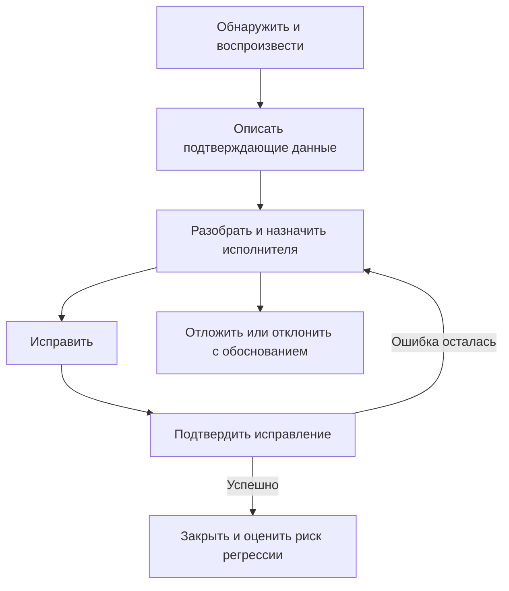

# Основные понятия тестирования

## Краткий справочник

| Измерение | Примеры | Вопрос для QA |
| --- | --- | --- |
| Уровень | Компонентное, интеграция компонентов, системное, интеграция систем, приёмочное | Какая граница проверяется? |
| Характеристика качества | Функциональность, производительность, удобство использования, безопасность | Какой риск оцениваем? |
| Цель после изменения | Подтверждающее, регрессионное | Сработало ли исправление и нет ли побочных последствий? |
| Выполнение | С участием человека, автоматизированное, смешанное | Где полезнее инструменты, а где — суждение человека? |

Пять уровней соответствуют [ISTQB CTFL v4.0.1, раздел 2.2](https://istqb.org/wp-content/uploads/2024/11/ISTQB_CTFL_Syllabus_v4.0.1.pdf). Исчерпывающее тестирование обычно невозможно; выбирайте покрытие по рискам. Ранняя обратная связь сокращает переделки, но не гарантирует определённую стоимость каждого дефекта. Краткий список принципов в исходном PDF не является полным официальным списком ISTQB.

## Практическое применение

При изменении оформления заказа компонентный тест может проверять округление, интеграционный — взаимодействие с платёжной системой, а приёмочное тестирование — готовность для бизнеса. Smoke-набор быстро даёт сведения об основных сценариях, но не обеспечивает полной уверенности в релизе. Ручное тестирование тоже может использовать инструменты.

## Пример жизненного цикла дефекта

Статусы зависят от команды. Приёмочное тестирование не требует, чтобы каждую проверку лично выполняли конечные пользователи.

## Выбор проверок для изменения

Один тест может относиться сразу к нескольким измерениям: автоматизированный регрессионный тест системного уровня может проверять требование безопасности. Классификация помогает планировать, но не доказывает полноту покрытия рисков.

| Изменение | Начальные проверки | Расширение по рискам |
| --- | --- | --- |
| Исправление дефекта | Подтвердить, что исходный сбой больше не возникает | Добавить случаи для исправления и регрессию затронутого поведения |
| Новая интеграция | Проверить интерфейс и обработку сбоев | Сквозные сценарии между системами, согласованность данных и восстановление |
| Правка текста UI | Текст, переносы и нужные языки | Доступность и влияние на общие компоненты |
| Срочное исправление в production | Целевое подтверждение и критические сценарии | Релевантная регрессия, мониторинг и готовность отката |

Это авторская матрица планирования, а не обязательный рецепт релиза. Объём зависит от влияния, вероятности, имеющихся свидетельств и ограничений. Ни «полная регрессия в каждом релизе», ни «только smoke в production» не достаточны во всех случаях.

## Термины, требующие внимания

- **Системное и E2E:** системное — уровень тестирования; полный пользовательский путь может пересекать границы систем. Это не синонимы.
- **Приёмочное и UAT:** приёмочное включает эксплуатационные, договорные и нормативные проверки наряду с UAT; оно не обязано ждать финальной стадии проекта.
- **Подтверждающее и регрессионное:** подтверждение может включать новые тесты изменений, внесённых исправлением, а не только повтор исходных шагов. Регрессия ищет нежелательные последствия в других местах. См. [CTFL, раздел 2.2](https://istqb.org/wp-content/uploads/2024/11/ISTQB_CTFL_Syllabus_v4.0.1.pdf).
- **Smoke и sanity:** фиксируйте принятый в команде объём, не предполагая одинаковых определений у всех. Универсального числа тестов или длительности нет.
- **Позитивное и негативное:** допустимые сценарии не ограничиваются одним happy path. Негативное тестирование оценивает обработку неверных входных данных и исключительных условий; сообщение об ошибке может быть правильным результатом.
- **Виды и техники:** анализ граничных значений и классы эквивалентности помогают получать тесты; это не уровни и не характеристики качества.

## Источники

- [Качество ПО и измеримые критерии](software-quality-criteria.md)
- [Планирование тестирования по рискам](../qa-process/test-planning.md)
- [Эвристики исследовательского тестирования](../manual-testing/exploratory-heuristics.md)
- Источник: `cheatlistbase.pdf`, стр. 1–2; [происхождение материалов и исправления](../../docs/sources/2026-09-05-testing-cheat-sheets.md).
