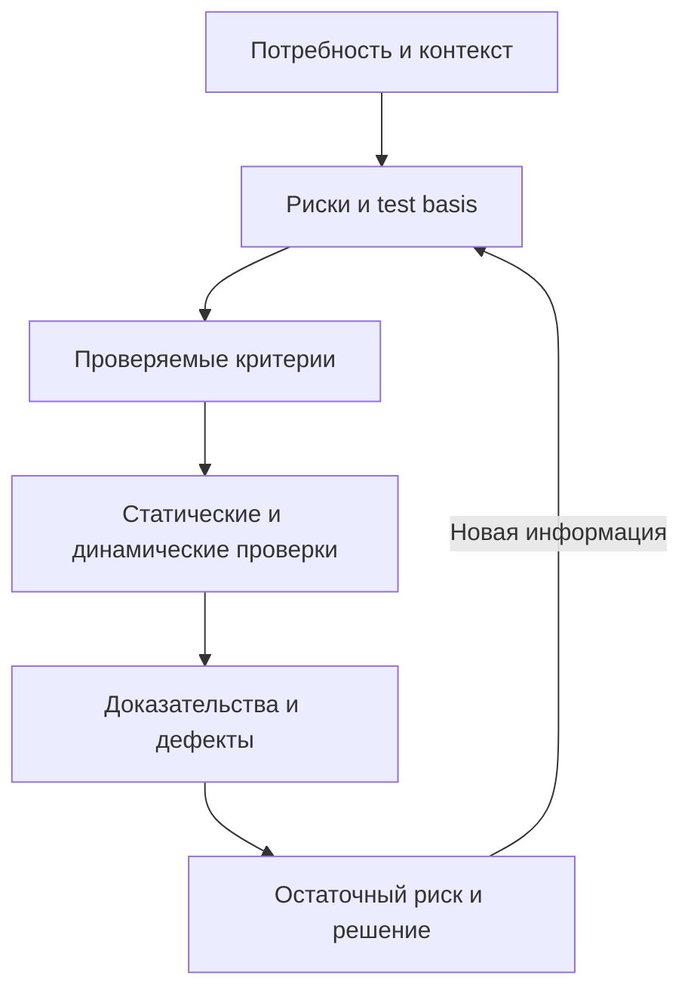

# Основы тестирования: блоки 1–3

## Рабочая модель

1. Определите объект, заинтересованные стороны и риск, который нужно снизить.
2. Найдите test basis: требования, дизайн, код, договорённости, нормативы или наблюдаемое поведение.
3. Запишите проверяемый ожидаемый результат и условия, при которых он действует.
4. Выберите статические и динамические проверки, уровень тестирования и нужные характеристики качества.
5. Соберите доказательства: окружение, данные, шаги, фактический результат, логи и влияние.
6. Сообщите остаточный риск и владельца решения; количество тестов или багов само по себе не является выводом о качестве.

## Термины, которые полезно разделять

| Пара | Практическое различие |
| --- | --- |
| Ошибка / дефект / отказ | Действие человека может внести дефект; выполнение дефектного элемента при определённых условиях может вызвать наблюдаемый отказ |
| Ожидаемый / фактический результат | Ожидаемое поведение выводится из test basis и согласованных критериев; расхождение требует исследования, а не автоматического объявления дефекта |
| Severity / priority | Severity описывает влияние; priority — порядок и срочность работы. Шкалы и владельцы решения зависят от команды |
| Верификация / валидация | Упрощённо: соответствие спецификации и пригодность для потребности; в реальной работе действия могут давать оба вида доказательств |
| Позитивная / негативная проверка | Валидные сценарии подтверждают ожидаемое поведение; невалидные и исключительные условия проверяют безопасную и понятную обработку |
| Статическое / динамическое тестирование | Статическое оценивает рабочие продукты без выполнения тестируемого ПО; динамическое требует его выполнения |

## Позитивное и негативное тестирование (§1.3)

Сильная сторона страницы — конкретные примеры для email, пароля, возраста, загрузки файла, авторизации, поиска, числового поля и API-токена. Главную идею стоит формулировать так: позитивная проверка использует ожидаемо допустимые условия, а негативная — недопустимые, исключительные или граничные условия и проверяет контролируемую реакцию системы. Оба теста считаются пройденными, если фактический результат совпал с ожидаемым. Поэтому подписи *Test to Pass* и *Test to Fail* не означают, что негативный тест должен завершиться падением продукта или статусом Failed.

Практические поправки к странице:

- Универсального отношения 70/30 или 50/50 между позитивными и негативными тестами нет. Набор определяется риском, контрактом, критичностью и доступным временем.
- Эквивалентное разбиение и анализ граничных значений применяются к валидным и невалидным классам/границам; это не исключительно негативные техники.
- Happy Path обычно является позитивным сценарием, но позитивное тестирование шире одного Happy Path. Smoke-набор определяется критичностью функций и может содержать негативные проверки.
- «Оба типа для каждого условия» — полезная эвристика, а не обязательное правило. Для каждого условия нужны проверки, которые дают достаточное покрытие соответствующего риска.
- Коды HTTP зависят от контракта: 401 обычно относится к отсутствующей или недействительной аутентификации, 403 — к недостаточным правам, 400 — к некорректному запросу. Ожидание следует брать из спецификации API.
- SQL-инъекция и XSS относятся также к тестированию безопасности. Такие проверки выполняют только в разрешённой среде и в согласованных границах.

## Семь принципов тестирования (§1.6)

Перечень в целом соответствует ISTQB CTFL 4.0.1: тестирование показывает наличие дефектов; исчерпывающее тестирование невозможно; раннее тестирование экономит время и деньги; дефекты кластеризуются; тесты изнашиваются; тестирование зависит от контекста; отсутствие дефектов само по себе не гарантирует полезность продукта.

Уточнения к формулировкам и примерам:

- В CTFL 4.0.1 пятый принцип называется Tests wear out («тесты изнашиваются»). «Парадокс пестицида» — распространённое прежнее название идеи, но не актуальный заголовок принципа в syllabus.
- Повторяемые регрессионные тесты не становятся бесполезными автоматически: они продолжают подтверждать ранее проверяемое поведение, но со временем хуже находят новые классы дефектов. Набор и данные нужно пересматривать и дополнять.
- Числа «в 100–1000 раз дешевле» и «80% дефектов в 20% модулей» иллюстрируют направление и эвристику, а не универсальные гарантии.
- Раннее тестирование включает статические и динамические действия настолько рано, насколько это практически возможно; оно не сводится к участию тестировщика с первого дня.
- Принцип отсутствия ошибок говорит о соответствии потребностям и бизнес-целям даже после выполнения спецификации. Формула «validation не менее важна, чем verification» полезна как напоминание, но реальные действия часто дают оба вида доказательств.

## Практические принципы

- Направление ранней обратной связи полезно, но коэффициенты не являются универсальным законом. Стоимость зависит от продукта, архитектуры, обнаружения и последствий
- Defect clustering — принцип наблюдаемой концентрации, а 80/20 — эвристика. Не считайте проценты гарантированными
- Такая схема встречается в учебных материалах, но названия и границы ролей различаются. ISTQB описывает test roles и activities, а не обязательную корпоративную иерархию QA/QC
- Это карьерный ориентир автора. SQL, API и Git полезны, но конкретный язык, брокер, Kubernetes или AI нужны по контексту вакансии и продукта
- Локальная шкала. Согласуйте определения, примеры, полномочия и SLA triage внутри организации
- Всегда указывайте знаменатель, период, область, тяжесть и источник данных. Высокий процент не доказывает приемлемый риск
- Это модель 2011 года. Актуальная [ISO/IEC 25010:2023](https://www.iso.org/standard/78176.html) содержит девять характеристик; полная платная версия стандарта в этом разборе не читалась
- Это удобная модель, но ограничения могут относиться ко всем уровням, а характеристика качества часто конкретизирует способ выполнения функции
- Термины происходят из разных практик и моделей. Перед применением определите значение, владельца и решение, которое поддерживает артефакт

## Testware, критерии и ревью

План, стратегия, test basis, сценарии, тест-кейсы, логи и отчёты образуют testware только в контексте конкретной организации. Не обязательно создавать каждый документ отдельно. Храните минимальный набор, который помогает планировать, выполнять проверки, воспроизводить результаты и принимать решения.

Entry, exit, suspension и resumption criteria отвечают на разные вопросы: когда полезно начать, когда достаточно завершить, когда остановиться и что нужно для продолжения. Definition of Done — командное соглашение о завершённости элемента работы и не заменяет автоматически exit criteria тестирования или решение о выпуске.

Ревью требований, кода и тестов позволяет находить неоднозначности и дефекты до выполнения ПО. Уровень формальности зависит от риска. Inspection требует определённых ролей и процесса; walkthrough и техническое ревью не обязаны копировать эту структуру. См. официальный [ISTQB CTFL v4.0.1](https://istqb.org/wp-content/uploads/2024/11/ISTQB_CTFL_Syllabus_v4.0.1.pdf).

## Практический чек-лист

- [ ] Назван риск или вопрос, на который должна ответить проверка.
- [ ] Указаны test basis, окружение, данные и версия сборки.
- [ ] Ожидаемый результат проверяем и не опирается на слова «быстро», «удобно» или «нормально» без критерия.
- [ ] Позитивные, негативные и исключительные сценарии выбраны по риску.
- [ ] Severity отделена от priority, а решение о выпуске — от числа закрытых тест-кейсов.
- [ ] Метрика имеет период, знаменатель, область и назначение.
- [ ] Требования и тесты связаны там, где трассируемость помогает оценивать влияние и покрытие.
- [ ] Результат сообщает известный остаточный риск и ограничения доказательств.

## Источники

- [Основные понятия тестирования](testing-concepts.md).
- [Качество ПО и измеримые критерии](software-quality-criteria.md).
- [Планирование тестирования по рискам](../qa-process/test-planning.md).
- [Исходный PDF — «Основы тестирования Блок 1–3»](../../docs/sources/originals/2026-09-21-testing-foundations-blocks-1-3.pdf), SHA-256 `4ac1d19608900339f00e4784c862d0a6a9bd7e929b402c0ec64059f7a5faf3ba`.
- [Обновлённый PDF блока 1](../../docs/sources/originals/2026-09-21-testing-foundations-block-1-new.pdf), SHA-256 `857b5400a12f2b281a6e05fcb4346b5a0175dbd25fd749aa2c91aa183ff34081`.
- Приложенные страницы: [семь принципов](../../docs/sources/originals/2026-09-21-testing-foundations-block-1-update/seven-testing-principles.png), SHA-256 `dfa8bf6e2f0fb01c0b884222372f004fe1f1bac0d5544b15ccaf55d5af482854`; [позитивное и негативное тестирование](../../docs/sources/originals/2026-09-21-testing-foundations-block-1-update/positive-vs-negative-testing.png), SHA-256 `da7d6aa8bc93140261154b1b662a52dadc32ec4cf1f9fb8d67d948138799b543`.
- [ISTQB CTFL v4.0.1](https://istqb.org/wp-content/uploads/2024/11/ISTQB_CTFL_Syllabus_v4.0.1.pdf) и публичная страница [ISO/IEC 25010:2023](https://www.iso.org/standard/78176.html), проверено 2026-09-21.
