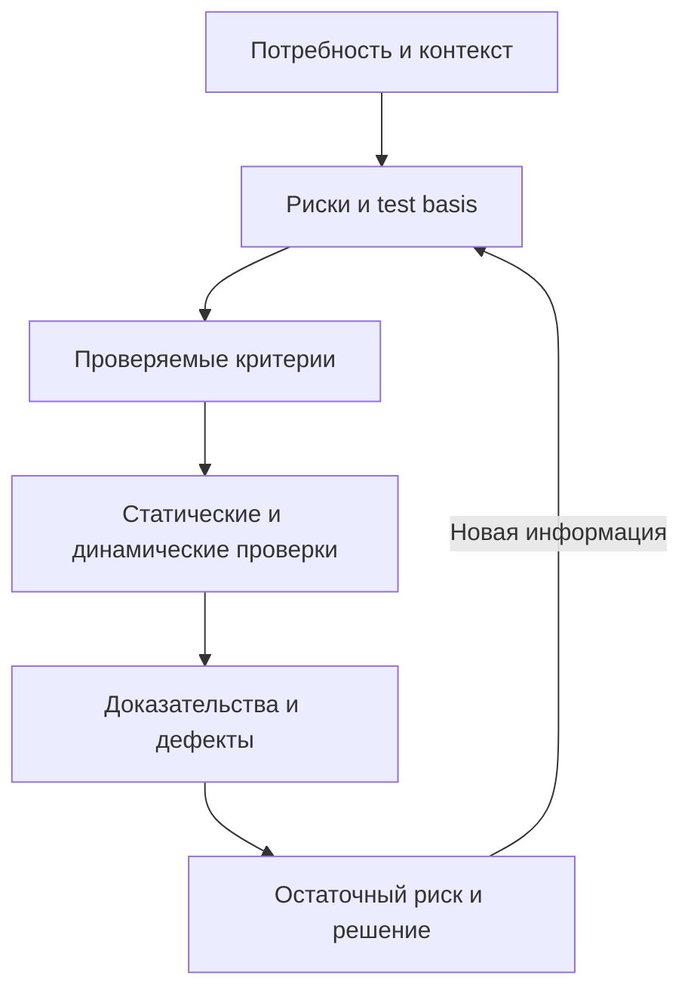

# Основы тестирования: разбор блоков 1–3

## Кратко

PDF даёт широкую карту базовых понятий и удобен для повторения. Его сильная сторона — связь терминов с примерами. Числовые правила, карьерные матрицы и некоторые классификации следует воспринимать как авторские ориентиры. Для работы важнее выбирать проверки по риску, фиксировать ожидаемый результат и условия измерения, а также отделять стандарт от локального процесса команды.

Все 22 графические страницы PDF прочитаны визуально. Автор на обложке — Евгений Гусинец, указан Telegram-канал QA❤️4Life. Исходный URL и лицензия не установлены. Метаданные файла содержат дату создания 2026-04-27, но это не подтверждённая дата публикации. Разбор сначала написан на русском, затем переведён на английский.

## Карта источника

| Страницы | Тема | Что сохранить в практике |
| --- | --- | --- |
| 1–8 | Определение и цели тестирования, раннее тестирование, позитивные и негативные сценарии, навыки, QA/QC/Testing, семь принципов | Тестирование даёт информацию о риске; начинайте обратную связь рано; исчерпывающее покрытие обычно невозможно |
| 9–14 | Ошибка, дефект и отказ; ожидаемый и фактический результат; testware; процесс; критерии; верификация/валидация; severity/priority; баг-репорт; метрики | Используйте согласованный словарь, воспроизводимые доказательства и контекст метрик |
| 15–22 | Качество ПО, ISO/IEC 25010, функциональные и нефункциональные требования, атрибуты требований, виды ревью, quality gate и трассируемость | Превращайте потребности в проверяемые критерии и применяйте статическое тестирование до выполнения кода |

## Рабочая модель

1. Определите объект, заинтересованные стороны и риск, который нужно снизить.
2. Найдите test basis: требования, дизайн, код, договорённости, нормативы или наблюдаемое поведение.
3. Запишите проверяемый ожидаемый результат и условия, при которых он действует.
4. Выберите статические и динамические проверки, уровень тестирования и нужные характеристики качества.
5. Соберите доказательства: окружение, данные, шаги, фактический результат, логи и влияние.
6. Сообщите остаточный риск и владельца решения; количество тестов или багов само по себе не является выводом о качестве.

## Термины, которые полезно разделять

| Пара | Практическое различие |
| --- | --- |
| Ошибка / дефект / отказ | Действие человека может внести дефект; выполнение дефектного элемента при определённых условиях может вызвать наблюдаемый отказ |
| Ожидаемый / фактический результат | Ожидаемое поведение выводится из test basis и согласованных критериев; расхождение требует исследования, а не автоматического объявления дефекта |
| Severity / priority | Severity описывает влияние; priority — порядок и срочность работы. Шкалы и владельцы решения зависят от команды |
| Верификация / валидация | Упрощённо: соответствие спецификации и пригодность для потребности; в реальной работе действия могут давать оба вида доказательств |
| Позитивная / негативная проверка | Валидные сценарии подтверждают ожидаемое поведение; невалидные и исключительные условия проверяют безопасную и понятную обработку |
| Статическое / динамическое тестирование | Статическое оценивает рабочие продукты без выполнения тестируемого ПО; динамическое требует его выполнения |

## Критические уточнения

| Утверждение или схема PDF | Уточнение |
| --- | --- |
| Исправление дефекта дорожает по шкале ×1/×5/×10/×20/×100–1000 | Направление ранней обратной связи полезно, но коэффициенты не являются универсальным законом. Стоимость зависит от продукта, архитектуры, обнаружения и последствий |
| 80% дефектов находятся в 20% модулей | Defect clustering — принцип наблюдаемой концентрации, а 80/20 — эвристика. Не считайте проценты гарантированными |
| QA ⊃ QC ⊃ Testing и три фиксированных набора обязанностей | Такая схема встречается в учебных материалах, но названия и границы ролей различаются. ISTQB описывает test roles и activities, а не обязательную корпоративную иерархию QA/QC |
| Матрица навыков Junior/Middle/Senior 2025–2026 | Это карьерный ориентир автора. SQL, API и Git полезны, но конкретный язык, брокер, Kubernetes или AI нужны по контексту вакансии и продукта |
| C1–C5 и фиксированные действия по severity/priority | Локальная шкала. Согласуйте определения, примеры, полномочия и SLA triage внутри организации |
| Покрытие, pass rate, DDP и другие формулы | Всегда указывайте знаменатель, период, область, тяжесть и источник данных. Высокий процент не доказывает приемлемый риск |
| Восемь характеристик ISO/IEC 25010 | Это модель 2011 года. Актуальная [ISO/IEC 25010:2023](https://www.iso.org/standard/78176.html) содержит девять характеристик; полная платная версия стандарта в этом разборе не читалась |
| Функциональные и нефункциональные требования как строгая пирамида | Это удобная модель, но ограничения могут относиться ко всем уровням, а характеристика качества часто конкретизирует способ выполнения функции |
| Quality Gate, Quality Debt, TQM, SAFe и RTM как один словарь | Термины происходят из разных практик и моделей. Перед применением определите значение, владельца и решение, которое поддерживает артефакт |

## Testware, критерии и ревью

План, стратегия, test basis, сценарии, тест-кейсы, логи и отчёты образуют testware только в контексте конкретной организации. Не обязательно создавать каждый документ отдельно. Храните минимальный набор, который помогает планировать, выполнять проверки, воспроизводить результаты и принимать решения.

Entry, exit, suspension и resumption criteria отвечают на разные вопросы: когда полезно начать, когда достаточно завершить, когда остановиться и что нужно для продолжения. Definition of Done — командное соглашение о завершённости элемента работы и не заменяет автоматически exit criteria тестирования или решение о выпуске.

Ревью требований, кода и тестов позволяет находить неоднозначности и дефекты до выполнения ПО. Уровень формальности зависит от риска. Inspection требует определённых ролей и процесса; walkthrough и техническое ревью не обязаны копировать эту структуру. См. официальный [ISTQB CTFL v4.0.1](https://istqb.org/wp-content/uploads/2024/11/ISTQB_CTFL_Syllabus_v4.0.1.pdf).

## Практический чек-лист

- [ ] Назван риск или вопрос, на который должна ответить проверка.
- [ ] Указаны test basis, окружение, данные и версия сборки.
- [ ] Ожидаемый результат проверяем и не опирается на слова «быстро», «удобно» или «нормально» без критерия.
- [ ] Позитивные, негативные и исключительные сценарии выбраны по риску.
- [ ] Severity отделена от priority, а решение о выпуске — от числа закрытых тест-кейсов.
- [ ] Метрика имеет период, знаменатель, область и назначение.
- [ ] Требования и тесты связаны там, где трассируемость помогает оценивать влияние и покрытие.
- [ ] Результат сообщает известный остаточный риск и ограничения доказательств.

## Связанные материалы и источники

- [Основные понятия тестирования](testing-concepts.md).
- [Качество ПО и измеримые критерии](software-quality-criteria.md).
- [Планирование тестирования по рискам](../qa-process/test-planning.md).
- [Исходный PDF — «Основы тестирования Блок 1–3»](../../docs/sources/originals/2026-09-21-testing-foundations-blocks-1-3.pdf), SHA-256 `4ac1d19608900339f00e4784c862d0a6a9bd7e929b402c0ec64059f7a5faf3ba`.
- [ISTQB CTFL v4.0.1](https://istqb.org/wp-content/uploads/2024/11/ISTQB_CTFL_Syllabus_v4.0.1.pdf) и публичная страница [ISO/IEC 25010:2023](https://www.iso.org/standard/78176.html), проверено 2026-09-21.
