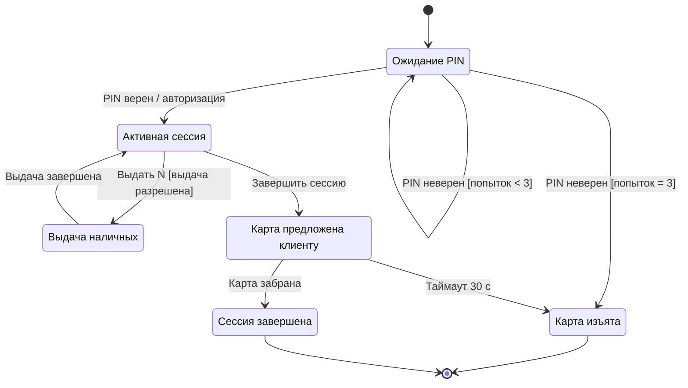

# Тестирование состояний и переходов

Состояние определяет, какие события система принимает сейчас. Переход описывает исходное состояние, событие, guard-условие, действие и следующее состояние. Проверяйте не только результат отдельного действия, но и порядок событий.

## Учебная модель банкомата

В этом примере карта возвращается по завершении сессии; после выдачи можно выбрать следующую операцию. Таймаут 30 секунд и изъятие после трёх неверных PIN — допущения примера, не универсальные банковские правила. «PIN введён» моделируем событием, а не отдельным состоянием.

## Контракт событий

| Состояние | Событие / условие | Ожидаемый результат |
| --- | --- | --- |
| Сессия | Выдать N; сумма разрешена | Одна операция выдачи |
| Сессия | N = 10 000, доступно 5 000 | Отказ; сессия сохранена, списания нет |
| Выдача | Повторная команда | Без второй выдачи; текущая операция продолжается |
| Выдача | Завершение | Возврат к выбору операций |
| Карта предложена | Клиент забрал карту | Завершение |
| Карта предложена | Истёк таймаут | Изъятие и запись события |

Guard выдачи должен учитывать положительную допустимую сумму, баланс, лимиты, наличие подходящих купюр и готовность устройства. Суммарной стоимости кассеты недостаточно: нужную сумму может быть невозможно собрать из номиналов. При ложном guard ожидаемый отказ и состояние задаются контрактом.

## Проверки

- Дойти до каждого состояния и выполнить допустимые выходы, включая повторные операции.
- Проверить неверный PIN и сброс счётчика по правилам новой сессии.
- Для таймаута проверить до границы, на границе и после неё; отдельно — гонку «карта забрана / таймер сработал». Уточнить порядок обработки событий.
- Во время выдачи отправить повторную команду и убедиться, что дополнительного списания и наличных нет.
- Смоделировать сбой устройства, потерю ответа и перезапуск. Зафиксировать правила сверки операции и восстановления; схема выше не покрывает эти аварийные ветки.

Двойной клик и повтор после потери ответа — разные случаи. Для API явно определить идентификатор операции или ключ идемпотентности, срок хранения результата и реакцию на тот же ключ с другой суммой. Проверить последовательные и конкурентные повторы одного ключа; новый ключ может обозначать новую операцию. Сам метод POST не обеспечивает идемпотентность.

## Выбор покрытия

Покрытие состояний требует посетить все состояния; 0-switch — пройти все допустимые переходы. Невалидные переходы проверяются отдельно: посещение состояния их не покрывает.

1-switch покрывает допустимые пары последовательных переходов; n-switch — цепочки из n+1 переходов. Например: сессия → выдача → сессия. Глубину выбирают по риску ошибок порядка, а не по правилу «регресс — одиночные, новый код — пары».

## Источники

- Предоставленная шпаргалка QA❤️4LIFE: «Тестирование состояний и переходов»; оригинальное изображение сохранено в [архиве](../../docs/sources/originals/state-transition-cheat-sheet.png).
- [ISTQB CTFL v4.0.1, §4.2.4 (EN)](https://istqb.org/wp-content/uploads/2024/11/ISTQB_CTFL_Syllabus_v4.0.1.pdf)
- [ISTQB CTAL-TA v4.0, §3.2.2: N-switch (EN)](https://istqb.org/wp-content/uploads/sdm-uploads/ISTQB-CTAL-TA-Syllabus-v4.0-EN-4.pdf)

В шпаргалке также указан Lee Copeland, A Practitioner's Guide to Software Test Design. Эта глава отдельно не проверялась; определения покрытия сверены с указанными syllabus.
