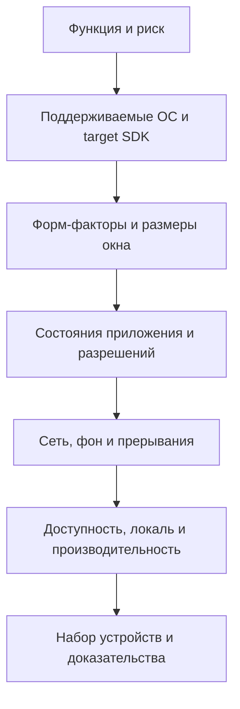

# Мобильное тестирование: практическое руководство

## Матрица покрытия

Для каждого значимого сценария фиксируйте версию приложения и backend, устройство или профиль эмулятора, ОС/API level, состояние установки, аккаунт, разрешения, сеть, локаль, тему и энергосберегающий режим. Это делает дефект воспроизводимым и помогает отличить проблему приложения от среды.

## Практические принципы

- Список устарел. Android 16 использует API 36, а Google Play с 31 августа 2026 требует API 36 для новых приложений и обновлений. Версии iOS нужно брать из текущей матрицы поддержки продукта и аналитики
- Их обычно относят к cross-platform native frameworks; hybrid чаще означает web-контент в native-контейнере. Риски WebView и нативного рендеринга различаются
- Это стартовая эвристика. Учитывайте минимальную поддерживаемую версию, долю пользователей, target SDK, модели с высокой аварийностью и изменения платформы
- Keychain, облачные резервные копии, серверное состояние и некоторые идентификаторы могут сохраниться. Отдельно проверяйте локальное, облачное и серверное состояние
- Лимиты менялись и зависят от версии ОС и типа invocation; проверяйте актуальные требования Apple для конкретной поставки
- Приложения с target Android 7+ по умолчанию не доверяют пользовательским CA. Нужна безопасная debug-конфигурация доверия; pinning и отдельные networking libraries могут по-прежнему блокировать перехват
- Android прямо предупреждает о рисках pinning и рекомендует предусматривать backup key. Решение принимает security/architecture с планом ротации
- Это возможные цели, но не универсальные критерии. Нужны продуктовый SLO, класс устройства, тип сети, сценарий запуска, percentile и метод измерения
- 4.5:1 относится к обычному тексту; для крупного текста допустим 3:1, а UI-компоненты и графика имеют отдельные требования WCAG
- Контракт API определяет допустимые коды, идемпотентность и тело ответа. Повторный DELETE может вернуть 204, 404 или иной документированный результат
- Это верно только при определённом контракте идемпотентности, например с idempotency key. Иначе несколько ресурсов могут быть корректным результатом
- Это security-проверки. Выполняйте их только в разрешённой среде, в согласованной области и без риска повредить данные
- Нужен смешанный подход. Эмуляторы дают быстрый масштаб, а реальные устройства обязательны там, где важны аппаратные датчики, OEM-поведение, энергия, радиомодуль и фактическая производительность

## Практический минимальный набор

1. Выберите устройства по доле пользователей и риску: минимум одна актуальная iOS-конфигурация, одна минимально поддерживаемая, несколько Android API/OEM и нужные форм-факторы.
2. Проверьте clean install, обновление с поддерживаемой предыдущей версии и восстановление состояния.
3. Пройдите критический путь при нормальной сети, затем при потере, задержке, переключении и восстановлении соединения.
4. Проверьте разрешение, отказ, ограниченный доступ, отзыв разрешения и возврат из Settings.
5. Проверьте foreground, background, terminated state, прерывания, deep links и push для поддерживаемых состояний.
6. Увеличьте системный шрифт, включите screen reader, тёмную тему, RTL/длинную локаль и внешнюю клавиатуру, если она входит в область.
7. Измеряйте запуск, отзывчивость, память, CPU, сеть и энергию на определённом классе устройства с повторяемым сценарием.
8. Перед выпуском повторите критический путь на реальных устройствах и зафиксируйте остаточный риск.

## Charles и сетевые проверки

Перехватывающий proxy полезен для наблюдения запросов, throttling и контролируемой подмены ответов. Не добавляйте доверие к тестовому CA в production-сборку. Для Android используйте debug-only Network Security Configuration; для iOS учитывайте ATS, pinning и поведение используемой библиотеки.

Проверяйте не только статус: метод, URL, заголовки, тело, аутентификацию, повтор, тайм-аут, кэш, редиректы, персональные данные и побочный эффект. Нагрузочные выводы по 50–100 запросам через Charles ограничены: для server-side capacity нужен отдельный инструмент и контролируемый профиль нагрузки.

## Чек-лист доказательств

- [ ] Матрица устройств опирается на поддержку, аналитику и риск.
- [ ] Указаны build, backend, ОС/API, модель и состояние установки.
- [ ] Для разрешений проверены grant, deny, limited, revoke и Settings.
- [ ] Состояние сохраняется при повороте, resize, фоне, убийстве процесса и нехватке памяти там, где это требуется.
- [ ] Offline/retry/sync не создают дубликаты и не показывают данные другого аккаунта.
- [ ] Accessibility проверена сервисами платформы, а не только визуально.
- [ ] Пороги производительности имеют условия и источник требования.
- [ ] MITM и инъекционные проверки выполнялись только в разрешённой среде.
- [ ] Известные пропуски и остаточный риск вошли в отчёт.

## Источники

- [Евгений Гусинец — «Шпаргалка-гайд по мобильному тестированию»](https://qa4life.yonote.ru/share/410ee537-b9b4-4c37-87f8-6856defec0b1), прочитано 2026-09-22.
- [Android API levels](https://developer.android.com/guide/topics/manifest/uses-sdk-element), [Google Play target API requirements](https://developer.android.com/google/play/requirements/target-sdk), [Network Security Configuration](https://developer.android.com/privacy-and-security/security-config) и [минимизация permission requests](https://developer.android.com/privacy-and-security/minimize-permission-requests), проверено 2026-09-22.
- [Тестирование веб-интерфейса](../../playbooks/checklists/web-ui-testing.md).
- [Основы запросов REST API](../api-testing/rest-api-request-basics.md).
- [Планирование тестирования по рискам](../qa-process/test-planning.md).
