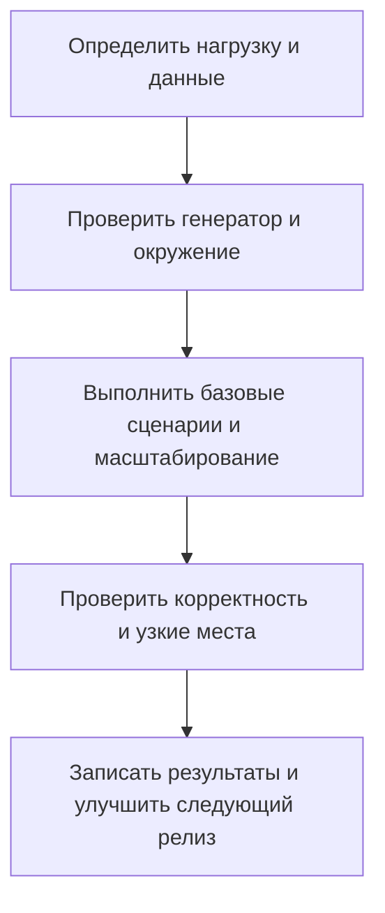

# Воспроизводимое нагрузочное тестирование

## Кратко

Сделайте тестирование производительности повторяемой частью релиза: реалистичные данные, описанная нагрузка и проверки корректности наряду с пропускной способностью.

## Содержание источника

Инженеры LDM описывают регулярную программу тестирования платформы управления контентом. Они используют Gatling с отдельным Kubernetes-окружением, заранее загружают документы и политики доступа, проверяют операции отдельно, затем масштабирование и длительную нагрузку. Проверки включают последующее чтение: успешный ответ загрузки не доказывает, что файл можно корректно скачать.

Среди описанных узких мест — насыщение БД, общий сетевой интерфейс, ограничивающий генерацию нагрузки, и фрагментация памяти. Отчёты ведут к изменениям следующих релизов. Смешанные нагрузки и реальные запросы приложения требуют дополнительного покрытия помимо изолированных операций. Это наблюдения команды, а не независимо воспроизведённые измерения. [Кейс](https://habr.com/ru/articles/1061680/)

## Ключевые понятия и значение для QA

| Понятие | Вопрос QA |
| --- | --- |
| Масштаб данных | Набор соответствует production по размеру и распределению? |
| Профиль нагрузки | Какие операции, пользователи, интенсивности поступления и паузы представлены? |
| Мощность генератора | Не ограничивает ли измерение клиент или общая сеть? |
| Корректность под нагрузкой | Можно точно прочитать завершённые записи? |
| Масштабируемость | Какая зависимость мешает дополнительным экземплярам увеличить пропускную способность? |
| Повторяемость | Записаны версии, настройки и изменения нагрузки? |

## Практический пример

Для API документов согласуйте бюджет задержки и ошибок, загрузите репрезентативные документы и выполните загрузку с последующим чтением. Записывайте перцентили времени ответа, ошибки, успешные бизнес-операции и насыщение инфраструктуры. Повторите со смешанным профилем до переноса выводов на клиентскую нагрузку. Это предлагаемое упражнение, а не измерение из статьи.

## Ограничения и критическое чтение

Широкие формулировки масштабируемости в статье соседствуют с узким местом БД. Сохраняйте эту границу выводов. Ограничение БД важно для поставляемой системы независимо от обслуживающей команды. Сравнения инструментов, лицензирование и показатели ёмкости зависят от версии и конфигурации; заметка не рекомендует покупку и не повторяет их как универсальные факты. Встроенные графики отдельно не переписывались и не проверялись; полный текст статьи прочитан.

## Связанные темы и источники

- [Проверка API-запроса](../../playbooks/checklists/api-request-review.md)
- [Планирование тестирования](../qa-process/test-planning.md)
- Владимир Семёнов и Олеся Панкова, [кейс нагрузочного тестирования LDM](https://habr.com/ru/articles/1061680/), получен через дайджест июля 2026 года. Первичный рассказ компании о собственной работе.
