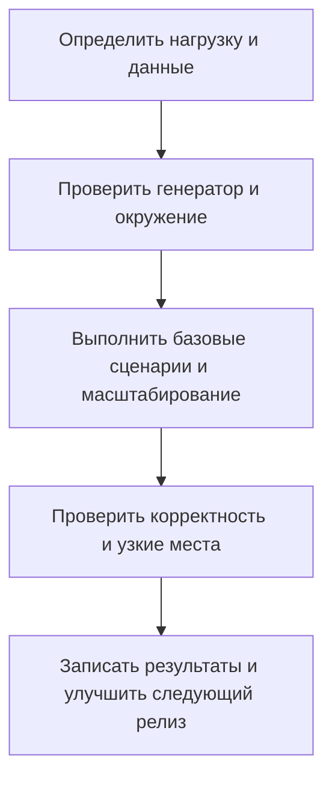

# Воспроизводимое нагрузочное тестирование

Сделайте тестирование производительности повторяемой частью релиза: реалистичные данные, описанная нагрузка и проверки корректности наряду с пропускной способностью.

## Профиль и корректность

Инженеры LDM описывают регулярную программу тестирования платформы управления контентом. Они используют Gatling с отдельным Kubernetes-окружением, заранее загружают документы и политики доступа, проверяют операции отдельно, затем масштабирование и длительную нагрузку. Проверки включают последующее чтение: успешный ответ загрузки не доказывает, что файл можно корректно скачать.

Среди описанных узких мест — насыщение БД, общий сетевой интерфейс, ограничивающий генерацию нагрузки, и фрагментация памяти. Отчёты ведут к изменениям следующих релизов. Смешанные нагрузки и реальные запросы приложения требуют дополнительного покрытия помимо изолированных операций. Это наблюдения команды, а не независимо воспроизведённые измерения. [Кейс](https://habr.com/ru/articles/1061680/)

## Ключевые понятия и значение для QA

| Понятие | Вопрос QA |
| --- | --- |
| Масштаб данных | Набор соответствует production по размеру и распределению? |
| Профиль нагрузки | Какие операции, пользователи, интенсивности поступления и паузы представлены? |
| Мощность генератора | Не ограничивает ли измерение клиент или общая сеть? |
| Корректность под нагрузкой | Можно точно прочитать завершённые записи? |
| Масштабируемость | Какая зависимость мешает дополнительным экземплярам увеличить пропускную способность? |
| Повторяемость | Записаны версии, настройки и изменения нагрузки? |

## Практический пример

Для API документов согласуйте бюджет задержки и ошибок, загрузите репрезентативные документы и выполните загрузку с последующим чтением. Записывайте перцентили времени ответа, ошибки, успешные бизнес-операции и насыщение инфраструктуры. Повторите со смешанным профилем до переноса выводов на клиентскую нагрузку. Это предлагаемое упражнение, а не измерение из статьи.

```mermaid
flowchart TD
 A[Определить нагрузку и данные] --> B[Проверить генератор и окружение]
 B --> C[Выполнить базовые сценарии и масштабирование]
 C --> D[Проверить корректность и узкие места]
 D --> E[Записать результаты и улучшить следующий релиз]
```

## Ограничения и критическое чтение

Широкие формулировки масштабируемости в статье соседствуют с узким местом БД. Сохраняйте эту границу выводов. Ограничение БД важно для поставляемой системы независимо от обслуживающей команды. Сравнения инструментов, лицензирование и показатели ёмкости зависят от версии и конфигурации; заметка не рекомендует покупку и не повторяет их как универсальные факты. Встроенные графики отдельно не переписывались и не проверялись; полный текст статьи прочитан.

## Инженерный цикл нагрузки

Статья Sportmaster Lab дополняет регулярные прогоны процессом от требований до решения. Используйте шесть этапов как структуру артефактов, а не гарантию детерминированного результата.

| Этап | Что должно быть готово |
| --- | --- |
| Подготовка | Сборка, интеграции, генератор и мониторинг |
| Требования | Метрика, цель, профиль и ограничения |
| Методика | Цель итерации, частота и критерии остановки |
| Сценарии | Методы → операции → пути пользователя; данные |
| Проведение | Согласованный слот, наблюдение и сохранённый запуск |
| Интерпретация | Выполнение SLO, деградация, запас и план действий |

Типичный профиль и всплеск проверяют разные вопросы: не исключайте пики навсегда только потому, что они нетипичны. Отмечайте исключённые операции и влияние исключений на выводы. Пейсинг задаёт интервал между началами итераций; если итерация длиннее интервала, проверьте фактически достигнутую интенсивность. Прогрев не заменяет отдельного сценария холодного старта.

### Паспорт запуска — авторский шаблон

- SHA сборки, версии зависимостей и конфигурация; различия со средой пользователей.
- Профиль, объём и распределение данных; источник прогноза роста.
- Метрики бизнес-успеха, задержки, ошибок и насыщения; окно измерения и целевые значения.
- Оператор, ограничения нагрузки, стоп-условия и способ восстановления.
- Достигнутая нагрузка, первый нарушенный критерий, исключения и следующая задача.

Не переносите внутренние пороги светофора 5%/15% и полгода на любой проект. Задайте формулу запаса и прогноз с допущениями; скорость роста не обязана быть линейной. Тест на production требует согласованного ограничения воздействия и немедленной реакции на угрозу пользователям. Совет «не чинить ночью» не отменяет обязанность остановить вредный прогон и восстановить сервис. Эти процедуры предложены для планирования, нагрузка в QA Lab не запускалась.

## Связанные темы и источники

- [Проверка API-запроса](../../playbooks/checklists/api-request-review.md)
- [Планирование тестирования](../qa-process/test-planning.md)
- Владимир Семёнов и Олеся Панкова, [кейс нагрузочного тестирования LDM](https://habr.com/ru/articles/1061680/), получен через дайджест июля 2026 года. Первичный рассказ компании о собственной работе.

- [Sportmaster Lab: Нагрузочное тестирование как инженерный процесс (RU)](https://habr.com/ru/companies/sportmaster_lab/articles/1082436/)

Детали, представленные только на встроенных изображениях источника, отдельно не транскрибировались; заметка опирается на доступный текст и авторские рабочие шаблоны.
