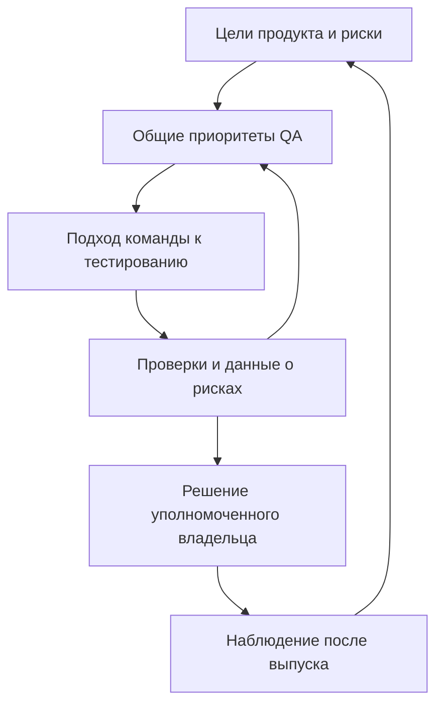

# Lead QA и Head of QA — ответственность, метрики и рост

## Главное

Lead QA обычно организует тестирование в команде или продукте, а Head of QA развивает QA-функцию в более широком контуре. Это полезная модель масштаба, а не универсальная иерархия должностей. Проверяйте реальные полномочия, число команд, бюджет и ожидаемые результаты.

## Сравнение в девяти измерениях

| Измерение | Lead QA: типичный фокус | Head of QA: типичный фокус |
| --- | --- | --- |
| Ответственность | Тестирование команды, проекта или продукта | Развитие QA-функции нескольких команд или подразделения |
| Планирование | Релиз, итерация, квартальные улучшения | Межкомандные приоритеты и долгосрочные возможности |
| Люди | Наставничество, координация; иногда прямое управление | Руководители команд, найм, развитие компетенций; по полномочиям |
| Техника | Тест-дизайн, ревью, надёжность автоматизации | Согласование общих принципов с Engineering и техническими экспертами |
| Коммуникации | Разработчики, Product, смежные команды | Руководство, Product, Engineering, финансы и другие функции |
| Бюджет | Оценка потребностей; возможен собственный лимит | Планирование и обоснование инвестиций; утверждение может быть выше |
| Метрики | Риски релиза и эффективность обратной связи | Пользовательские последствия и устойчивость QA-функции |
| Стратегия | Разрабатывает подход продукта и влияет на общую стратегию | Согласует стратегию функции с бизнес-целями |
| Влияние | Команда или поток работ; возможны общие инициативы | Несколько продуктов, подразделение или организация |

Названия QA Lead, Test Lead, QA Manager, Head, Director и VP не являются автоматическими синонимами. Отдельно выясняйте техническое лидерство и административное управление людьми. Качество продукта — совместная ответственность, а не исключительная обязанность QA.

## Повседневная работа и результаты

**Lead QA:** анализ требований и рисков, ревью тестов и баг-репортов, оценка объёма тестирования, поддержка автоматизации, наставничество и синхронизация. Полезные результаты: карта рисков, план проверок, понятный отчёт об остаточном риске, устранённые причины нестабильных тестов. Лид может делегировать выполнение проверок; обязательной доли времени «в коде» нет.

**Head of QA:** согласование приоритетов нескольких команд, модель компетенций, план развития людей, обоснование бюджета, общие подходы к качеству и оценка улучшений. Полезные результаты: согласованные владельцы решений, портфель улучшений, прозрачные затраты и связь качества с последствиями для пользователей. В полученной подборке нет отдельного листа ежедневных задач Head; этот абзац — редакционный синтез, а не пересказ отсутствующей страницы.

В обзорной странице [ISTQB CTAL-TM](https://istqb.org/certifications/certified-tester-advanced-level-test-management-ctal-tm-v3-0/) рассматриваются и организационная стратегия, и подход проекта, и управление командой. Поэтому формула «Lead только исполняет, Head только создаёт стратегию» чрезмерно жёсткая. Обзор не устанавливает соответствие корпоративных титулов.

## Метрики без ложных KPI

Следующая таблица — рекомендации этого разбора. Любая метрика требует периода, знаменателя, источника данных и решения, которое она помогает принять. Не используйте количество найденных багов для рейтинга сотрудников.

| Метрика из изображений | Как применять и что уточнить |
| --- | --- |
| Плотность дефектов | Согласовать единицу размера и тяжесть; разные продукты и способы обнаружения несопоставимы напрямую |
| Покрытие тестами | Назвать объект: риски, требования, код или сценарии; наличие тест-кейса не доказывает выполнение и качество проверки |
| Время регрессии | Разделять календарное время и трудозатраты; ускорение оценивать вместе с остаточным риском |
| Процент автоматизации | Определить набор подходящих проверок; учитывать поддержку, нестабильность и скорость обратной связи |
| Дефекты после релиза | Фиксировать тяжесть, влияние и окно наблюдения; число зависит от нагрузки и обнаружения |
| Выполнение плана | Уточнить состав актуального плана и заблокированные проверки; 100% выполнения не равно приемлемому риску |
| OKR качества | Это система целей и измеримых результатов, а не отдельная метрика; связывать с пользовательским эффектом |
| Cost of Quality | Учитывать предупреждение, оценку качества, внутренние и внешние отказы; не ограничивать исправлением багов |
| SLA по инцидентам | Уточнить обещание и последствия нарушения; не смешивать договорённость с внутренней целью и временем восстановления |
| Рост и удержание | Рассматривать текучесть, развитие навыков и обратную связь совместно; eNPS сам по себе не измеряет компетентность |
| Time to Market | Общий результат Product, Engineering и других функций; отделять ожидание от полезного тестирования |
| Зрелость процессов | Нужны модель, версия, область и оценка; название TMMi/CMMI или уровень не гарантируют качество продукта |

[ASQ](https://asq.org/quality-resources/cost-of-quality) различает четыре категории Cost of Quality. Пример для ПО: обучение предупреждает проблемы, тестирование оценивает качество, доработка до выпуска относится к внутренним отказам, поддержка из-за дефекта после выпуска — к внешним. Это шире затрат QA-команды.

[Google SRE](https://sre.google/sre-book/service-level-objectives/) различает SLI (измеряемый показатель), SLO (целевое значение) и SLA (соглашение с последствиями нарушения). Срок реакции может быть частью SLA, но не всякий внутренний целевой срок является SLA. Кто восстанавливает сервис и кто принимает риск, нужно согласовать с владельцем сервиса и участниками incident response.

## Пример распределения решений

Учебная ситуация: перед выпуском изменений оплаты обнаружены повторные списания. Это пример применения, не результат проведённого тестирования.

| Участник | Действие и результат |
| --- | --- |
| Lead QA | Проверяет воспроизводимость, область риска и проверки исправления; готовит рекомендацию по выпуску |
| Head of QA | Помогает снять межкомандные ограничения и выделить ресурсы; проверяет, нужна ли общая профилактика |
| Engineering и владелец сервиса | Исправляют причину, организуют наблюдаемость, восстановление и технический откат |
| Уполномоченный владелец релиза / бизнеса | Принимает решение по заранее согласованным правилам и фиксирует принятый риск |

Head не обязан лично утверждать каждый релиз, а Lead не получает право блокировки только из названия должности. Эти полномочия определяет рабочее соглашение команды.

## Карьера и размер компании

В изображениях показан путь Engineer → Senior → Lead → Manager → Head/VP со стажем 0–2, 2–4, 3–6, 5–8 и 8+ лет. Это неподтверждённая иллюстрация, не требования к повышению. Оценивать стоит самостоятельность, сложность решаемых задач, развитие коллег и доказанный масштаб влияния. Возможен технический путь через экспертные роли без управления людьми; названия и переходы зависят от компании. Пометка «вы здесь» не описывает карьеру читателя.

Схема «до 50 / 50–300 / 300+ сотрудников» также не является стандартом. В небольшой компании роли могут совмещаться; крупная может распределять QA по продуктовым командам без отдельного Head. Утверждения «в стартапе нет QA Manager» и «в enterprise всегда отдельные должности» нельзя применять как правила. Смотрите на число продуктов, риски, регулирование, зрелость и устройство команд.

## Практические принципы

- Разделение стратегии и тактики сохранено как ориентир масштаба, а не запрет лиду создавать стратегию.
- «Полная ответственность за бюджет» заменена проверкой реальных полномочий и порядка утверждения.
- Пропорция 60% задач / 30% коммуникаций / 10% менторинга не принята как норматив: оснований или исследования на изображениях нет.
- Сроки карьерного роста и численность компании не используются как критерии уровня специалиста или обязательного состава должностей.
- Уточнены Cost of Quality, покрытие, SLA и ограничения KPI; TMMi/CMMI не рассматриваются как взаимозаменяемые шкалы. Их полные модели в рамках этого разбора не изучались.
- Head, Director и VP не приравниваются; значок ISTQB не представлен подтверждением содержания инфографики.

## Чек-лист обсуждения роли

- [ ] Какие продукты, команды и риски входят в зону ответственности?
- [ ] Какие решения принимаю сам, а какие согласую и с кем?
- [ ] Есть ли прямые подчинённые, найм, оценка и бюджетные полномочия?
- [ ] Какие результаты ожидаются за первые 90 дней и какими данными их проверим?
- [ ] Кто принимает решение о выпуске и остаточный бизнес-риск?
- [ ] Какие технические и управленческие навыки нужны для следующего шага?

## Источники

- [Планирование тестирования](test-planning.md).
- [Координация релизов](release-orchestration.md).
- [Измеримые критерии качества](../fundamentals/software-quality-criteria.md).
- [Шаблон тест-плана](../../playbooks/templates/test-plan.md).
- [Реестр семи исходных изображений](../../docs/sources/2026-09-16-qa-lead-head-infographics.md): русскоязычный источник, названия листов и SHA-256; исходный URL, автор и лицензия неизвестны.
- Проверочные источники выше — англоязычные страницы ISTQB, ASQ и Google SRE, просмотренные 2026-09-16. Полный syllabus ISTQB не заявляется прочитанным.
