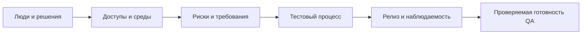

# QA Onboarding: проверенный чек-лист первых дней

## Кратко

Одностраничная инфографика предлагает 17 вопросов для подключения QA к проекту: команда и workflow, документация и среды, коммуникации и выпуск, инфраструктура, тестовые артефакты, лицензии и метрики. Это хорошая карта разговора, но обещание завершить onboarding за 48 часов следует понимать как цель для первичного доступа и ориентации, а не как гарантию полной готовности.

PDF полностью просмотрен визуально. Это одна горизонтальная русскоязычная страница, автор — Евгений Гусинец, указан Telegram-канал QA4Life. Дата публикации, исходный URL и лицензия не указаны. Присланное текстовое описание совпадает со структурой листа; на самом листе пункт 12 включает release checklist, hotfix и rollback, а не только пять изображённых стадий.

## Результат onboarding

Onboarding завершён не после получения списка ссылок, а когда QA способен самостоятельно взять изменение, найти требование, подготовить данные, проверить его на допустимой среде, оформить дефект, объяснить риск и участвовать в решении о выпуске.

## Проверенный чек-лист

### 1. Люди и процесс

- [ ] Известны владелец продукта, технический владелец, QA-владелец, release owner и лица, принимающие риск.
- [ ] Для решений и эскалаций описано, кто отвечает, согласует, консультирует и получает уведомление.
- [ ] Получен минимально необходимый доступ к task tracker; понятны типы задач, статусы, Definition of Ready/Done и приоритеты.
- [ ] Правила учёта времени уточнены только там, где организация действительно его требует.
- [ ] QA прошёл одну реальную задачу по workflow и знает исключения: возврат, блокировку, hotfix и отмену.

### 2. Требования и среды

- [ ] Найдены актуальные требования, решения, API-контракты и владелец каждого источника истины.
- [ ] Для Dev/Stage/UAT/Prod известны назначение, версия, конфигурация, данные, способ доставки и ограничения доступа.
- [ ] Уточнены нефункциональные требования: производительность, надёжность, безопасность, доступность, совместимость и наблюдаемость.
- [ ] Известны цели спринта или потока, ближайшие даты, зависимости и критерии выпуска.
- [ ] Отдельно записаны пробелы требований и вопросы, которые нельзя закрыть предположением.

### 3. Коммуникация и выпуск

- [ ] Понятны обязательные встречи, асинхронные каналы, формат статуса и время реакции на инциденты.
- [ ] Границы API/UI/mobile/backend не подменяют совместную ответственность за пользовательский путь.
- [ ] Для демо известны аудитория, цель, данные, сценарий, ответственный и запасной план.
- [ ] Release flow описывает триггер, approvals, миграции, feature flags, rollback, мониторинг и post-release ownership.
- [ ] Code freeze и demo используются только если это реальный процесс проекта; они не универсальные стадии каждого релиза.

### 4. Инфраструктура и тестирование

- [ ] Доступы выдаются по принципу минимальных привилегий; секреты не пересылаются в задачах и документах открытым текстом.
- [ ] Для VPN, логов, CI/CD, feature flags, observability и тестовых данных известны владелец и путь запроса доступа.
- [ ] В TMS или репозитории найдены актуальные наборы, история прогонов, правила ревью и связь с рисками/требованиями.
- [ ] Выбран подходящий уровень документации: charter, checklist, test case или автоматизированная проверка.
- [ ] Для сторонних компонентов фиксируются точные SPDX-идентификаторы и версия; решение о совместимости принимают engineering/legal/OSPO, а QA проверяет согласованный контроль.
- [ ] Метрики имеют определение, источник, владельца, период и ожидаемое решение; одна цифра не служит оценкой качества или сотрудника.

## Поправки к 17 пунктам

| На листе | Практическое уточнение |
| --- | --- |
| «Проверить всё за первые 48 часов» | За два дня реально создать карту проекта и разблокировать критичные доступы; обучение домену и самостоятельная поставка требуют проверяемых этапов |
| IP, VPN, серверы и логины | Запрашивайте минимальные роли через утверждённый канал; прямой Production-доступ QA не является обязательным |
| Dev → Stage → UAT → Production | Названия и количество сред различаются; важнее назначение, конфигурация, данные и promotion path |
| API/UI/Mobile/Backend как жёсткие зоны | Компонентные владельцы полезны, но критические пользовательские пути требуют совместной проверки границ |
| Freeze → Testing → Demo → Deploy → Monitoring | Это один возможный процесс. Непрерывная поставка, feature flags и progressive delivery могут обходиться без общего freeze или pre-release demo |
| MIT/GPL/Apache | Название семейства недостаточно: нужны точная версия лицензии, исключения, способ распространения и политика организации; SPDX идентифицирует лицензии, но не даёт юридического заключения |
| Bug density 2.3 bugs/KLOC — «положительно» | Без определения дефекта, языка, фазы обнаружения и контекста число не интерпретируется; снижение может означать и худшее обнаружение |
| Test coverage 67% — «в норме» | Вид покрытия и риск не указаны. Высокое покрытие не доказывает качество assertions или значимость сценариев |
| Velocity 45 — «рост» | Velocity нужна команде для планирования; это не производительность и её нельзя корректно сравнивать между командами |

## Доказательства готовности

| Этап | Наблюдаемый результат |
| --- | --- |
| Доступ | QA открывает задачу, документацию, тестовую среду, логи и pipeline в разрешённой роли |
| Понимание | Может нарисовать путь изменения от требования до Production и назвать владельцев решений |
| Практика | Самостоятельно проверяет небольшую задачу, сохраняет доказательства и оформляет воспроизводимый дефект |
| Релиз | Объясняет критерии выпуска, rollback, сигналы мониторинга и остаточный риск |
| Обратная связь | Список пробелов onboarding передан владельцам и превращён в задачи документации/доступа |

## Источники и связи

- PDF «QA ONBOARDING CHECKLIST: Что узнать при подключении на проект», одна страница, автор Евгений Гусинец, получен 2026-09-22.
- [SPDX: работа с информацией о лицензиях](https://spdx.dev/learn/handling-license-info/) и [обзор SPDX](https://spdx.dev/about/overview/).
- [Atlassian: sprint velocity](https://www.atlassian.com/agile/project-management/velocity-scrum) и [DORA delivery metrics](https://dora.dev/guides/dora-metrics/).

Связи: [подготовка и выпуск релиза](release-readiness-playbook.md), [планирование на основе рисков](test-planning.md), [Lead QA и Head of QA](lead-qa-vs-head-of-qa.md).
