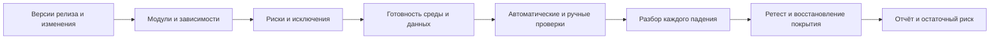

# Регресс: объём, прогон и разбор падений

Регресс проверяет, не нарушило ли изменение ранее работавшее поведение. Подтверждающее тестирование проверяет конкретное исправление. Планируйте оба вида, но не считайте успешный ретест доказательством отсутствия побочных эффектов.

## От изменения до решения



## Что включить в план

| Источник риска | Что добавить к списку изменённых файлов |
| --- | --- |
| Прямые изменения | Модули, владельцы, затронутые сценарии и контракты |
| Косвенные зависимости | Вызывающие сервисы, цепочки A → B → C, потребители общих библиотек |
| Миграции | Преобразование данных, совместимость версий, проверенный путь восстановления |
| Флаги | Доступные состояния и переключение в работающей системе |
| Кэш и CDN | Холодное и прогретое состояние, инвалидирование |
| Очереди и вебхуки | Доставка, задержки, повторы, DLQ, совместимость потребителя |
| Индексы и фоновые процессы | Лаг реплик, поиск, расписание задач и сходимость |
| Конфигурация и инфраструктура | Таймауты, лимиты, зависимости, права, внешние настройки |
| Границы поставки | Фактические версии с учётом cherry-pick, revert и состава развёртывания |

Начните с реальных версий, а не произвольных названий веток. Примеры ниже используют условные теги, существование которых нужно проверить в своём репозитории:

```sh
git diff --name-only v1.2.3..v1.2.4
git diff --stat v1.2.3..v1.2.4
git log --oneline v1.2.3..v1.2.4
```

Diff показывает изменения файлов, а не полную область риска. Приоритизируйте по вероятности и последствиям; числовая шкала полезна только при согласованных значениях. Запишите исключённые зоны, причину и принимающего риск. Миграции проверяйте на разрешённых обезличенных или синтетических данных с реалистичными свойствами; откат схемы не всегда возможен и не равен восстановлению данных.

## Готовность и глубина

- Вход: согласованы сборка и конфигурация, доступны данные и зависимости, среда прошла базовую проверку готовности.
- Глубина: быстрые проверки работоспособности, критичные сквозные пути, затем более широкий набор по риску. Длительность задаёт проект; универсальных минут и часов нет.
- Автоматизация покрывает известные ожидания; ручные и исследовательские сессии закрывают пробелы и новые риски.
- Частый небольшой набор даёт быструю обратную связь; расписание широких прогонов зависит от стоимости и риска. Полный прогон сам по себе не создаёт flaky-поведение.
- Выход: план выполнен либо исключения отмечены; падения разобраны, исправления перепроверены, открытые риски имеют владельца решения.

Изменения продукта, исправления, миграции, вывод компонентов, зависимости и настройки — поводы пересмотреть объём. Не каждый повод требует одинакового набора.

## Команды отбора и отчёта

Маркеры pytest нужно объявить в конфигурации и присвоить тестам. Команды — примеры для настроенного проекта, в Lab они не запускались.

```sh
pytest -m "regression and not quarantine" --junitxml=report.xml
pytest -m quarantine
pytest --lf
npx playwright test --grep @regression
npx playwright test --last-failed
npx playwright test --grep @regression --shard=1/4
```

`--lf` и `--last-failed` используют историю прошлого запуска, не покрывают весь релиз и требуют сохранённого состояния. Для четырёх шардов запустите все четыре части и объедините результаты. Параллельные тесты требуют независимых данных. Отбор по изменениям может пропустить динамические связи: проверяйте его область и дополняйте рискованными путями.

## Разбор падения

| Шаг | Проверка | Результат |
| --- | --- | --- |
| Сохранить сигнал | Первый запуск, сборка, среда, данные, логи, trace | Исходное свидетельство не затёрто ретраем |
| Воспроизвести | Те же условия; затем контролируемое изменение одного фактора | Условия воспроизведения или открытая неопределённость |
| Классифицировать | Контракт, продукт, тест, данные и инфраструктура | Причина или гипотеза с ответственным |
| Локализовать | Сравнение версий; bisect при устойчивом критерии | Подтверждённая связь с изменением |
| Исправить и проверить | Исходный сценарий плюс побочные риски | Ретест, результат и восстановленное покрытие |

Три повтора не доказывают flaky-тест: непостоянным может быть дефект продукта. Quarantine означает потерю надёжного сигнала, поэтому нужны владелец, срок, отдельный прогон и компенсация критичного риска. Ретраи ограничивайте политикой, сохраняйте все попытки. В Playwright `--fail-on-flaky-tests` может делать такой результат причиной неуспешного запуска; проверьте поддержку своей версией.

Bisect полезен при воспроизводимом критерии good/bad и возможности проверять промежуточные коммиты. Он находит границу наблюдаемого поведения, а не автоматически доказывает первопричину; завершайте сессию `git bisect reset`.

## Карточка модуля и ревизия

Храните границы, зависимости, критичные сценарии, источники и ограничения данных, интеграционные ожидания, известные дефекты и связанные изменения. Обновляйте вместе с изменением поведения. Удаляйте устаревшие проверки, объединяйте реальные дубли и сохраняйте различающиеся риски. Следите за временем прогона, нестабильностью, трудозатратами разбора и пропущенными дефектами; pass rate без объёма и исключений мало говорит о качестве.

## Связанные материалы

- [Единый цикл ручного и автоматизированного тестирования](manual-automation-quality-loop.md)
- [Готовность релиза](release-readiness-playbook.md)

## Источники

- [Евгений Гусинец / QA❤️4Life: «Чек-лист регрессионного тестирования. Часть 1: что брать в регресс» (RU)](https://telegra.ph/CHek-list-regressionnogo-testirovaniya-CHast-1-chto-brat-v-regress-09-28)
- [Тот же автор: «Часть 2: как прогнать и разобрать падения» (RU)](https://telegra.ph/CHek-list-regressionnogo-testirovaniya-CHast-2-kak-prognat-i-razobrat-padeniya-09-28)
- [pytest: маркеры (EN)](https://docs.pytest.org/en/stable/how-to/mark.html)
- [Playwright CLI (EN)](https://playwright.dev/docs/test-cli)

Обе статьи прочитаны полностью через публичный API Telegraph; связанные книги и syllabus отдельно не читались. Таблицы и примеры оформлены как практическая адаптация, а не копия исходников.
