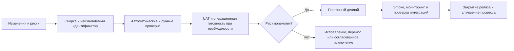

# Подготовка и выпуск релиза: playbook

## Рабочая модель релизной готовности

Перед каждым релизом зафиксируйте конкретную сборку или commit SHA, область изменений, зависимости, миграции, результаты проверок, нерешённые дефекты, план отката, сигналы мониторинга и владельца решения. Один и тот же артефакт должен проходить проверки и попадать в production; пересборка после одобрения создаёт новую неопределённость.

## Практические принципы

- Definition of Ready — распространённое командное соглашение, но не официальный commitment Scrum. Scrum Guide говорит, что элементы приобретают достаточную готовность через refinement
- DoD описывает состояние Increment и обязательные меры качества. Она не гарантирует отсутствие технического долга и не является релизным разрешением сама по себе
- Качество — общая ответственность. QA предоставляет информацию о риске; технические ограничения должны обеспечивать CI, правила веток, ревью и права доступа
- Это один рабочий процесс. Trunk-based development, feature flags, короткоживущие ветки и continuous delivery используют другие способы стабилизировать поставку
- SemVer описывает изменения публичного API. Для внутреннего приложения команда может выбрать другой формат, если он однозначно связывает сборку, код и окружение
- Статус сам по себе не определяет решение. Нужны критичность, покрываемый риск, причина, обходной путь, владелец исключения и влияние на остаточный риск
- Приёмочное тестирование зависит от договора и процесса. Оно может включать пользовательское, эксплуатационное, договорное или нормативное подтверждение и не обязано быть единственным финальным этапом
- Длительность наблюдения определяется профилем трафика, отложенными заданиями, кэшами, интеграциями и SLO. Для некоторых отказов нужны сутки или полный бизнес-цикл
- Важны воспроизводимость, минимальный diff, проверка, одобрение, наблюдаемость и синхронизация исправления во всех поддерживаемых ветках; названия веток вторичны

## Релизные критерии как доказательства

| Область | Минимальное доказательство |
| --- | --- |
| Идентичность | Версия, commit SHA, checksum или image digest; перечень компонентов |
| Изменения | Связанные задачи, release notes, миграции, feature flags и конфигурация |
| Качество | Результаты обязательных проверок, известные дефекты, пропуски и обоснование |
| Данные | Проверенная миграция, резервная копия или доказанный иной способ восстановления |
| Эксплуатация | Дашборды, алерты, логи, владельцы реакции и критерии отката |
| Бизнес | Нужные согласования, поддержка, коммуникации и время запуска |
| Решение | Кто одобрил выпуск, когда, на основании каких данных и с каким остаточным риском |

## Замеченные несогласованности

- На последнем слайде указано 150 тест-кейсов, но статусы дают 142 пройденных + 5 непройденных + 1 заблокированный + 0 пропущенных = 148. Два теста не имеют статуса. Такой отчёт нельзя считать полным до сверки знаменателя.
- Круговая диаграмма со слайда о регрессии иллюстративна. Проценты и абсолютные числа нужно получать из одного снимка данных, иначе визуализация может расходиться с отчётом.
- «Конфигурация production отличается» правильно названа угрозой, но защита шире документирования: конфигурацию полезно версионировать, сравнивать автоматически и проверять безопасные значения перед выкладкой.
- Наличие плана отката не означает, что откат возможен. Для необратимых миграций данных нужна отдельная roll-forward или recovery-стратегия и репетиция.

## Чек-лист выпуска

- [ ] Определены релизная версия и неизменяемый артефакт.
- [ ] Известны изменения, зависимости, миграции и feature flags.
- [ ] Обязательные проверки завершены; отклонения имеют владельца и оценку риска.
- [ ] Среда и конфигурация сопоставимы с production либо различия явно проверены.
- [ ] План выкладки, остановки, отката или восстановления выполним и проверен.
- [ ] Дашборды, алерты, логи и бизнес-сигналы готовы до начала деплоя.
- [ ] Назначены владелец решения, исполнитель выкладки и участники реакции на инцидент.
- [ ] После деплоя проверены smoke-сценарии, интеграции и выбранные метрики.
- [ ] Итоговый отчёт содержит знаменатели, пропуски, известные проблемы и рекомендацию.

## Источники

- [Исходный PDF — «QA Release Playbook»](../../docs/sources/originals/2026-09-21-qa-release-playbook.pdf), SHA-256 `faacf54d819a9db558c4ef4b584b05fac9839b2f0dfe61ee2c4556e3851c146d`.
- [Автоматизация координации релизов](release-orchestration.md).
- [Планирование тестирования по рискам](test-planning.md).
- [Шаблон тест-плана](../../playbooks/templates/test-plan.md).
- [Scrum Guide 2020](https://scrumguides.org/docs/scrumguide/v2020/2020-Scrum-Guide-US.pdf), [Semantic Versioning 2.0.0](https://semver.org/) и [GitHub flow](https://docs.github.com/en/get-started/using-github/github-flow), проверено 2026-09-21.
