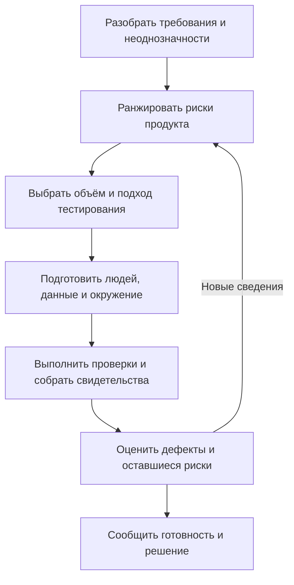

# Планирование тестирования по рискам

## Процесс

## Решения планирования

| Решение | Что записать |
| --- | --- |
| Объём | Включённое и исключённое поведение, обоснование |
| Тест-дизайн | Основные пути, необязательные значения, неверный ввод, допустимый ввод в запрещённых состояниях |
| Риски качества | Функциональность, производительность, безопасность и другие значимые риски |
| Ресурсы | Ответственные, навыки, инструменты, окружение, данные и зависимости |
| Расписание | Этапы, оценки, ограничения и отчётность о прогрессе |
| Вход | Условия начала полезного тестирования |
| Приостановка/возобновление | Когда остановиться и что позволяет продолжить |
| Выход | Свидетельства и критерии остаточного риска для завершения тестирования |
| Отчётность | Покрытие, дефекты, заблокированные проверки и решения |

## Практический пример и ответственность

Для релиза сохранённых платёжных методов поставьте доступ к чужому аккаунту и неверный выбор выше косметики. Запишите различия окружений, ослабляющие свидетельства. Это авторский пример планирования.

QA координирует свидетельства тестирования; разработчики отвечают за исправления; платформенные команды поддерживают нужную инфраструктуру; принимающие решения в продукте и разработке согласуют бизнес-приоритеты и риск релиза. Явно адаптируйте ответственность к команде.

## Практические принципы

Источник смешивает критерии входа/выхода и приостановки; разделяйте их. Одного rate limiting недостаточно для устойчивости к отказу в обслуживании, а сокрытие данных не равно шифрованию. Эксперименты с высокой нагрузкой требуют согласованных границ и условий остановки. Обсуждайте план с нужными ответственными, не предполагая одобрение каждого обновления всеми заинтересованными сторонами.

## Источники

- [Шаблон тест-плана](../../playbooks/templates/test-plan.md)
- [Понятия тестирования](../fundamentals/testing-concepts.md)
- Источник: `cheatlistplan.pdf`, стр. 1–3; [происхождение](../../docs/sources/2026-09-05-testing-cheat-sheets.md).
