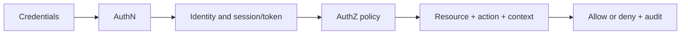

# Аутентификация и авторизация: проверки доступа без путаницы

## Модель проверки

Проверяйте не только «может ли роль открыть страницу». Отправьте запрос напрямую к API, замените идентификатор ресурса, tenant, scope и метод. UI-ограничение не является механизмом авторизации.

## HTTP без упрощения

| Ситуация | Типичное поведение | Что проверить |
| --- | --- | --- |
| Нет или недействительны credentials | `401 Unauthorized` | Для HTTP challenge присутствует подходящий `WWW-Authenticate`; клиент не зацикливается |
| Credentials действительны, но доступ запрещён | Обычно `403 Forbidden` | Сервер не раскрывает лишние детали политики или чужого ресурса |
| Нужно скрыть существование чужого ресурса | Допустим `404 Not Found` | Поведение не позволяет перечислять объекты по разнице ответа/времени |
| Истёк или ещё не действует token | По контракту, часто `401` | Проверяются `exp`, `nbf`, clock skew и повторное получение credentials |
| Слишком много запросов | Обычно `429 Too Many Requests` | Лимит привязан к правильному субъекту, а retry не создаёт лавину |

RFC 9110 определяет `401` как отсутствие действительных credentials для ресурса и требует `WWW-Authenticate`. `403` означает, что сервер понял запрос, но отказался его выполнить; причина может быть не связана с credentials. Поэтому фразы «401 — не знаю тебя» и «403 — знаю, но нельзя» полезны как мнемоника, но не исчерпывают контракт.

## Stateful, stateless и JWT

| Область | Stateful session | Self-contained token/JWT |
| --- | --- | --- |
| Основное состояние | Серверная запись, клиент несёт непрозрачный идентификатор | Claims находятся в токене; сервер проверяет целостность и контекст |
| Масштабирование | Общее хранилище или sticky strategy | Проверка может быть локальной, но ключи, policy и revocation всё равно требуют координации |
| Logout/revocation | Инвалидировать запись и cookie | Короткий TTL, status/deny list, rotation или иной механизм по модели угроз |
| Главные тесты | fixation, rotation после login, idle/absolute timeout, параллельные сессии | signature/algorithm, `iss`, `aud`, `exp`, `nbf`, scopes/roles, replay, key rotation |

JWT — формат claims, а не готовая схема аутентификации. Подпись защищает целостность, но обычный signed JWT не скрывает payload. «Stateless» реализация часто всё равно обращается к ключам, политике, данным пользователя, refresh-сессии или списку отзыва.

## Жизненный цикл credentials

- [ ] Выдача происходит только после требуемой AuthN и содержит минимальные scopes.
- [ ] Token/session невозможно навязать до входа и сохранить после смены уровня доверия.
- [ ] Проверяются signature/MAC, разрешённый algorithm, issuer, audience и временные claims.
- [ ] Истёкший, отозванный, подменённый или предназначенный другой аудитории token отклоняется.
- [ ] Refresh token ротируется; повторное использование старого обнаруживается по контракту.
- [ ] Logout инвалидирует серверное состояние или достигает заявленной модели отзыва.
- [ ] Смена пароля, блокировка пользователя и отзыв роли дают ожидаемый эффект на активные сессии.
- [ ] Ошибки и логи не содержат пароли, session IDs, API keys, access/refresh tokens.

## Матрица авторизации

| Измерение | Позитивная проверка | Негативная проверка |
| --- | --- | --- |
| Роль/permission | Разрешённое действие выполняется | Запрещённое действие отклоняется сервером |
| Ownership | Владелец читает/меняет свой объект | Пользователь подставляет ID чужого объекта |
| Tenant | Данные доступны внутри tenant | ID, фильтр, экспорт и поиск не пересекают tenants |
| Scope/audience | Token работает у целевого API | Token другого клиента/API отклоняется |
| Состояние | Допустимый переход разрешён | Нельзя менять закрытый/удалённый/заблокированный объект |
| Массовая операция | Все объекты разрешены | Частично запрещённый набор не обходит item-level checks |

## API keys

API key обычно идентифицирует приложение или проект, а не человека, хотя контракт может быть иным. Ключ не является автоматически «небезопасным»: риск определяется энтропией, передачей только по TLS, областью прав, хранением, ротацией, сроком, rate limits и обнаружением утечки.

- [ ] Ключ отсутствует в URL, Referer, сообщениях об ошибках, аналитике и обычных логах.
- [ ] Header и его значение редактируются во всех слоях логирования и трассировки.
- [ ] Ключ имеет минимальные права, понятного владельца и отдельное значение для каждой среды/клиента.
- [ ] Отзыв и ротация работают без длительного простоя.
- [ ] Отсутствующий, неизвестный, отозванный и ограниченный ключ различаются только настолько, насколько разрешает контракт.
- [ ] Rate limiting и quota нельзя обойти сменой регистра, маршрута или параллельностью.

## Источники

- [Евгений Гусинец — «Аутентификация и Авторизация: не путаем понятия»](https://telegra.ph/Autentifikaciya-i-Avtorizaciya-ne-putaem-ponyatiya-01-22), опубликовано 2026-01-22, прочитано 2026-09-22.
- [RFC 9110: HTTP Semantics](https://www.rfc-editor.org/rfc/rfc9110.html), разделы 15.5.2–15.5.4.
- [RFC 7519: JSON Web Token](https://www.rfc-editor.org/rfc/rfc7519.html).
- OWASP: [JWT Cheat Sheet](https://cheatsheetseries.owasp.org/cheatsheets/JSON_Web_Token_Cheat_Sheet.html), [Session Management](https://cheatsheetseries.owasp.org/cheatsheets/Session_Management_Cheat_Sheet.html), [REST Security](https://cheatsheetseries.owasp.org/cheatsheets/REST_Security_Cheat_Sheet.html).

Связи: [основы запросов REST API](../api-testing/rest-api-request-basics.md), [HTTP-статусы](../api-testing/http-status-codes.md), [инструменты API и безопасность](../../tools/developer-tools/api-testing-toolkit.md).
